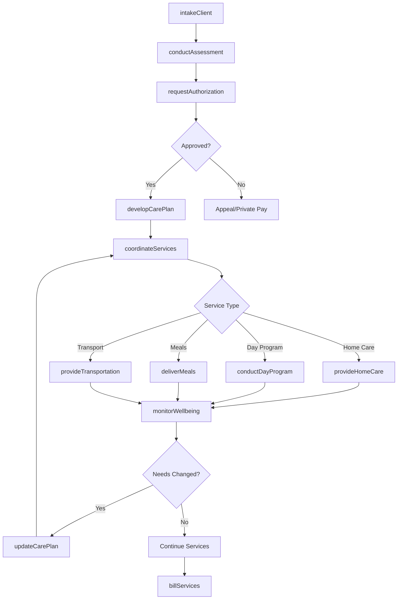
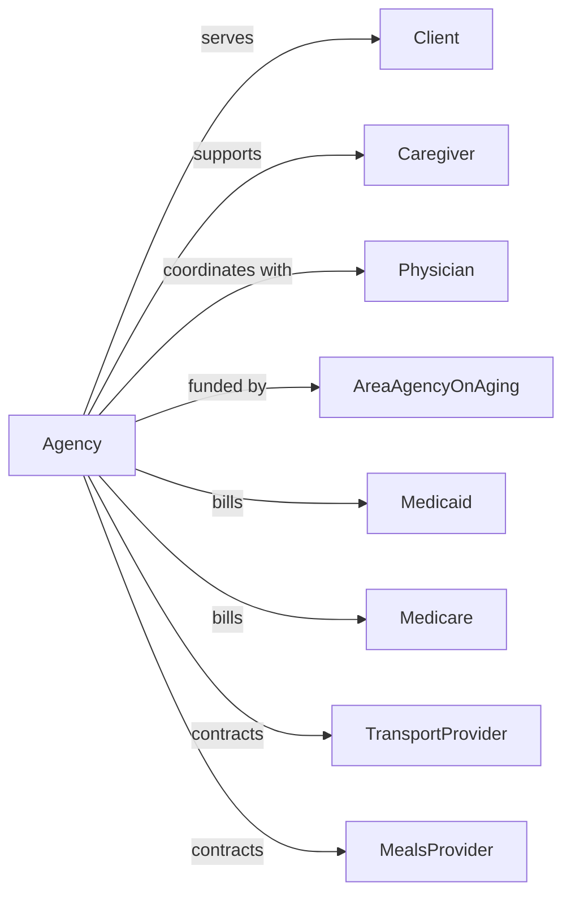

# Services for the Elderly and Persons with Disabilities

> Business-as-Code definition for nonresidential elder and disability services. Models programs including adult day care, home care, companion services, and community activities.

## Overview

Services for the elderly and persons with disabilities provide nonresidential support to improve quality of life including adult day programs, homemaker services, transportation, and social activities. This definition exposes actions for service delivery, events for care tracking, and searches for client and scheduling management.

## Actors

| Actor | Description |
|-------|-------------|
| Client | Elderly individual or person with disability |
| Caregiver | Family member providing unpaid care |
| Physician | Provides medical oversight |
| AreaAgencyOnAging | Coordinates elder services in region |
| Medicaid | Funds waiver services for eligible clients |
| Medicare | Federal healthcare payer |
| TransportProvider | Provides accessible transportation |
| MealsProvider | Delivers nutrition services |

## Roles

| Role | Description |
|------|-------------|
| ExecutiveDirector | Oversees agency operations |
| ProgramDirector | Manages service programs |
| CareCoordinator | Develops care plans and coordinates services |
| HomeCareworker | Provides in-home assistance |
| DayCenterStaff | Staffs adult day program |
| SocialWorker | Provides counseling and resource connection |
| TransportationDriver | Provides client transportation |
| ActivitiesLeader | Facilitates social programs |

## Entities

| Entity | Description |
|--------|-------------|
| Client | Individual receiving services |
| CarePlan | Documented service approach |
| ServiceVisit | In-home or center-based service event |
| DayProgram | Adult day center activities |
| MealDelivery | Home-delivered nutrition |
| Transportation | Client trip |
| Assessment | Evaluation of client needs |
| CaregiverSupport | Services for family caregivers |
| Invoice | Bill for services |
| Authorization | Approval for funded services |
| Activity | Scheduled program |
| WaitList | Queue for services |

## Actions

| Action | Description |
|--------|-------------|
| intakeClient | Process new service request |
| conductAssessment | Evaluate client needs |
| developCarePlan | Create service approach |
| provideHomeCare | Deliver in-home assistance |
| conductDayProgram | Operate adult day center |
| deliverMeals | Provide home-delivered nutrition |
| provideTransportation | Transport client |
| facilitateActivity | Lead social program |
| supportCaregiver | Provide respite and resources |
| monitorWellbeing | Check on client status |
| requestAuthorization | Obtain funding approval |
| coordinateServices | Arrange multiple supports |
| updateCarePlan | Modify service approach |
| billServices | Submit claims for payment |

## Events

| Event | Description |
|-------|-------------|
| clientIntaked | New service request processed |
| assessmentCompleted | Evaluation finished |
| carePlanDeveloped | Service approach documented |
| homeCareProvided | In-home visit completed |
| dayProgramAttended | Client participated in center |
| mealDelivered | Nutrition provided |
| transportationProvided | Trip completed |
| activityFacilitated | Program held |
| caregiverSupported | Respite or resource provided |
| wellbeingMonitored | Status check completed |
| authorizationObtained | Funding approved |
| carePlanUpdated | Services modified |
| billingSubmitted | Claim sent |
| clientDischarged | Services ended |

## Searches

| Search | Description |
|--------|-------------|
| findClients | List clients by status or service |
| getCarePlans | Retrieve service documentation |
| getServiceSchedule | View upcoming visits |
| findAuthorizations | Check funding approvals |
| getDayProgramCensus | View center attendance |
| getMealDeliveries | List nutrition services |
| getTransportationTrips | View scheduled trips |
| getBillingStatus | Check claim submissions |

## Workflow



## Actor Relationships



## Usage

### Calling Actions

```typescript
import { supportSeniors } from '@headlessly/support-seniors'

const agency = supportSeniors()

// Intake new client
const client = await agency.intakeClient({
  name: 'Margaret Williams',
  dateOfBirth: '1940-02-28',
  referralSource: 'physician',
  primaryDiagnosis: 'dementia',
  caregiverContact: 'daughter-susan'
})

// Conduct needs assessment
const assessment = await agency.conductAssessment({
  clientId: client.id,
  assessmentType: 'comprehensive',
  domains: ['adl', 'iadl', 'cognitive', 'social'],
  assessor: 'sw-001'
})

// Develop care plan
await agency.developCarePlan({
  clientId: client.id,
  assessmentId: assessment.id,
  services: [
    { type: 'adultDayProgram', frequency: '3x/week' },
    { type: 'homeCare', frequency: '2x/week', hours: 4 },
    { type: 'mealDelivery', frequency: 'daily' }
  ]
})
```

### Event-Driven Automation

```typescript
// Monitor wellbeing on schedule
agency.serviceScheduled(async ({ clientId, serviceType, scheduledDate }) => {
  await agency.monitorWellbeing({
    clientId,
    checkType: 'serviceVisit',
    scheduledDate
  })
})

// Alert caregiver on changes
agency.wellbeingConcern(async ({ clientId, concernType, severity }) => {
  await agency.supportCaregiver({
    clientId,
    alertType: 'wellbeingConcern',
    concernType,
    severity
  })

  if (severity === 'high') {
    await notifyPhysician({
      clientId,
      concernType
    })
  }
})
```

## Related

- [Child and Youth Services](./624110-ChildAndYouthServices.mdx)
- [Other Individual and Family Services](./624190-OtherIndividualAndFamilyServices.mdx)
