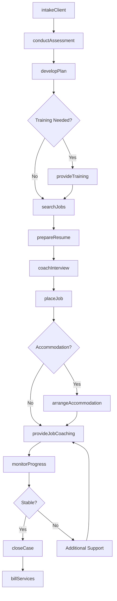
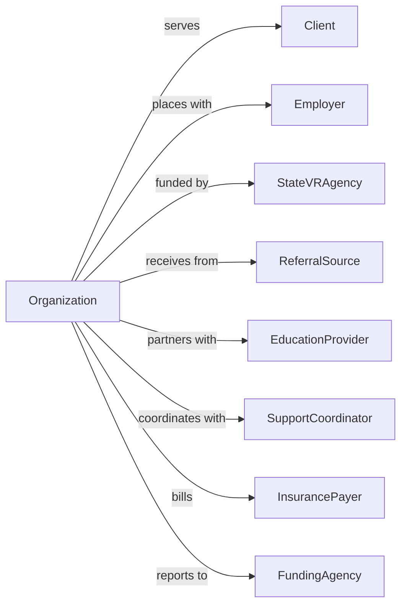

# Vocational Rehabilitation Services

> Business-as-Code definition for vocational rehabilitation operations. Models job training, employment services, and work preparation programs for individuals with disabilities and employment barriers.

## Overview

Vocational rehabilitation services provide job counseling, training, and employment support to individuals with disabilities, unemployed workers, and those facing employment barriers due to lack of education or experience. Services include skills assessment, job training, supported employment, job placement, and sheltered workshops. This definition exposes actions for client development, events for employment tracking, and searches for program and outcome management.

## Actors

| Actor | Description |
|-------|-------------|
| Client | Individual receiving rehabilitation services |
| Employer | Business providing job opportunities |
| StateVRAgency | Government vocational rehabilitation program |
| ReferralSource | Organization sending clients for services |
| EducationProvider | School or training institution |
| SupportCoordinator | Manages ongoing employment support |
| InsurancePayer | Workers comp or disability insurer |
| FundingAgency | Government or foundation providing grants |

## Roles

| Role | Description |
|------|-------------|
| ExecutiveDirector | Oversees organization operations |
| ProgramDirector | Manages rehabilitation programs |
| VocationalCounselor | Guides career exploration and planning |
| JobCoach | Provides on-site employment support |
| SkillsTrainer | Delivers job-specific instruction |
| PlacementSpecialist | Connects clients with employers |
| AssessmentSpecialist | Evaluates client abilities |
| CaseManager | Coordinates client services |

## Entities

| Entity | Description |
|--------|-------------|
| Client | Individual receiving services |
| Assessment | Evaluation of abilities and interests |
| IndividualPlan | Employment goals and services |
| TrainingProgram | Skill development curriculum |
| JobLead | Employment opportunity |
| Placement | Successful job start |
| SupportedEmployment | Ongoing workplace assistance |
| ShelteredWorkshop | Supervised work environment |
| Accommodation | Workplace modification |
| Employer | Hiring organization record |
| Outcome | Employment result tracking |
| Invoice | Billing for services |

## Actions

| Action | Description |
|--------|-------------|
| intakeClient | Process new service request |
| conductAssessment | Evaluate abilities and interests |
| developPlan | Create employment goals |
| provideTraining | Deliver skills instruction |
| arrangeAccommodation | Set up workplace modifications |
| searchJobs | Identify employment opportunities |
| prepareResume | Create job application materials |
| coachInterview | Practice interview skills |
| placeJob | Connect client with employer |
| provideJobCoaching | Support on-site employment |
| monitorProgress | Track employment stability |
| facilitateWorkshop | Operate sheltered work environment |
| billServices | Submit claims for reimbursement |
| closeCase | Complete services |

## Events

| Event | Description |
|-------|-------------|
| clientIntaked | New individual enrolled |
| assessmentCompleted | Evaluation finished |
| planDeveloped | Goals documented |
| trainingCompleted | Skills instruction finished |
| accommodationArranged | Workplace modification set |
| jobIdentified | Employment opportunity found |
| resumeCreated | Application materials completed |
| interviewScheduled | Job meeting arranged |
| jobPlaced | Client started employment |
| coachingProvided | On-site support given |
| progressMonitored | Employment check completed |
| retentionAchieved | Job stability milestone reached |
| caseClosed | Services completed |
| retentionMilestone | Client has reached an employment retention milestone |
| billingSubmitted | Claim sent |

## Searches

| Search | Description |
|--------|-------------|
| findClients | List clients by status or program |
| getAssessments | Retrieve evaluations |
| findTrainingPrograms | List available instruction |
| getJobLeads | View employment opportunities |
| findPlacements | List successful job starts |
| getEmployers | View hiring partners |
| getOutcomes | Retrieve employment results |
| getBillingStatus | Check reimbursement claims |

## Workflow



## Actor Relationships



## Usage

### Calling Actions

```typescript
import { rehabilitateWorkers } from '@headlessly/rehabilitate-workers'

const vocRehab = rehabilitateWorkers()

// Intake new client
const client = await vocRehab.intakeClient({
  name: 'Michael Torres',
  disability: 'traumaticBrainInjury',
  workHistory: ['warehouse', 'retail'],
  referralSource: 'stateVRAgency',
  goals: ['competitiveEmployment']
})

// Conduct vocational assessment
const assessment = await vocRehab.conductAssessment({
  clientId: client.id,
  assessmentTypes: ['vocationalInterest', 'functionalCapacity', 'aptitude'],
  assessor: 'as-001'
})

// Develop individual employment plan
await vocRehab.developPlan({
  clientId: client.id,
  assessmentId: assessment.id,
  employmentGoal: 'officeAssistant',
  services: [
    { type: 'computerTraining', duration: '8-weeks' },
    { type: 'softSkillsDevelopment', duration: '4-weeks' },
    { type: 'jobPlacement', startAfter: 'training' }
  ],
  accommodations: ['modifiedSchedule', 'taskReminders']
})
```

### Event-Driven Automation

```typescript
// Initiate job search when training completes
vocRehab.trainingCompleted(async ({ clientId, programId, skills }) => {
  await vocRehab.searchJobs({
    clientId,
    skillsAcquired: skills,
    matchCriteria: ['accessibility', 'transportation', 'schedule'],
    radiusMiles: 15
  })

  await vocRehab.prepareResume({
    clientId,
    highlightSkills: skills,
    format: 'functional'
  })
})

// Celebrate and track retention milestones
vocRehab.retentionMilestone(async ({ clientId, placementId, daysEmployed }) => {
  if (daysEmployed === 90) {
    await vocRehab.billServices({
      clientId,
      placementId,
      milestoneType: '90-dayRetention',
      fundingSource: 'stateVRAgency'
    })

    await notifyCaseManager({
      clientId,
      achievement: '90-dayRetention',
      nextMilestone: '180-day'
    })
  }
})
```

## Related

- [Services for the Elderly and Persons with Disabilities](../6241-IndividualAndFamilyServices/624120-ServicesForTheElderlyAndPersonsWithDisabilities.mdx)
- [Other Individual and Family Services](../6241-IndividualAndFamilyServices/624190-OtherIndividualAndFamilyServices.mdx)
