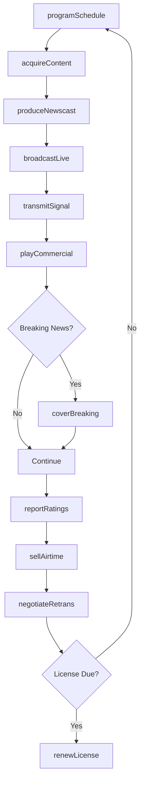
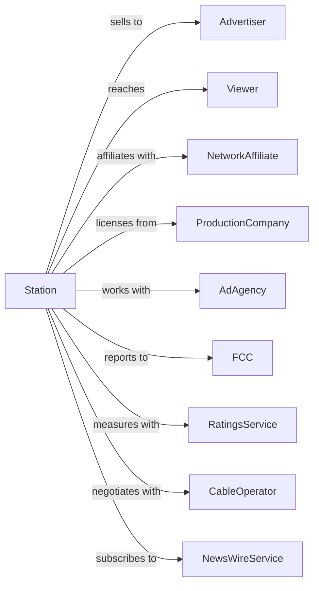

# Television Broadcasting Stations

> Business-as-Code definition for television broadcasting station operations. Models the complete broadcast cycle from programming through transmission and advertising.

## Overview

Television broadcasting stations produce and transmit video programming to viewers via over-the-air signals, combining visual and audio content. This definition exposes actions for programming, production, advertising sales, and transmission, events for tracking broadcasts and ratings, and searches for schedule, audience, and revenue data.

## Actors

| Actor | Description |
|-------|-------------|
| Advertiser | Purchases airtime for commercials |
| Viewer | Consumes broadcast programming |
| NetworkAffiliate | Provides national programming feed |
| ProductionCompany | Supplies syndicated and original content |
| AdAgency | Places advertising on behalf of clients |
| FCC | Regulates broadcast licensing and content |
| RatingsService | Measures audience size and demographics |
| CableOperator | Retransmits station to cable subscribers |
| NewsWireService | Provides news content and feeds |

## Roles

| Role | Description |
|------|-------------|
| ProgramDirector | Selects and schedules programming |
| NewsDirector | Oversees news department operations |
| Anchor | Presents news programming on air |
| Producer | Creates shows and manages production |
| SalesManager | Oversees advertising revenue |
| MasterControlOperator | Manages broadcast playout system |

## Entities

| Entity | Description |
|--------|-------------|
| Station | Licensed broadcast facility |
| Program | Show for broadcast |
| Newscast | News program with anchors and reporters |
| Commercial | Paid advertising spot |
| Daypart | Time segment for scheduling |
| Channel | Assigned broadcast frequency |
| Signal | Transmitted broadcast coverage |
| Ratings | Audience measurement data |
| Affiliate | Network membership relationship |
| License | FCC authorization to broadcast |
| Promo | Station or program promotional spot |

## Actions

| Action | Description |
|--------|-------------|
| programSchedule | Plan daily and weekly content lineup |
| produceNewscast | Create news program with segments |
| produceShow | Record or prepare program content |
| broadcastLive | Transmit live programming |
| playCommercial | Air paid advertising spot |
| coverBreaking | Interrupt programming for news event |
| reportRatings | Submit audience measurement data |
| sellAirtime | Negotiate commercial placements |
| transmitSignal | Broadcast to coverage area |
| negotiateRetrans | Secure carriage fees from cable operators |
| renewLicense | Maintain FCC broadcast authorization |
| acquireContent | License syndicated programming |

## Events

| Event | Description |
|-------|-------------|
| schedulePublished | Programming lineup confirmed |
| newscastProduced | News program ready for air |
| showProduced | Program content prepared |
| broadcastStarted | Live transmission commenced |
| commercialAired | Advertising spot played |
| breakingCovered | News event interrupted programming |
| ratingsReceived | Audience data delivered |
| airtimeSold | Commercial placement confirmed |
| signalTransmitted | Programming broadcast |
| retransNegotiated | Cable carriage agreement reached |
| licenseRenewed | FCC authorization continued |
| contentAcquired | Syndicated program licensed |

## Searches

| Search | Description |
|--------|-------------|
| getSchedule | View programming by day and daypart |
| getNewscasts | Access news program archive |
| getRatings | Retrieve audience metrics by daypart |
| getCommercials | List advertising by client or timing |
| getRevenue | Access advertising and retrans income |
| getShows | Browse program catalog |
| getSignalCoverage | Check transmission reach |
| getAffiliateFeeds | Monitor network programming |

## Workflow



## Actor Relationships



## Usage

### Calling Actions

```typescript
import { broadcastTelevisionBroadcasting } from '@headlessly/broadcast-television-broadcasting'

const station = broadcastTelevisionBroadcasting()

// Program prime time schedule
const schedule = await station.programSchedule({
  date: '2025-03-15',
  primetime: {
    '20:00': { program: 'network-drama', source: 'affiliate' },
    '21:00': { program: 'local-news', source: 'local' },
    '21:30': { program: 'syndicated-comedy', source: 'licensed' }
  }
})

// Produce evening newscast
await station.produceNewscast({
  date: '2025-03-15',
  time: '21:00',
  duration: 30,
  segments: [
    { type: 'top-stories', duration: 10 },
    { type: 'weather', duration: 3 },
    { type: 'sports', duration: 4 },
    { type: 'features', duration: 8 }
  ],
  anchor: 'anchor-williams'
})

// Sell prime time advertising
await station.sellAirtime({
  advertiserId: 'national-brand',
  spots: 10,
  daypart: 'primetime',
  rate: 5000,
  duration: '30-seconds',
  program: 'local-news'
})
```

### Event-Driven Automation

```typescript
// Auto-interrupt for breaking news
station.breakingCovered(async ({ eventId, severity }) => {
  if (severity === 'critical') {
    await station.broadcastLive({
      type: 'breaking-news',
      eventId,
      interruptCurrent: true,
      duration: 'until-resolved'
    })
  }
})

// Negotiate retrans annually
station.ratingsReceived(async ({ period, share }) => {
  if (period === 'sweeps' && share > 15) {
    const cableOps = await station.getAffiliateFeeds({ type: 'cable' })

    for (const op of cableOps) {
      await station.negotiateRetrans({
        operatorId: op.id,
        rateIncrease: 10,
        term: { years: 3 }
      })
    }
  }
})
```
