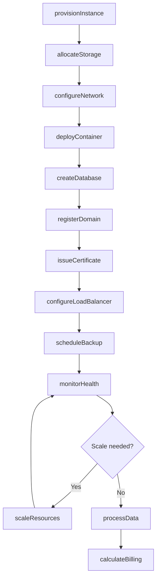
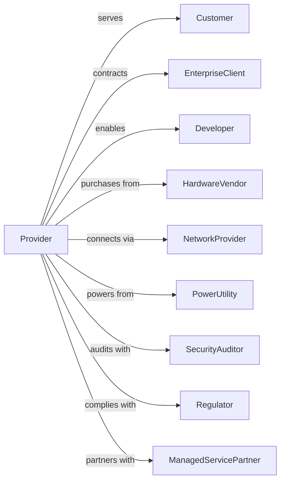

# Computing Infrastructure Providers, Data Processing, Web Hosting, and Related Services

> Business-as-Code definition for cloud computing and data center operations. Models the complete service lifecycle from infrastructure provisioning through customer workload management.

## Overview

Computing infrastructure providers deliver cloud computing, web hosting, data processing, and related services including IaaS, PaaS, colocation, and managed hosting. This definition exposes actions for resource provisioning, workload management, and customer support, events for tracking infrastructure health and usage, and searches for capacity, customer, and billing data.

## Actors

| Actor | Description |
|-------|-------------|
| Customer | Consumes computing resources and services |
| EnterpriseClient | Contracts for dedicated or hybrid solutions |
| Developer | Builds applications on platform services |
| HardwareVendor | Supplies servers, storage, and networking |
| NetworkProvider | Provides internet connectivity and peering |
| PowerUtility | Supplies electricity to facilities |
| SecurityAuditor | Verifies compliance and security |
| Regulator | Oversees data protection and privacy |
| ManagedServicePartner | Resells and manages customer workloads |

## Roles

| Role | Description |
|------|-------------|
| DataCenterManager | Oversees physical facility operations |
| CloudArchitect | Designs infrastructure and services |
| SiteReliabilityEngineer | Ensures service availability |
| SupportEngineer | Assists customers with technical issues |
| SalesEngineer | Sells solutions to customers |
| SecurityEngineer | Implements protection and compliance |

## Entities

| Entity | Description |
|--------|-------------|
| Instance | Virtual machine or compute resource |
| Storage | Data persistence service |
| Network | Virtual or physical connectivity |
| Container | Lightweight application runtime |
| Database | Managed data service |
| Domain | Customer web address |
| Certificate | SSL/TLS security credential |
| LoadBalancer | Traffic distribution service |
| Backup | Data protection copy |
| Region | Geographic service area |
| Account | Customer billing and resource container |

## Actions

| Action | Description |
|--------|-------------|
| provisionInstance | Create virtual machine |
| allocateStorage | Assign data storage resources |
| configureNetwork | Set up connectivity and firewalls |
| deployContainer | Run containerized application |
| createDatabase | Provision managed data service |
| registerDomain | Set up customer web address |
| issueCertificate | Generate SSL/TLS credential |
| configureLoadBalancer | Set up traffic distribution |
| scheduleBackup | Configure data protection |
| scaleResources | Adjust capacity up or down |
| monitorHealth | Track service status and metrics |
| processData | Execute customer data operations |
| calculateBilling | Compute usage-based charges |

## Events

| Event | Description |
|-------|-------------|
| instanceProvisioned | VM created and running |
| storageAllocated | Data resources assigned |
| networkConfigured | Connectivity established |
| containerDeployed | Application running |
| databaseCreated | Data service operational |
| domainRegistered | Web address active |
| certificateIssued | SSL/TLS credential generated |
| loadBalancerConfigured | Traffic distribution active |
| backupScheduled | Data protection configured |
| resourcesScaled | Capacity adjusted |
| healthMonitored | Status metrics collected |
| dataProcessed | Operations completed |
| billingCalculated | Charges computed |

## Searches

| Search | Description |
|--------|-------------|
| getInstances | List virtual machines by account |
| getStorage | Check data resources and usage |
| getNetworks | View connectivity configuration |
| getContainers | List running applications |
| getDatabases | Access data service details |
| getUsage | Retrieve consumption metrics |
| getBilling | View charges by account or service |
| getHealth | Monitor service status |

## Workflow



## Actor Relationships



## Usage

### Calling Actions

```typescript
import { hostComputingInfrastructure } from '@headlessly/host-computing-infrastructure'

const cloud = hostComputingInfrastructure()

// Review current usage and service health
const usage = await cloud.getUsage({ accountId: 'acct-startup-xyz', period: 'current-month' })
const health = await cloud.getHealth({ region: 'us-east-1', services: ['compute', 'storage'] })

// Provision compute resources
const instance = await cloud.provisionInstance({
  accountId: 'acct-startup-xyz',
  type: 'm5.xlarge',
  region: 'us-east-1',
  image: 'ubuntu-22.04',
  storage: { root: 100, data: 500 }
})

// Configure networking
await cloud.configureNetwork({
  instanceId: instance.id,
  vpc: 'vpc-production',
  securityGroups: ['sg-web', 'sg-ssh'],
  publicIp: true
})

// Deploy application
await cloud.deployContainer({
  instanceId: instance.id,
  image: 'startup-xyz/webapp:latest',
  ports: [80, 443],
  environment: {
    DATABASE_URL: 'postgres://...',
    REDIS_URL: 'redis://...'
  },
  replicas: 3
})

// Set up load balancer
await cloud.configureLoadBalancer({
  accountId: 'acct-startup-xyz',
  name: 'webapp-lb',
  targets: [instance.id],
  healthCheck: { path: '/health', interval: 30 }
})
```

### Event-Driven Automation

```typescript
// Auto-scale on demand
cloud.healthMonitored(async ({ instanceId, cpuUsage }) => {
  if (cpuUsage > 80) {
    await cloud.scaleResources({
      instanceId,
      direction: 'up',
      increment: 2
    })
  }
})

// Monthly billing
cloud.billingCalculated(async ({ accountId, period }) => {
  const usage = await cloud.getUsage({ accountId, period })

  await sendInvoice({
    accountId,
    period,
    compute: usage.compute,
    storage: usage.storage,
    network: usage.transfer,
    total: calculateTotal(usage)
  })
})
```
