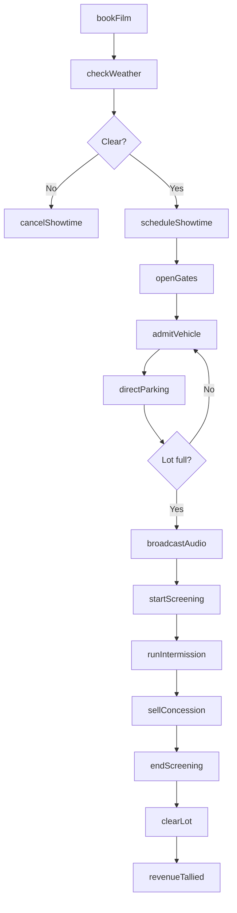
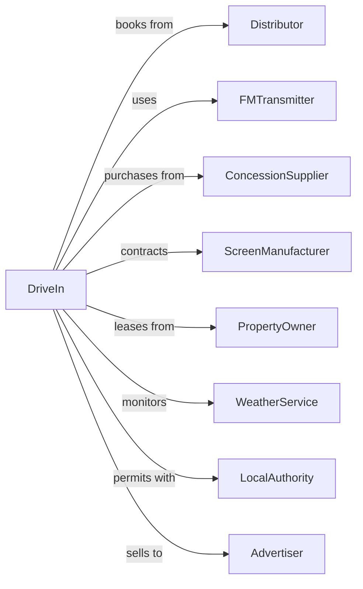

# Drive-In Motion Picture Theaters

> Business-as-Code definition for drive-in motion picture theater operations. Models the complete outdoor exhibition experience from lot management through screening.

## Overview

Drive-in motion picture theaters operate outdoor cinema venues where patrons view films from their vehicles. This definition exposes actions for lot management, audio transmission, concessions, and weather-dependent scheduling, events for tracking admissions and operations, and searches for capacity and performance data.

## Actors

| Actor | Description |
|-------|-------------|
| Distributor | Supplies films for outdoor exhibition |
| FMTransmitter | Provides radio frequency audio equipment |
| ConcessionSupplier | Provides food, beverage, and snack inventory |
| ScreenManufacturer | Builds and maintains large outdoor screens |
| PropertyOwner | Owns the land where drive-in operates |
| WeatherService | Provides forecasts for scheduling decisions |
| LocalAuthority | Issues permits and enforces noise ordinances |
| Advertiser | Purchases pre-show advertising slots |

## Roles

| Role | Description |
|------|-------------|
| SiteManager | Oversees daily operations and grounds |
| Projectionist | Operates digital projection systems |
| LotAttendant | Directs traffic and manages vehicle spacing |
| ConcessionStaff | Operates snack bar and delivery service |
| BoxOfficeOperator | Processes admissions at entry gate |

## Entities

| Entity | Description |
|--------|-------------|
| Lot | Outdoor viewing area with parking spaces |
| Screen | Large outdoor projection surface |
| Space | Individual vehicle parking spot |
| Vehicle | Patron automobile admitted to lot |
| Showtime | Scheduled outdoor presentation |
| AudioChannel | FM frequency for film soundtrack |
| Admission | Entry fee for vehicle or per-person |
| Concession | Food and beverage items for sale |
| Weather | Environmental conditions affecting operations |
| SpeakerPost | Legacy in-car audio equipment |
| DoubleFeature | Two films shown in single admission |

## Actions

| Action | Description |
|--------|-------------|
| bookFilm | Negotiate exhibition deal with distributor |
| checkWeather | Verify conditions suitable for screening |
| scheduleShowtime | Set screening start time based on sunset |
| openGates | Begin admitting vehicles to lot |
| admitVehicle | Process entry and assign parking space |
| directParking | Guide vehicles to optimal viewing positions |
| broadcastAudio | Transmit soundtrack via FM frequency |
| startScreening | Begin film projection at darkness |
| runIntermission | Pause between features for concession sales |
| sellConcession | Process food and beverage orders |
| endScreening | Conclude film and prepare for exit |
| clearLot | Direct vehicles to exit safely |
| cancelShowtime | Call off screening due to weather |

## Events

| Event | Description |
|-------|-------------|
| filmBooked | Exhibition agreement confirmed |
| showtimeScheduled | Screening time set based on sunset |
| gatesOpened | Admission commenced for showtime |
| vehicleAdmitted | Patron vehicle entered and parked |
| lotFull | Capacity reached for showtime |
| audioBroadcasting | FM transmission active for soundtrack |
| screeningStarted | Film projection commenced |
| intermissionStarted | Break between features began |
| screeningEnded | Film presentation concluded |
| lotCleared | All vehicles exited property |
| showtimeCanceled | Screening called off due to weather |
| revenueTallied | Nightly receipts calculated |

## Searches

| Search | Description |
|--------|-------------|
| getShowtimes | List screenings by date and screen |
| getCapacity | Check available spaces for showtime |
| getWeatherForecast | Retrieve conditions for scheduling |
| getAdmissions | Access vehicle and patron counts |
| getRevenue | Retrieve sales by category and date |
| getAudioChannels | List FM frequencies by screen |
| getFilmSchedule | View current and upcoming programming |

## Workflow



## Actor Relationships



## Usage

### Calling Actions

```typescript
import { exhibitDriveInFilms } from '@headlessly/exhibit-drive-in-films'

const driveIn = exhibitDriveInFilms()

// Check weather and schedule
const weather = await driveIn.checkWeather({
  date: '2025-07-04',
  location: 'riverside-lot'
})

if (weather.clear && !weather.rainChance) {
  const showtime = await driveIn.scheduleShowtime({
    screenId: 'screen-1',
    date: '2025-07-04',
    sunsetTime: '20:15',
    films: ['film-001', 'film-002'],
    type: 'doubleFeature'
  })
}

// Admit vehicles
const admission = await driveIn.admitVehicle({
  showtimeId: 'show-001',
  vehicleType: 'sedan',
  occupants: 4,
  admissionType: 'per-vehicle',
  price: 30.00
})

await driveIn.directParking({
  admissionId: admission.id,
  spaceId: 'row-d-15',
  audioChannel: '88.5'
})
```

### Event-Driven Automation

```typescript
// Auto-start broadcast at dusk
driveIn.lotFull(async ({ showtimeId, screenId }) => {
  const audioChannel = await driveIn.getAudioChannels({ screenId })

  await driveIn.broadcastAudio({
    showtimeId,
    frequency: audioChannel.primary,
    volume: 'standard'
  })
})

// Weather monitoring for cancellation
driveIn.showtimeScheduled(async ({ showtimeId, date }) => {
  const weather = await driveIn.getWeatherForecast({ date })

  if (weather.rainChance > 70) {
    await driveIn.cancelShowtime({
      showtimeId,
      reason: 'weather',
      notifyPatrons: true,
      offerRaincheck: true
    })
  }
})
```
