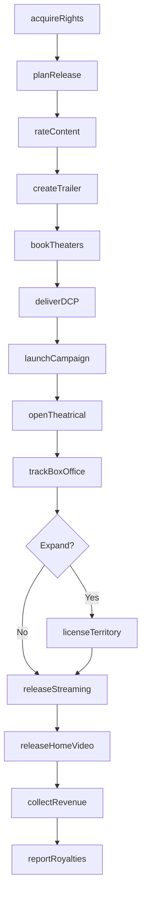
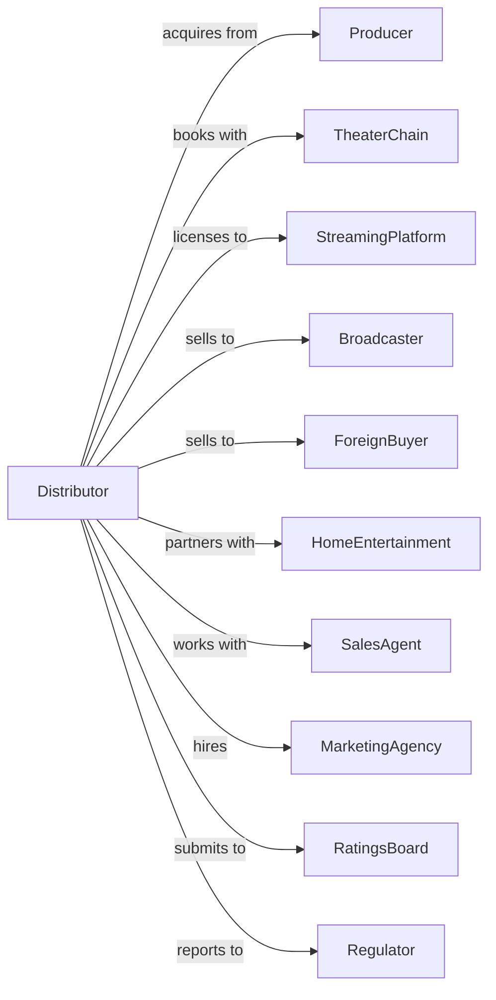

# Motion Picture and Video Distribution

> Business-as-Code definition for motion picture and video distribution operations. Models the complete distribution lifecycle from rights acquisition through exhibition.

## Overview

Motion picture and video distribution involves acquiring distribution rights and delivering content to theaters, broadcasters, streaming platforms, and other exhibition channels. This definition exposes actions for licensing, marketing, and release management, events for tracking distribution milestones, and searches for rights and revenue data.

## Actors

| Actor | Description |
|-------|-------------|
| Producer | Creates and sells content for distribution |
| TheaterChain | Operates cinemas for theatrical exhibition |
| StreamingPlatform | Distributes content via on-demand streaming |
| Broadcaster | Licenses content for television airings |
| ForeignBuyer | Acquires rights for international territories |
| HomeEntertainment | Distributes physical and digital home video |
| SalesAgent | Represents content for international sales |
| MarketingAgency | Creates promotional campaigns and materials |
| RatingsBoard | Certifies content ratings for release |
| Regulator | Oversees distribution compliance and quotas |

## Roles

| Role | Description |
|------|-------------|
| DistributionExecutive | Oversees acquisition and release strategy |
| SalesManager | Negotiates deals with exhibitors and licensees |
| MarketingDirector | Plans and executes promotional campaigns |
| TerritoryManager | Manages rights and releases by region |
| OperationsManager | Coordinates delivery and fulfillment logistics |
| FilmBuyer | Evaluates and acquires distribution rights to titles |

## Entities

| Entity | Description |
|--------|-------------|
| Title | A film or video being distributed |
| Rights | Licensed permissions for specific uses and territories |
| Territory | Geographic region for distribution rights |
| ReleaseWindow | Time period for specific distribution channel |
| Deal | Agreement with exhibitor or licensee |
| Revenue | Income from theatrical, streaming, or licensing |
| PrintDCP | Digital cinema package for theatrical delivery |
| Trailer | Promotional video for marketing |
| Poster | Key art and promotional imagery |
| BoxOffice | Theatrical ticket sales data |
| Residual | Ongoing payments to rights holders |

## Actions

| Action | Description |
|--------|-------------|
| acquireRights | Negotiate and secure distribution rights to title |
| planRelease | Develop release strategy and window schedule |
| rateContent | Submit content for ratings certification |
| createTrailer | Produce promotional trailer and teasers |
| bookTheaters | Secure theatrical exhibition commitments |
| deliverDCP | Send digital cinema packages to exhibitors |
| launchCampaign | Execute marketing and promotional activities |
| openTheatrical | Release title in cinemas |
| trackBoxOffice | Monitor and report theatrical performance |
| licenseTerritory | Sell rights to foreign distributors |
| releaseStreaming | Make title available on streaming platforms |
| releaseHomeVideo | Distribute physical and digital home media |
| collectRevenue | Process and reconcile distribution income |
| reportRoyalties | Calculate and pay rights holder residuals |

## Events

| Event | Description |
|-------|-------------|
| rightsAcquired | Distribution rights secured for title |
| releaseScheduled | Opening date confirmed for territory |
| ratingReceived | Content certification issued |
| trailerReleased | Promotional trailer published |
| theatersBooked | Exhibition commitments confirmed |
| dcpDelivered | Digital print received by exhibitors |
| campaignLaunched | Marketing activities commenced |
| theatricalOpened | Title released in cinemas |
| boxOfficeReported | Sales data received from exhibitors |
| territoryLicensed | Foreign rights deal closed |
| streamingReleased | Title available on streaming platform |
| homeVideoReleased | Physical and digital home media available |
| revenueCollected | Distribution income received |
| royaltiesPaid | Rights holder payments processed |

## Searches

| Search | Description |
|--------|-------------|
| findTitles | List titles by status, genre, or release date |
| getRights | Check rights availability by title and territory |
| getDeals | Retrieve active deals with exhibitors and licensees |
| getBoxOffice | Access theatrical performance by title and market |
| getRevenue | Retrieve income by title, territory, and channel |
| getReleaseSchedule | Get upcoming releases by date and territory |
| getMarketingAssets | Access trailers, posters, and promotional materials |

## Workflow



## Actor Relationships



## Usage

### Calling Actions

```typescript
import { distributeMotionPicture } from '@headlessly/distribute-motion-picture'

const distribution = distributeMotionPicture()

// Acquire distribution rights
const rights = await distribution.acquireRights({
  titleId: 'film-456',
  territories: ['north-america', 'uk', 'australia'],
  channels: ['theatrical', 'streaming', 'home-video'],
  term: { years: 15 },
  minimumGuarantee: 2500000
})

// Plan theatrical release
const release = await distribution.planRelease({
  titleId: 'film-456',
  territory: 'north-america',
  openingDate: '2025-07-04',
  pattern: 'wide',
  screenCount: 3500
})

// Book theater commitments
await distribution.bookTheaters({
  titleId: 'film-456',
  releaseId: release.id,
  chains: ['amc', 'regal', 'cinemark'],
  terms: { split: 55, minimumWeeks: 4 }
})
```

### Event-Driven Automation

```typescript
// Auto-trigger streaming release after theatrical window
distribution.theatricalOpened(async ({ titleId, territory, openingDate }) => {
  const streamingDate = addDays(openingDate, 45)

  await distribution.releaseStreaming({
    titleId,
    territory,
    availableDate: streamingDate,
    platforms: ['primary-svod']
  })
})

// Report royalties when revenue collected
distribution.revenueCollected(async ({ titleId, amount, channel }) => {
  const deals = await distribution.getDeals({ titleId })

  for (const deal of deals) {
    await distribution.reportRoyalties({
      titleId,
      dealId: deal.id,
      grossRevenue: amount,
      period: getCurrentQuarter()
    })
  }
})
```
