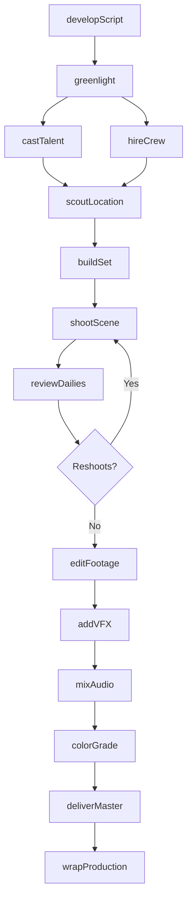
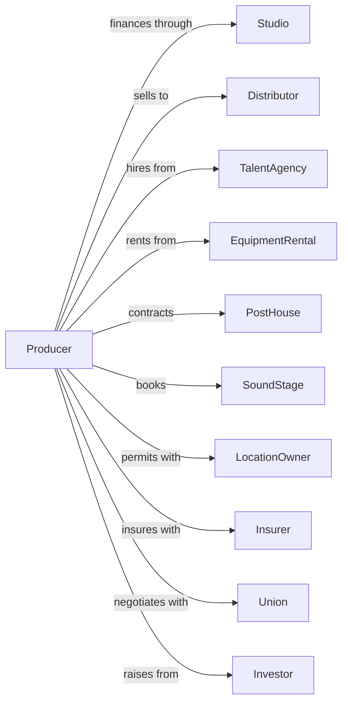

# Motion Picture and Video Production

> Business-as-Code definition for motion picture and video production operations. Models the complete production lifecycle from development through delivery.

## Overview

Motion picture and video production encompasses the creation of films, television programs, commercials, and digital content. This definition exposes actions for each phase of production from script development through final delivery, events for workflow automation, and searches for project and talent data retrieval.

## Actors

| Actor | Description |
|-------|-------------|
| Studio | Finances and oversees production of content |
| Distributor | Acquires rights and distributes finished content |
| TalentAgency | Represents actors, directors, and creative talent |
| EquipmentRental | Provides cameras, lighting, and production gear |
| PostHouse | Provides editing, VFX, and finishing services |
| SoundStage | Provides controlled filming environments |
| LocationOwner | Grants permission to film on property |
| Insurer | Provides production insurance and completion bonds |
| Union | Represents crew and talent labor interests |
| Investor | Provides financing for production |

## Roles

| Role | Description |
|------|-------------|
| Producer | Oversees all aspects of production and budget |
| Director | Guides creative vision and performances |
| LineProducer | Manages day-to-day production operations |
| ProductionManager | Coordinates logistics and scheduling |
| Editor | Assembles footage into final cut |
| Cinematographer | Designs and captures visual imagery |

## Entities

| Entity | Description |
|--------|-------------|
| Project | A film, series, or video being produced |
| Script | Written blueprint for the production |
| Budget | Financial plan allocating funds across departments |
| Schedule | Timeline of shooting days and milestones |
| Footage | Raw recorded video and audio material |
| Dailies | Processed footage reviewed each day |
| Cut | Version of edited project at a given stage |
| Talent | Actors and performers in the production |
| Crew | Technical and creative team members |
| Location | Place where filming occurs |
| Asset | Props, costumes, and set pieces |
| Contract | Agreement with talent, crew, or vendors |

## Actions

| Action | Description |
|--------|-------------|
| developScript | Create and refine screenplay through drafts |
| greenlight | Approve project for production with budget |
| castTalent | Audition and hire actors for roles |
| hireCrew | Recruit and contract production team members |
| scoutLocation | Find and secure filming locations |
| buildSet | Construct sets and production environments |
| shootScene | Capture footage according to shot list |
| reviewDailies | Evaluate footage shot each day |
| editFootage | Assemble and cut footage into sequences |
| addVFX | Create and integrate visual effects |
| mixAudio | Balance and master sound elements |
| colorGrade | Adjust color and look of final picture |
| deliverMaster | Provide final deliverables to distributor |
| wrapProduction | Close out production and settle accounts |

## Events

| Event | Description |
|-------|-------------|
| scriptApproved | Final screenplay locked for production |
| projectGreenlit | Production approved to proceed |
| talentCast | Actor confirmed for role |
| crewHired | Team member contracted and onboarded |
| locationSecured | Filming permit obtained for location |
| principalPhotographyStarted | Main filming commenced |
| sceneWrapped | Individual scene filming completed |
| principalPhotographyCompleted | All main filming finished |
| roughCutDelivered | First assembly available for review |
| fineCutApproved | Locked picture ready for finishing |
| vfxCompleted | Visual effects shots delivered |
| finalMixApproved | Audio mix signed off |
| masterDelivered | Final deliverables sent to distributor |
| productionWrapped | All production activities concluded |

## Searches

| Search | Description |
|--------|-------------|
| findProjects | List projects by status, genre, or budget range |
| getTalent | Search available actors by role type and availability |
| getCrew | Find crew members by department and experience |
| getLocations | Search locations by type and permit status |
| getBudgetStatus | Retrieve spending against budget by department |
| getSchedule | Get production calendar and milestone dates |
| getDailies | Access footage from specific shoot days |
| getDeliverables | List required delivery formats and deadlines |

## Workflow



## Actor Relationships



## Usage

### Calling Actions

```typescript
import { produceMotionPicture } from '@headlessly/produce-motion-picture'

const production = produceMotionPicture()

// Review active projects and budget status
const projects = await production.findProjects({ status: 'in-production', format: 'theatrical' })
const budget = await production.getBudgetStatus({ projectId: 'proj-frontier', department: 'all' })

// Greenlight a project
const project = await production.greenlight({
  title: 'The Last Frontier',
  budget: 45000000,
  format: 'theatrical',
  targetRelease: '2025-06-15'
})

// Cast lead talent
const lead = await production.castTalent({
  projectId: project.id,
  role: 'protagonist',
  talentId: 'talent-123',
  dealTerms: {
    fee: 5000000,
    backend: 5,
    billing: 'top'
  }
})

// Begin principal photography
await production.shootScene({
  projectId: project.id,
  sceneNumber: '1A',
  locationId: 'loc-desert-001',
  callTime: '06:00',
  estimatedWrap: '18:00'
})
```

### Event-Driven Automation

```typescript
// Auto-notify stakeholders when dailies ready
production.sceneWrapped(async ({ projectId, sceneNumber, footageId }) => {
  await production.reviewDailies({
    projectId,
    footageId,
    notifyList: ['director', 'producer', 'editor']
  })
})

// Trigger post-production when filming wraps
production.principalPhotographyCompleted(async ({ projectId }) => {
  const footage = await production.getDailies({ projectId })

  await production.editFootage({
    projectId,
    footageIds: footage.map(f => f.id),
    targetDelivery: '2025-02-01'
  })
})
```
