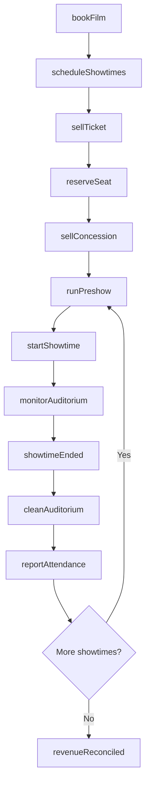
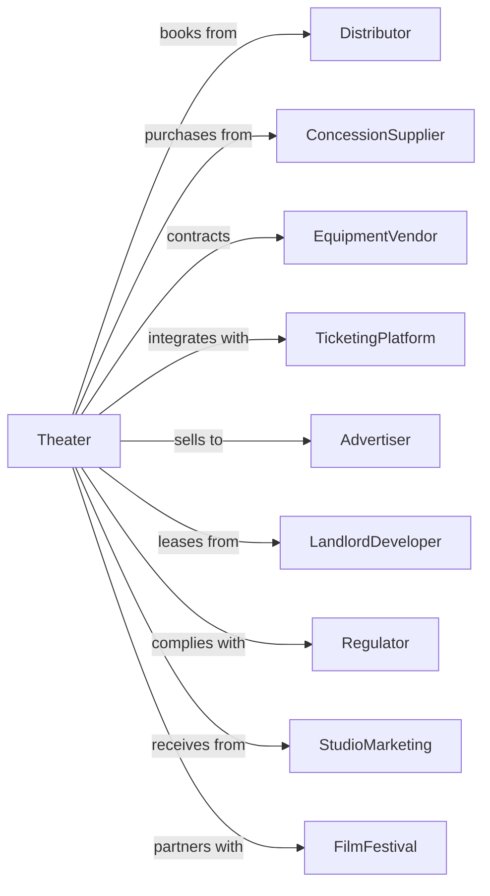

# Motion Picture Theaters (except Drive-Ins)

> Business-as-Code definition for motion picture theater operations. Models the complete exhibition lifecycle from film booking through audience experience.

## Overview

Motion picture theaters operate cinemas that exhibit films and host special events for paying audiences. This definition exposes actions for programming, ticketing, concessions, and facility management, events for tracking showtimes and attendance, and searches for performance and scheduling data.

## Actors

| Actor | Description |
|-------|-------------|
| Distributor | Supplies films for theatrical exhibition |
| ConcessionSupplier | Provides food, beverage, and snack inventory |
| EquipmentVendor | Supplies and maintains projection and sound systems |
| TicketingPlatform | Processes online ticket sales and reservations |
| Advertiser | Purchases pre-show advertising slots |
| LandlordDeveloper | Owns or leases theater property |
| Regulator | Enforces safety codes and accessibility requirements |
| StudioMarketing | Provides promotional materials and campaigns |
| FilmFestival | Partners for special screenings and premieres |

## Roles

| Role | Description |
|------|-------------|
| TheaterManager | Oversees daily operations and staff |
| Booker | Selects films and negotiates exhibition terms |
| Projectionist | Operates and maintains projection equipment |
| ConcessionManager | Manages food service operations |
| BoxOfficeAttendant | Sells tickets and assists patrons |

## Entities

| Entity | Description |
|--------|-------------|
| Auditorium | Individual screening room with seating |
| Showtime | Scheduled presentation of a film |
| Film | Movie being exhibited |
| Ticket | Admission to a specific showtime |
| Concession | Food and beverage items for sale |
| Seat | Individual seating position in auditorium |
| BookingDeal | Agreement with distributor for film rental |
| Attendance | Number of patrons at showtime |
| Revenue | Income from tickets, concessions, and advertising |
| Equipment | Projectors, sound systems, and screens |
| Preshow | Advertising and trailers before feature |

## Actions

| Action | Description |
|--------|-------------|
| bookFilm | Negotiate exhibition deal with distributor |
| scheduleShowtimes | Set screening times across auditoriums |
| sellTicket | Process admission sale to patron |
| reserveSeat | Assign specific seat for reserved seating |
| sellConcession | Process food and beverage purchase |
| startShowtime | Begin scheduled presentation |
| runPreshow | Display advertising and trailers |
| monitorAuditorium | Check presentation quality during screening |
| reportAttendance | Record and transmit box office data |
| cleanAuditorium | Prepare room between screenings |
| maintainEquipment | Service projection and sound systems |
| hostEvent | Facilitate premieres, festivals, or private screenings |
| processRefund | Handle ticket cancellations and exchanges |

## Events

| Event | Description |
|-------|-------------|
| filmBooked | Exhibition deal confirmed with distributor |
| showtimesPublished | Schedule available for ticket sales |
| ticketSold | Admission purchased by patron |
| seatReserved | Specific seat assigned to ticket |
| showtimeStarted | Presentation commenced |
| preshowCompleted | Advertising and trailers finished |
| showtimeEnded | Presentation concluded |
| attendanceReported | Box office data transmitted to distributor |
| auditoriumCleaned | Room ready for next screening |
| equipmentServiced | Maintenance completed on systems |
| eventHosted | Special screening concluded |
| revenueReconciled | Daily receipts balanced and deposited |

## Searches

| Search | Description |
|--------|-------------|
| getShowtimes | List screenings by film, date, or auditorium |
| getAvailableSeats | Check seat availability for showtime |
| getAttendance | Retrieve patron counts by showtime or film |
| getRevenue | Access sales data by category and period |
| getFilmSchedule | View current and upcoming film lineup |
| getEquipmentStatus | Check operational status of projection systems |
| getConcessionInventory | Monitor stock levels of food and beverage |

## Workflow



## Actor Relationships



## Usage

### Calling Actions

```typescript
import { exhibitFilms } from '@headlessly/exhibit-films'

const theater = exhibitFilms()

// Review current film lineup and concession stock
const schedule = await theater.getFilmSchedule({ week: '2025-07-04' })
const concessions = await theater.getConcessionInventory({ belowReorder: true })

// Book a film for exhibition
const booking = await theater.bookFilm({
  filmId: 'film-789',
  startDate: '2025-07-04',
  endDate: '2025-07-31',
  auditoriums: ['aud-1', 'aud-2', 'aud-5'],
  terms: { split: 55, minimumWeeks: 3 }
})

// Schedule showtimes
await theater.scheduleShowtimes({
  bookingId: booking.id,
  showtimes: [
    { auditoriumId: 'aud-1', time: '14:00' },
    { auditoriumId: 'aud-1', time: '17:30' },
    { auditoriumId: 'aud-1', time: '21:00' },
    { auditoriumId: 'aud-2', time: '15:15' },
    { auditoriumId: 'aud-2', time: '19:00' }
  ]
})

// Sell ticket with seat selection
const ticket = await theater.sellTicket({
  showtimeId: 'show-001',
  seatId: 'G-12',
  ticketType: 'adult',
  price: 15.99
})
```

### Event-Driven Automation

```typescript
// Auto-clean after showtime ends
theater.showtimeEnded(async ({ showtimeId, auditoriumId }) => {
  await theater.cleanAuditorium({
    auditoriumId,
    priority: 'standard',
    nextShowtime: getNextShowtime(auditoriumId)
  })
})

// Report attendance nightly
theater.revenueReconciled(async ({ date, totalTickets }) => {
  const films = await theater.getFilmSchedule({ date })

  for (const film of films) {
    const attendance = await theater.getAttendance({
      filmId: film.id,
      date
    })

    await theater.reportAttendance({
      filmId: film.id,
      distributorId: film.distributorId,
      attendance: attendance.total,
      grossRevenue: attendance.revenue
    })
  }
})
```
