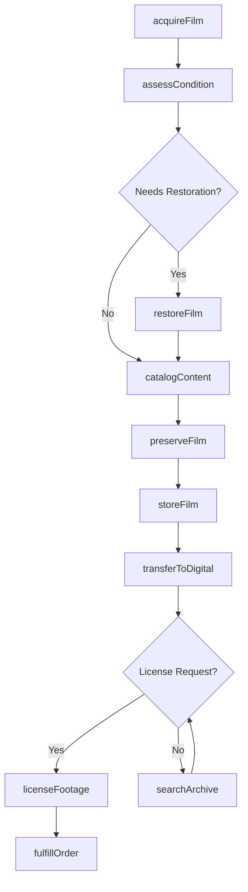
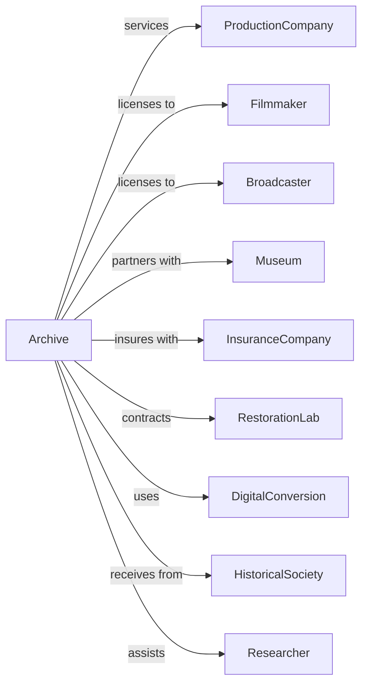

# Other Motion Picture and Video Industries

> Business-as-Code definition for film laboratory, archive, and specialized motion picture services. Models operations for film processing, preservation, and stock footage management.

## Overview

Other motion picture and video industries provide specialized services including film laboratories, stock footage libraries, and film preservation facilities. This definition exposes actions for processing, archiving, licensing, and preservation, events for tracking asset management, and searches for footage and archive content.

## Actors

| Actor | Description |
|-------|-------------|
| ProductionCompany | Requires film processing and archive services |
| Filmmaker | Seeks stock footage for productions |
| Broadcaster | Licenses archival content for programs |
| Museum | Partners for preservation and exhibition |
| InsuranceCompany | Insures valuable film assets |
| RestorationLab | Provides specialized film restoration services |
| DigitalConversion | Transfers film to digital formats |
| HistoricalSociety | Donates or loans archival materials |
| Researcher | Accesses archives for academic study |

## Roles

| Role | Description |
|------|-------------|
| ArchiveDirector | Oversees collection management and strategy |
| Archivist | Catalogs and maintains film holdings |
| PreservationSpecialist | Handles physical film care and storage |
| LicensingManager | Negotiates usage rights for footage |
| LabTechnician | Operates film processing equipment |
| ResearchCoordinator | Assists researchers accessing collections |

## Entities

| Entity | Description |
|--------|-------------|
| FilmReel | Physical film element in collection |
| StockFootage | Licensed clips available for use |
| Negative | Original camera negative requiring preservation |
| Print | Distribution copy of film |
| Catalog | Searchable database of holdings |
| License | Permission to use archived content |
| Preservation | Conservation treatment for film elements |
| Transfer | Digital conversion of film material |
| Vault | Climate-controlled storage facility |
| Metadata | Descriptive information about content |
| Collection | Group of related archival materials |

## Actions

| Action | Description |
|--------|-------------|
| acquireFilm | Add new materials to archive collection |
| catalogContent | Create metadata records for holdings |
| assessCondition | Evaluate physical state of film elements |
| preserveFilm | Apply conservation treatments to materials |
| storeFilm | Place elements in climate-controlled vault |
| transferToDigital | Convert film to digital formats |
| licenseFootage | Grant usage rights for archived content |
| fulfillOrder | Prepare and deliver licensed materials |
| restoreFilm | Repair damaged or deteriorated elements |
| processFilm | Develop and print film in laboratory |
| searchArchive | Query catalog for specific content |
| authenticateMaterial | Verify provenance and authenticity |
| deaccession | Remove items from collection |

## Events

| Event | Description |
|-------|-------------|
| filmAcquired | New materials added to collection |
| contentCataloged | Metadata record created for item |
| conditionAssessed | Physical evaluation completed |
| filmPreserved | Conservation treatment applied |
| filmStored | Element placed in vault |
| transferCompleted | Digital conversion finished |
| footageLicensed | Usage rights granted to client |
| orderFulfilled | Licensed materials delivered |
| filmRestored | Damage repair completed |
| filmProcessed | Laboratory development finished |
| materialAuthenticated | Provenance verified |
| itemDeaccessioned | Material removed from collection |

## Searches

| Search | Description |
|--------|-------------|
| searchFootage | Find clips by subject, era, or format |
| getCollection | List holdings by collection or donor |
| getConditionReports | Access preservation status by item |
| getLicenses | Retrieve active usage agreements |
| getVaultInventory | Check storage locations and capacity |
| getCatalog | Browse complete archive holdings |
| getTransferQueue | View pending digital conversions |

## Workflow



## Actor Relationships



## Usage

### Calling Actions

```typescript
import { serviceFilmArchive } from '@headlessly/service-film-archive'

const archive = serviceFilmArchive()

// Acquire new film materials
const acquisition = await archive.acquireFilm({
  donor: 'paramount-legacy-collection',
  materials: [
    { type: 'negative', title: 'Lost Horizon', year: 1937 },
    { type: 'print', title: 'Lost Horizon', year: 1937, condition: 'fair' }
  ],
  terms: 'donation',
  provenance: 'verified'
})

// Catalog and assess condition
await archive.catalogContent({
  itemId: acquisition.items[0].id,
  metadata: {
    title: 'Lost Horizon',
    director: 'Frank Capra',
    studio: 'Columbia Pictures',
    runtime: 132,
    format: '35mm nitrate'
  }
})

// License footage for production
const license = await archive.licenseFootage({
  clipIds: ['clip-001', 'clip-002'],
  licensee: 'documentary-prod-llc',
  usage: 'worldwide-theatrical',
  term: { years: 5 },
  fee: 15000
})
```

### Event-Driven Automation

```typescript
// Auto-queue preservation when condition assessed
archive.conditionAssessed(async ({ itemId, condition }) => {
  if (condition.rating === 'deteriorating') {
    await archive.preserveFilm({
      itemId,
      priority: 'urgent',
      treatments: ['cleaning', 'splicing', 'rehousing']
    })
  }
})

// Auto-transfer to digital after preservation
archive.filmPreserved(async ({ itemId, condition }) => {
  if (condition.stable) {
    await archive.transferToDigital({
      itemId,
      resolution: '4K',
      format: 'dpx',
      colorSpace: 'archival'
    })
  }
})
```
