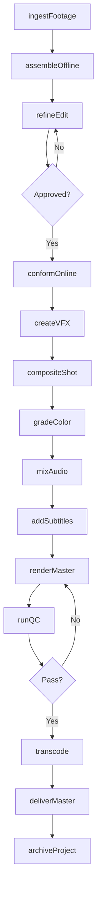
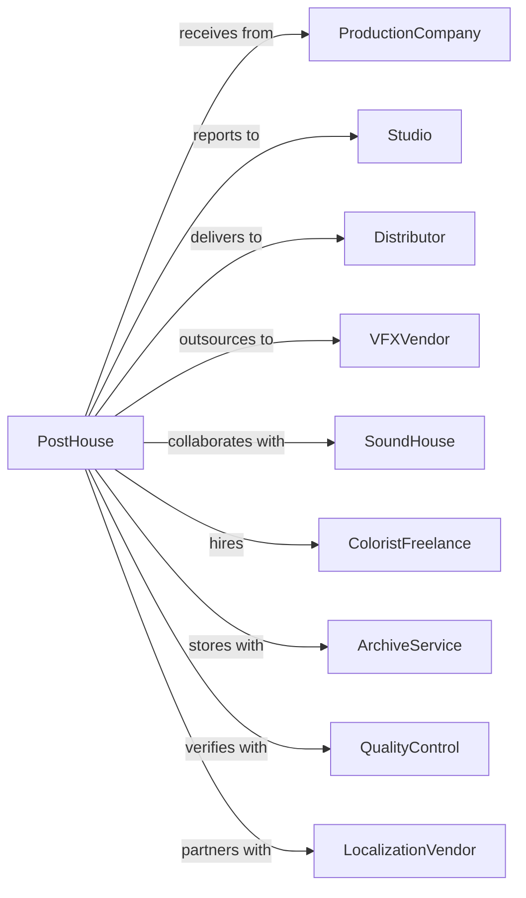

# Teleproduction and Other Postproduction Services

> Business-as-Code definition for postproduction services operations. Models the complete finishing pipeline from raw footage through final delivery.

## Overview

Teleproduction and postproduction services provide specialized editing, visual effects, color grading, and finishing services for film, television, and video content. This definition exposes actions for each stage of postproduction, events for tracking project milestones, and searches for project status and asset management.

## Actors

| Actor | Description |
|-------|-------------|
| ProductionCompany | Delivers raw footage and oversees creative direction |
| Studio | Finances and approves final deliverables |
| Distributor | Receives finished masters in required formats |
| VFXVendor | Provides specialized visual effects work |
| SoundHouse | Handles audio mixing and mastering |
| ColoristFreelance | Provides specialized color grading expertise |
| ArchiveService | Stores and manages finished assets long-term |
| QualityControl | Verifies technical specifications of deliverables |
| LocalizationVendor | Creates foreign language versions and subtitles |

## Roles

| Role | Description |
|------|-------------|
| PostSupervisor | Oversees all postproduction activities |
| Editor | Assembles and cuts footage into sequences |
| VFXArtist | Creates digital visual effects and composites |
| Colorist | Grades and balances color across project |
| OnlineEditor | Conforms and finishes high-resolution timeline |
| TechnicalDirector | Manages file formats and delivery specifications |

## Entities

| Entity | Description |
|--------|-------------|
| Project | Film, episode, or video in postproduction |
| Timeline | Sequence of clips assembled for editing |
| Footage | Raw video and audio source material |
| VFXShot | Visual effects element requiring creation |
| Conform | High-resolution assembly matching offline edit |
| Grade | Color correction applied to project |
| Master | Final finished version for delivery |
| Deliverable | Formatted output for specific destination |
| Asset | Media files and project elements |
| Subtitle | Text overlay for dialogue and captions |
| QCReport | Technical evaluation of finished content |

## Actions

| Action | Description |
|--------|-------------|
| ingestFootage | Import and organize raw source material |
| assembleOffline | Create initial edit from proxy footage |
| refineEdit | Iterate on timing, pacing, and structure |
| conformOnline | Rebuild timeline with full-resolution media |
| createVFX | Design and render visual effects shots |
| compositeShot | Combine multiple elements into final frame |
| gradeColor | Apply color correction and creative looks |
| mixAudio | Balance and master sound elements |
| addSubtitles | Create and sync text overlays |
| renderMaster | Output final high-quality version |
| transcode | Convert master to required delivery formats |
| runQC | Verify technical specifications and quality |
| deliverMaster | Send finished files to distributor |
| archiveProject | Store project files for long-term access |

## Events

| Event | Description |
|-------|-------------|
| footageIngested | Source material imported and organized |
| offlineApproved | Edit locked by creative stakeholders |
| conformCompleted | High-resolution timeline built |
| vfxDelivered | Visual effects shots completed |
| colorApproved | Grade signed off by colorist and director |
| audioMixed | Sound elements balanced and mastered |
| subtitlesAdded | Text overlays created and synced |
| masterRendered | Final version output completed |
| transcodeCompleted | Delivery formats created |
| qcPassed | Technical quality verified |
| masterDelivered | Finished files sent to recipient |
| projectArchived | Assets stored for long-term access |

## Searches

| Search | Description |
|--------|-------------|
| findProjects | List projects by status, client, or deadline |
| getVFXShots | Retrieve effects shots by status or complexity |
| getTimeline | Access current edit with version history |
| getDeliverables | List required output formats and specs |
| getQCStatus | Check technical verification results |
| getAssets | Search media files by type or metadata |
| getSchedule | View milestones and deadlines |

## Workflow



## Actor Relationships



## Usage

### Calling Actions

```typescript
import { finishPostproduction } from '@headlessly/finish-postproduction'

const postHouse = finishPostproduction()

// Review active projects and pending VFX shots
const projects = await postHouse.findProjects({ status: 'in-progress', client: 'netflix' })
const pendingVFX = await postHouse.getVFXShots({ status: 'awaiting-review' })

// Ingest footage from production
const footage = await postHouse.ingestFootage({
  projectId: 'proj-123',
  source: 's3://production-footage/ep-101/',
  format: 'arriraw',
  createProxies: true
})

// Conform online after edit approval
await postHouse.conformOnline({
  projectId: 'proj-123',
  offlineEditId: 'edit-v7-locked',
  resolution: '4K',
  colorSpace: 'ACES'
})

// Grade color with creative look
await postHouse.gradeColor({
  projectId: 'proj-123',
  coloristId: 'colorist-456',
  lookReference: 'moody-noir',
  deliverables: ['hdr', 'sdr']
})
```

### Event-Driven Automation

```typescript
// Auto-start VFX when conform completes
postHouse.conformCompleted(async ({ projectId, timelineId }) => {
  const vfxShots = await postHouse.getVFXShots({ projectId })

  for (const shot of vfxShots) {
    await postHouse.createVFX({
      projectId,
      shotId: shot.id,
      timelineRef: timelineId,
      deadline: shot.dueDate
    })
  }
})

// Auto-deliver when QC passes
postHouse.qcPassed(async ({ projectId, masterId }) => {
  const deliverables = await postHouse.getDeliverables({ projectId })

  for (const spec of deliverables) {
    await postHouse.transcode({
      masterId,
      format: spec.format,
      destination: spec.deliveryPath
    })
  }
})
```
