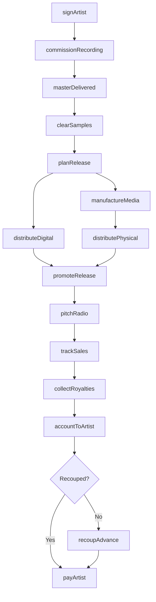
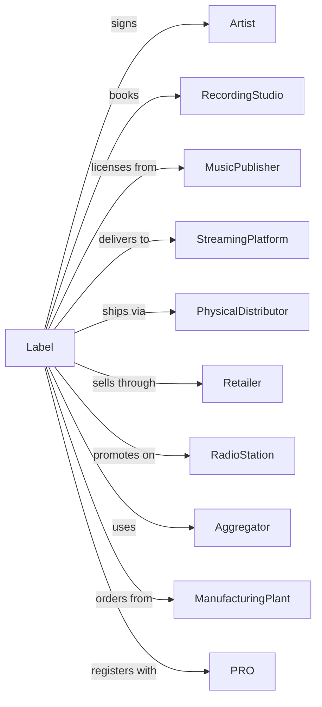

# Record Production and Distribution

> Business-as-Code definition for record label operations. Models the complete release lifecycle from artist signing through streaming and physical distribution.

## Overview

Record production and distribution encompasses signing artists, financing recordings, manufacturing physical media, and distributing music through streaming platforms, retailers, and direct channels. This definition exposes actions for A&R, production, marketing, and distribution, events for tracking releases and revenue, and searches for catalog and sales data.

## Actors

| Actor | Description |
|-------|-------------|
| Artist | Creates and performs recorded music |
| RecordingStudio | Provides facilities for recording sessions |
| MusicPublisher | Licenses compositions for recordings |
| StreamingPlatform | Distributes music digitally to subscribers |
| PhysicalDistributor | Delivers CDs and vinyl to retailers |
| Retailer | Sells physical and digital music to consumers |
| RadioStation | Promotes and plays recordings |
| Aggregator | Delivers releases to multiple digital platforms |
| ManufacturingPlant | Produces physical media |
| PRO | Collects performance royalties |

## Roles

| Role | Description |
|------|-------------|
| LabelExecutive | Oversees artist roster and release strategy |
| AandRManager | Signs artists and oversees recordings |
| ProductManager | Coordinates release campaigns |
| MarketingManager | Plans and executes promotional activities |
| RoyaltyAccountant | Tracks and processes artist payments |
| DigitalDistributionManager | Manages streaming platform relationships |

## Entities

| Entity | Description |
|--------|-------------|
| Artist | Signed performer or band on roster |
| Release | Album, EP, or single being distributed |
| MasterRecording | Owned audio asset from recording |
| Track | Individual song on a release |
| Contract | Agreement defining artist deal terms |
| Royalty | Payment to artists and rights holders |
| Catalog | Collection of owned master recordings |
| Format | Physical or digital distribution medium |
| Territory | Geographic region for release rights |
| Advance | Upfront payment against future royalties |
| Marketing | Promotional activities and materials |

## Actions

| Action | Description |
|--------|-------------|
| signArtist | Contract performer to label roster |
| commissionRecording | Finance and oversee recording sessions |
| acquireMaster | Obtain ownership or license of recording |
| planRelease | Schedule and strategize product launch |
| clearSamples | Obtain permissions for sampled material |
| manufactureMedia | Produce physical CDs or vinyl |
| distributeDigital | Deliver release to streaming platforms |
| distributePhysical | Ship media to retailers and distributors |
| promoteRelease | Execute marketing and publicity campaign |
| pitchRadio | Submit tracks for broadcast consideration |
| trackSales | Monitor streaming and purchase data |
| collectRoyalties | Receive payments from all sources |
| accountToArtist | Calculate and report artist earnings |
| recoupAdvance | Apply earnings against artist advance |

## Events

| Event | Description |
|-------|-------------|
| artistSigned | Performer contracted to label |
| recordingCommissioned | Studio sessions financed and scheduled |
| masterDelivered | Final recording received and approved |
| samplesCleared | All permissions obtained for release |
| releaseScheduled | Launch date confirmed |
| mediaManufactured | Physical product ready for distribution |
| digitalDelivered | Release live on streaming platforms |
| physicalShipped | Media sent to retailers |
| releasePromoted | Marketing campaign launched |
| radioAdded | Track added to station playlist |
| salesReported | Streaming and purchase data received |
| royaltiesCollected | Payments received from sources |
| artistRoyaltiesAccountedFor | Earnings statement sent to artist |
| advanceRecouped | Artist advance fully earned back |

## Searches

| Search | Description |
|--------|-------------|
| getArtists | List signed artists and contract status |
| getReleases | Retrieve releases by artist, date, or status |
| getCatalog | Browse master recordings by genre or era |
| getSales | Access streaming and sales data by release |
| getRoyalties | View earnings by artist, release, or source |
| getSchedule | Check upcoming release calendar |
| getRadioActivity | Monitor airplay and playlist adds |

## Workflow



## Actor Relationships



## Usage

### Calling Actions

```typescript
import { releaseRecords } from '@headlessly/release-records'

const label = releaseRecords()

// Review roster and upcoming releases
const artists = await label.getArtists({ status: 'signed', contractExpiring: '6-months' })
const releases = await label.getReleases({ status: 'upcoming', quarter: 'Q3-2025' })

// Sign new artist
const artist = await label.signArtist({
  name: 'The Midnight Hour',
  type: 'band',
  term: { albums: 3 },
  territory: 'worldwide',
  advance: 250000,
  royaltyRate: 18
})

// Commission album recording
const recording = await label.commissionRecording({
  artistId: artist.id,
  projectType: 'album',
  budget: 150000,
  studioId: 'studio-electric-lady',
  producerId: 'producer-456',
  targetDelivery: '2025-06-01'
})

// Plan and execute release
await label.planRelease({
  masterId: recording.masterId,
  title: 'Electric Dreams',
  releaseDate: '2025-09-15',
  formats: ['streaming', 'vinyl', 'cd'],
  territories: ['worldwide'],
  singles: [
    { trackNumber: 3, releaseDate: '2025-07-15' },
    { trackNumber: 7, releaseDate: '2025-08-15' }
  ]
})
```

### Event-Driven Automation

```typescript
// Auto-distribute when master approved
label.masterDelivered(async ({ masterId, artistId }) => {
  await label.clearSamples({ masterId })

  const release = await label.planRelease({
    masterId,
    artistId,
    releaseWindow: 'Q4-2025'
  })
})

// Auto-account quarterly
label.royaltiesCollected(async ({ period, source }) => {
  const artists = await label.getArtists({ hasEarnings: true })

  for (const artist of artists) {
    const earnings = await label.getRoyalties({
      artistId: artist.id,
      period,
      source
    })

    await label.accountToArtist({
      artistId: artist.id,
      period,
      earnings,
      statement: generateStatement(earnings)
    })
  }
})
```
