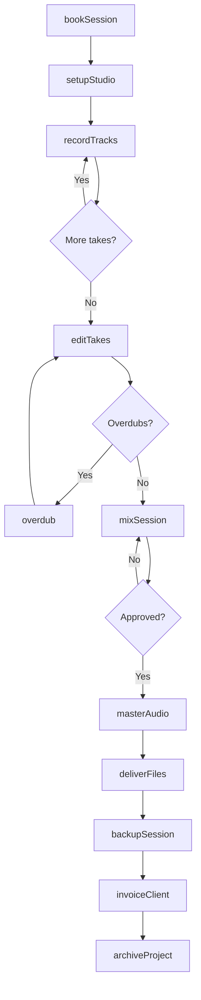
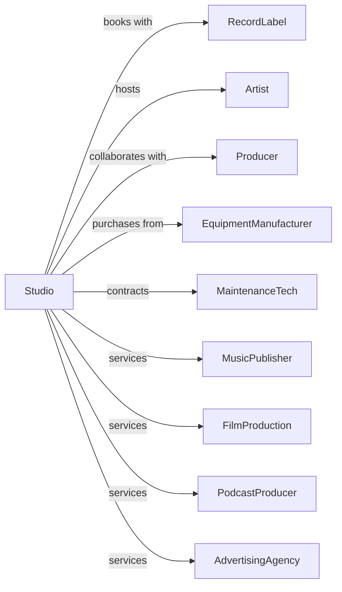

# Sound Recording Studios

> Business-as-Code definition for sound recording studio operations. Models the complete recording process from session booking through master delivery.

## Overview

Sound recording studios provide facilities, equipment, and technical expertise for audio recording, mixing, and mastering. This definition exposes actions for studio operations, session management, and audio production, events for tracking bookings and project milestones, and searches for availability and project data.

## Actors

| Actor | Description |
|-------|-------------|
| RecordLabel | Books sessions for artist recordings |
| Artist | Performs and records in studio |
| Producer | Directs recording sessions creatively |
| EquipmentManufacturer | Supplies microphones, consoles, and outboard gear |
| MaintenanceTech | Services and repairs studio equipment |
| MusicPublisher | Commissions demo and production recordings |
| FilmProduction | Books sessions for soundtracks and scores |
| PodcastProducer | Records spoken word content |
| AdvertisingAgency | Books sessions for commercial audio |

## Roles

| Role | Description |
|------|-------------|
| StudioOwner | Manages facility and business operations |
| RecordingEngineer | Captures and balances sound during sessions |
| MixingEngineer | Blends tracks into final stereo or surround mix |
| MasteringEngineer | Prepares final audio for distribution |
| AssistantEngineer | Supports lead engineer with setup and operation |
| StudioManager | Coordinates bookings and client relations |

## Entities

| Entity | Description |
|--------|-------------|
| Studio | Recording room with acoustic treatment |
| ControlRoom | Space housing mixing console and monitors |
| Session | Booked time for recording or mixing |
| Track | Individual audio channel in recording |
| Mix | Combined audio elements as stereo or surround |
| Master | Final processed audio for release |
| Equipment | Microphones, consoles, and processing gear |
| Project | Client work spanning multiple sessions |
| Rate | Hourly or daily pricing for studio time |
| Booking | Reserved time slot for client session |
| Backup | Archived copies of session files |

## Actions

| Action | Description |
|--------|-------------|
| bookSession | Reserve studio time for client |
| setupStudio | Prepare room and equipment for session |
| recordTracks | Capture audio performances |
| overdub | Add additional tracks to existing recording |
| editTakes | Compile best performances from multiple takes |
| mixSession | Blend tracks into final mix |
| masterAudio | Process mix for distribution formats |
| deliverFiles | Send finished audio to client |
| backupSession | Archive project files and recordings |
| maintainEquipment | Service and calibrate studio gear |
| invoiceClient | Bill for completed sessions |
| archiveProject | Store completed work for future access |
| rentEquipment | Provide gear for external use |

## Events

| Event | Description |
|-------|-------------|
| sessionBooked | Studio time reserved for client |
| setupCompleted | Room and equipment ready for recording |
| trackingCompleted | All performances captured |
| overdubsCompleted | Additional tracks recorded |
| editingCompleted | Best takes compiled |
| mixApproved | Final mix signed off by client |
| masterApproved | Final master accepted |
| filesDelivered | Finished audio sent to client |
| sessionBackedUp | Project files archived |
| equipmentServiced | Maintenance completed |
| invoiceSent | Bill issued to client |
| projectArchived | Work stored for long-term access |

## Searches

| Search | Description |
|--------|-------------|
| getAvailability | Check studio schedule for open time |
| getBookings | List sessions by client, date, or studio |
| getProjects | Retrieve active and completed work |
| getEquipment | List available gear and status |
| getRates | Access pricing by studio and session type |
| getEngineers | Find available staff by specialty |
| getBackups | Locate archived session files |

## Workflow



## Actor Relationships



## Usage

### Calling Actions

```typescript
import { recordSoundRecording } from '@headlessly/record-sound-recording'

const studio = recordSoundRecording()

// Check studio availability and current bookings
const openSlots = await studio.getAvailability({ studioId: 'studio-a', week: '2025-03-15' })
const bookings = await studio.getBookings({ studioId: 'studio-a', status: 'confirmed' })

// Book recording session
const session = await studio.bookSession({
  studioId: 'studio-a',
  clientId: 'atlantic-records',
  projectName: 'New Album Sessions',
  date: '2025-03-15',
  startTime: '10:00',
  duration: 8,
  engineerId: 'eng-smith',
  rate: 'daily'
})

// Setup and record
await studio.setupStudio({
  sessionId: session.id,
  configuration: 'full-band',
  mics: ['u87', 'sm57', 'c414'],
  console: 'ssl-4000'
})

await studio.recordTracks({
  sessionId: session.id,
  tracks: [
    { name: 'drums-overhead-L', input: 1 },
    { name: 'drums-overhead-R', input: 2 },
    { name: 'kick', input: 3 },
    { name: 'snare', input: 4 }
  ],
  sampleRate: 96000,
  bitDepth: 24
})
```

### Event-Driven Automation

```typescript
// Auto-backup after session completes
studio.trackingCompleted(async ({ sessionId, projectId }) => {
  await studio.backupSession({
    sessionId,
    projectId,
    destinations: ['local-raid', 'cloud-archive'],
    verify: true
  })
})

// Auto-invoice after delivery
studio.filesDelivered(async ({ projectId, clientId }) => {
  const sessions = await studio.getBookings({ projectId })
  const total = sessions.reduce((sum, s) => sum + s.cost, 0)

  await studio.invoiceClient({
    clientId,
    projectId,
    amount: total,
    terms: 'net-30'
  })
})
```
