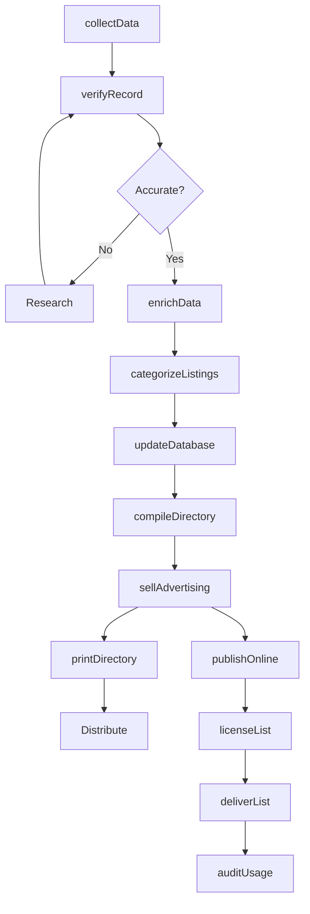
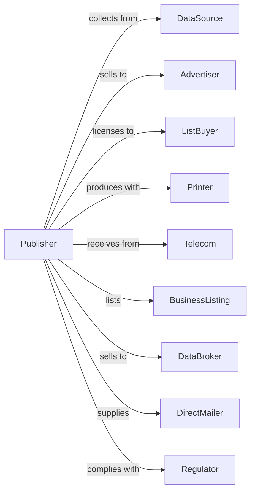

# Directory and Mailing List Publishers

> Business-as-Code definition for directory and mailing list publishing operations. Models the complete data compilation lifecycle from collection through commercial licensing.

## Overview

Directory and mailing list publishers compile, maintain, and distribute business and consumer data products including telephone directories, business listings, and targeted mailing lists. This definition exposes actions for data collection, verification, and licensing, events for tracking publication cycles, and searches for data quality and customer metrics.

## Actors

| Actor | Description |
|-------|-------------|
| DataSource | Provides raw information for compilation |
| Advertiser | Purchases enhanced listings and display ads |
| ListBuyer | Licenses mailing lists for marketing |
| Printer | Produces physical directory volumes |
| Telecom | Provides subscriber information for phone books |
| BusinessListing | Submits company information for inclusion |
| DataBroker | Licenses compiled data for resale |
| DirectMailer | Uses lists for postal marketing campaigns |
| Regulator | Oversees data privacy and opt-out requirements |

## Roles

| Role | Description |
|------|-------------|
| DataManager | Oversees collection and quality processes |
| ResearchAnalyst | Verifies and enriches data records |
| SalesRepresentative | Sells advertising and list licenses |
| ProductionManager | Coordinates directory compilation and printing |
| ComplianceOfficer | Ensures data privacy regulation adherence |
| CustomerService | Handles listing updates and corrections |
| ListBroker | Sources, segments, and licenses mailing list data |

## Entities

| Entity | Description |
|--------|-------------|
| Directory | Published compilation of listings |
| Listing | Individual record in directory |
| MailingList | Targeted subset of records for licensing |
| Record | Data entry with contact information |
| Category | Classification grouping for listings |
| Advertisement | Paid enhanced listing or display |
| License | Permission to use data for specific purpose |
| Suppression | Opt-out request from data subject |
| Territory | Geographic coverage area |
| Edition | Version of directory by date or region |
| Database | Master repository of compiled data |

## Actions

| Action | Description |
|--------|-------------|
| collectData | Gather information from sources |
| verifyRecord | Confirm accuracy of listing data |
| enrichData | Add additional fields to records |
| categorizeListings | Assign records to classification groups |
| updateDatabase | Process changes and corrections |
| compileDirectory | Assemble listings for publication |
| sellAdvertising | Negotiate enhanced listing placements |
| printDirectory | Produce physical volumes |
| publishOnline | Release searchable digital version |
| licenseList | Grant usage rights for mailing data |
| processSuppression | Handle opt-out requests |
| deliverList | Provide licensed data to buyer |
| auditUsage | Verify compliance with license terms |

## Events

| Event | Description |
|-------|-------------|
| dataCollected | Source information received |
| recordVerified | Listing accuracy confirmed |
| dataEnriched | Additional fields added |
| listingsCategorized | Records assigned to groups |
| databaseUpdated | Changes processed |
| directoryCompiled | Publication assembled |
| adSold | Enhanced listing confirmed |
| directoryPrinted | Physical copies produced |
| directoryPublished | Edition released |
| listLicensed | Usage rights granted |
| suppressionProcessed | Opt-out completed |
| listDelivered | Data sent to buyer |
| usageAudited | License compliance verified |

## Searches

| Search | Description |
|--------|-------------|
| searchListings | Find records by name, category, or location |
| getDirectories | List editions by territory or date |
| getLists | Retrieve available mailing lists by criteria |
| getSuppressions | Check opt-out records |
| getAds | Access advertising by client or placement |
| getDataQuality | View accuracy metrics by category |
| getLicenses | Retrieve active data usage agreements |
| getCategories | Browse classification hierarchy |

## Workflow



## Actor Relationships



## Usage

### Calling Actions

```typescript
import { publishDirectories } from '@headlessly/publish-directories'

const directory = publishDirectories()

// Check data quality and active licenses
const dataQuality = await directory.getDataQuality({ category: 'restaurants', territory: 'los-angeles-county' })
const licenses = await directory.getLicenses({ status: 'active', expiresWithin: '90-days' })

// Collect and verify data
const records = await directory.collectData({
  source: 'business-registry',
  territory: 'los-angeles-county',
  categories: ['restaurants', 'retail', 'services']
})

for (const record of records) {
  await directory.verifyRecord({
    recordId: record.id,
    method: 'phone-verification',
    fields: ['phone', 'address', 'hours']
  })
}

// Compile and publish edition
const edition = await directory.compileDirectory({
  territory: 'los-angeles-county',
  year: 2025,
  format: 'business-yellow-pages',
  categories: 'all'
})

await directory.publishOnline({
  editionId: edition.id,
  searchable: true,
  api: true
})

// License mailing list
const license = await directory.licenseList({
  criteria: {
    territory: 'los-angeles-county',
    category: 'restaurants',
    employeeCount: { min: 10 }
  },
  buyer: 'restaurant-supply-co',
  usage: 'direct-mail',
  quantity: 5000,
  price: 0.15
})
```

### Event-Driven Automation

```typescript
// Auto-enrich after verification
directory.recordVerified(async ({ recordId }) => {
  await directory.enrichData({
    recordId,
    sources: ['social-profiles', 'business-credit'],
    fields: ['email', 'website', 'revenue-range']
  })
})

// Process suppression immediately
directory.suppressionProcessed(async ({ recordId, source }) => {
  await directory.updateDatabase({
    recordId,
    status: 'suppressed',
    suppressionSource: source,
    removeFrom: ['all-lists', 'future-editions']
  })
})
```
