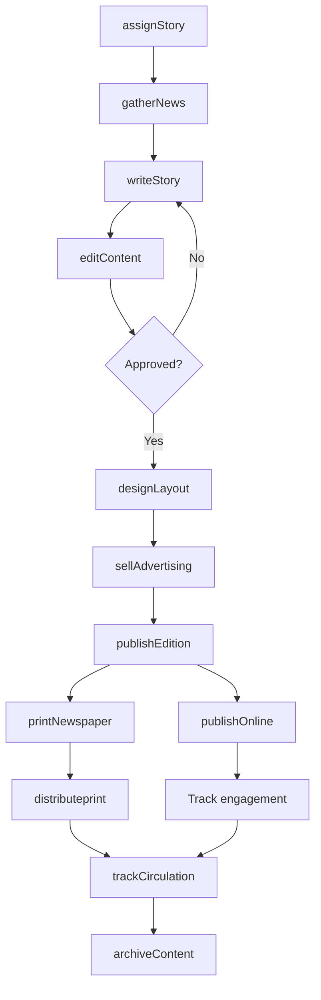
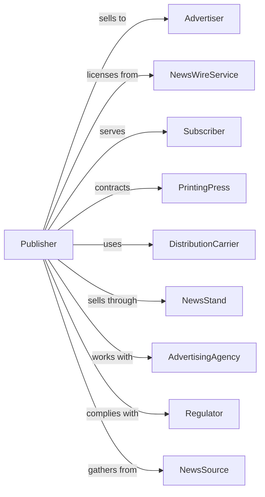

# Newspaper Publishers

> Business-as-Code definition for newspaper publishing operations. Models the complete news cycle from story assignment through print and digital distribution.

## Overview

Newspaper publishers produce and distribute news content through print editions, websites, and mobile applications. This definition exposes actions for editorial workflow, advertising sales, and distribution, events for tracking publication milestones, and searches for content, circulation, and revenue data.

## Actors

| Actor | Description |
|-------|-------------|
| Advertiser | Purchases display and classified advertising |
| NewsWireService | Provides syndicated news content |
| Subscriber | Pays for print or digital access |
| PrintingPress | Produces physical newspaper copies |
| DistributionCarrier | Delivers print editions to homes and retailers |
| NewsStand | Sells single copies to public |
| AdvertisingAgency | Places ads on behalf of clients |
| Regulator | Oversees press freedom and libel standards |
| NewsSource | Provides information for reporting |

## Roles

| Role | Description |
|------|-------------|
| Editor | Oversees content selection and editorial direction |
| Reporter | Investigates and writes news stories |
| Photographer | Captures images for publication |
| CopyEditor | Edits and fact-checks content |
| AdSalesRep | Sells advertising space to clients |
| CirculationManager | Manages subscription and distribution |
| Columnist | Writes regular opinion or specialty columns |

## Entities

| Entity | Description |
|--------|-------------|
| Story | News article for publication |
| Edition | Specific issue of newspaper |
| Section | Categorized part of newspaper (news, sports, etc.) |
| Advertisement | Paid promotional content |
| Subscription | Ongoing reader payment for access |
| Circulation | Number of copies distributed |
| Headline | Title summarizing story content |
| Byline | Author attribution on story |
| Layout | Page design and arrangement |
| Deadline | Time by which content must be submitted |
| Archive | Historical collection of published editions |

## Actions

| Action | Description |
|--------|-------------|
| assignStory | Direct reporter to cover news event |
| gatherNews | Research and interview for story |
| writeStory | Draft article for publication |
| editContent | Review and refine submitted stories |
| designLayout | Arrange content on page or screen |
| sellAdvertising | Negotiate and close ad placements |
| publishEdition | Release newspaper to print or digital |
| printNewspaper | Produce physical copies at press |
| distributeprint | Deliver editions to subscribers and stands |
| publishOnline | Post content to website and apps |
| manageSubscription | Process reader sign-ups and renewals |
| archiveContent | Store published material for future access |
| trackCirculation | Monitor distribution and readership |

## Events

| Event | Description |
|-------|-------------|
| storyAssigned | Reporter directed to cover event |
| storyFiled | Article submitted by deadline |
| storyEdited | Content reviewed and approved |
| layoutCompleted | Page design finalized |
| adSold | Advertising placement confirmed |
| editionPublished | Issue released to audience |
| printRun | Physical copies produced |
| editionDistributed | Copies delivered to readers |
| contentPosted | Article live on website |
| subscriberAdded | New reader enrolled |
| circulationReported | Distribution numbers calculated |
| contentArchived | Material stored for reference |

## Searches

| Search | Description |
|--------|-------------|
| searchStories | Find articles by topic, author, or date |
| getEditions | List issues by date or section |
| getAds | Retrieve advertising by client or placement |
| getSubscribers | Access reader database and status |
| getCirculation | View distribution numbers by area |
| getDeadlines | Check submission times by section |
| getArchive | Browse historical editions and content |
| getRevenue | Track advertising and subscription income |

## Workflow



## Actor Relationships



## Usage

### Calling Actions

```typescript
import { publishNewspapers } from '@headlessly/publish-newspapers'

const paper = publishNewspapers()

// Check deadlines and circulation numbers
const deadlines = await paper.getDeadlines({ section: 'local-news', date: '2025-03-15' })
const circulation = await paper.getCirculation({ area: 'metro', period: '2025-Q1' })

// Assign breaking story
const story = await paper.assignStory({
  reporter: 'reporter-johnson',
  topic: 'city-council-budget',
  deadline: '2025-03-15T17:00:00',
  section: 'local-news',
  priority: 'high'
})

// Process through editorial
await paper.writeStory({
  storyId: story.id,
  headline: 'City Council Approves Record Budget',
  wordCount: 1200,
  photos: ['budget-hearing-001.jpg']
})

await paper.editContent({
  storyId: story.id,
  editorId: 'editor-smith',
  changes: ['headline-revised', 'fact-checked']
})

// Publish to all channels
await paper.publishEdition({
  date: '2025-03-16',
  sections: ['front-page', 'local', 'sports', 'business'],
  featuredStory: story.id,
  printRun: 45000
})
```

### Event-Driven Automation

```typescript
// Auto-post online when story edited
paper.storyEdited(async ({ storyId, section }) => {
  if (section === 'breaking') {
    await paper.publishOnline({
      storyId,
      priority: 'immediate',
      pushNotification: true
    })
  }
})

// Track circulation daily
paper.editionDistributed(async ({ editionId, date }) => {
  const metrics = await paper.getCirculation({ date })

  await paper.trackCirculation({
    editionId,
    totalPrint: metrics.print,
    totalDigital: metrics.digital,
    returnRate: metrics.returns
  })
})
```
