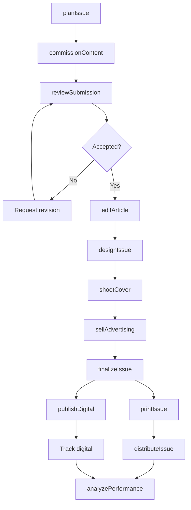
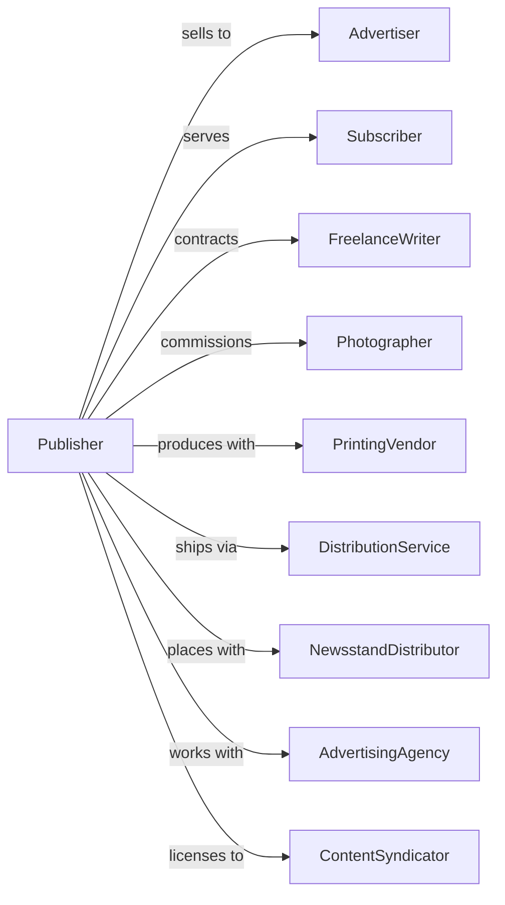

# Periodical Publishers

> Business-as-Code definition for magazine and periodical publishing operations. Models the complete publishing cycle from content planning through subscriber delivery.

## Overview

Periodical publishers produce magazines, journals, and other recurring publications in print and digital formats. This definition exposes actions for editorial planning, production, advertising sales, and subscription management, events for tracking publication milestones, and searches for content and circulation data.

## Actors

| Actor | Description |
|-------|-------------|
| Advertiser | Purchases display advertising in issues |
| Subscriber | Pays for ongoing delivery of publication |
| FreelanceWriter | Contributes articles and features |
| Photographer | Provides images for editorial content |
| PrintingVendor | Produces physical magazine copies |
| DistributionService | Delivers issues to subscribers and retailers |
| NewsstandDistributor | Places copies in retail locations |
| AdvertisingAgency | Represents advertisers for placements |
| ContentSyndicator | Licenses content for republication |

## Roles

| Role | Description |
|------|-------------|
| EditorInChief | Sets editorial vision and approves content |
| ManagingEditor | Coordinates production schedule and staff |
| ArtDirector | Designs visual look and layouts |
| ContributingWriter | Creates feature articles and columns |
| AdDirector | Oversees advertising sales team |
| CirculationDirector | Manages subscriptions and distribution |

## Entities

| Entity | Description |
|--------|-------------|
| Issue | Single edition of the periodical |
| Article | Written content for publication |
| Feature | Long-form editorial piece |
| Column | Recurring authored section |
| Cover | Front page design and image |
| Advertisement | Paid promotional placement |
| Subscription | Reader commitment for multiple issues |
| EditorialCalendar | Planning schedule for future issues |
| MediaKit | Advertising rates and audience data |
| Circulation | Distribution numbers and demographics |
| Archive | Historical issues and content |

## Actions

| Action | Description |
|--------|-------------|
| planIssue | Develop theme and content lineup |
| commissionContent | Assign articles to writers |
| reviewSubmission | Evaluate and accept contributed content |
| editArticle | Refine and fact-check written content |
| designIssue | Create layout and visual presentation |
| shootCover | Produce cover photography or art |
| sellAdvertising | Negotiate ad placements for issue |
| finalizeIssue | Lock content and prepare for production |
| printIssue | Produce physical copies |
| publishDigital | Release electronic version |
| distributeIssue | Ship to subscribers and newsstands |
| manageSubscription | Process orders, renewals, and cancellations |
| analyzePerformance | Track readership and engagement |

## Events

| Event | Description |
|-------|-------------|
| issuePlanned | Content lineup established |
| contentCommissioned | Article assigned to writer |
| submissionReceived | Contributed content delivered |
| articleEdited | Content approved for publication |
| layoutCompleted | Issue design finalized |
| coverApproved | Front page design signed off |
| adsSold | Advertising placements confirmed |
| issueFinalized | Content locked for production |
| issuePrinted | Physical copies produced |
| digitalPublished | Electronic version released |
| issueDistributed | Copies delivered to readers |
| subscriptionProcessed | Reader order handled |
| performanceAnalyzed | Engagement metrics calculated |

## Searches

| Search | Description |
|--------|-------------|
| getIssues | List editions by date or theme |
| searchArticles | Find content by topic, author, or keyword |
| getSubscribers | Access reader database and status |
| getAds | Retrieve advertising by client or issue |
| getCalendar | View editorial planning schedule |
| getCirculation | Check distribution numbers and trends |
| getArchive | Browse historical issues |
| getMediaKit | Access advertising rates and demographics |

## Workflow



## Actor Relationships



## Usage

### Calling Actions

```typescript
import { publishPeriodicals } from '@headlessly/publish-periodicals'

const magazine = publishPeriodicals()

// Plan upcoming issue
const issue = await magazine.planIssue({
  issueNumber: 'vol-45-issue-6',
  theme: 'Summer Travel',
  publishDate: '2025-06-01',
  pageCount: 120,
  coverStory: 'Hidden European Destinations'
})

// Commission feature content
await magazine.commissionContent({
  issueId: issue.id,
  type: 'feature',
  title: 'The Rise of Slow Travel',
  writerId: 'writer-chen',
  wordCount: 3500,
  deadline: '2025-04-15',
  fee: 2500
})

// Sell advertising
await magazine.sellAdvertising({
  issueId: issue.id,
  advertiserId: 'travel-co',
  placement: 'inside-front-cover',
  size: 'full-page',
  rate: 45000
})
```

### Event-Driven Automation

```typescript
// Auto-publish digital when issue finalized
magazine.issueFinalized(async ({ issueId }) => {
  await magazine.publishDigital({
    issueId,
    platforms: ['app', 'web', 'kindle'],
    notifySubscribers: true
  })
})

// Track performance after distribution
magazine.issueDistributed(async ({ issueId, printRun }) => {
  setTimeout(async () => {
    const sales = await magazine.getCirculation({ issueId })

    await magazine.analyzePerformance({
      issueId,
      printSales: sales.print,
      digitalDownloads: sales.digital,
      newsstandSellThrough: sales.sellThrough
    })
  }, 30 * 24 * 60 * 60 * 1000) // 30 days
})
```
