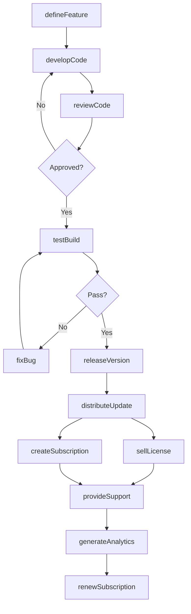
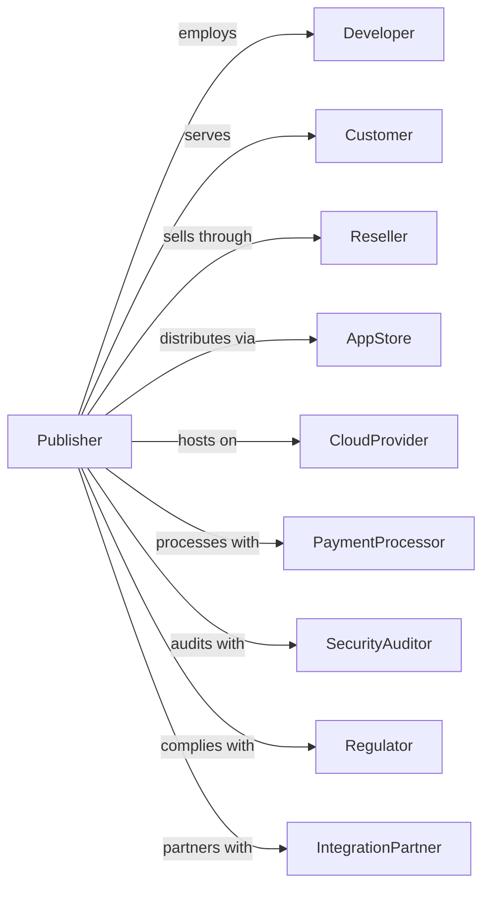

# Software Publishers

> Business-as-Code definition for software publishing operations. Models the complete product lifecycle from development through distribution and subscription management.

## Overview

Software publishers design, develop, and distribute computer software products through downloads, subscriptions, and physical media. This definition exposes actions for product development, release management, and customer lifecycle, events for tracking development milestones and usage, and searches for product, customer, and revenue data.

## Actors

| Actor | Description |
|-------|-------------|
| Developer | Builds software features and fixes |
| Customer | Licenses and uses software products |
| Reseller | Distributes software to end users |
| AppStore | Hosts software for download and purchase |
| CloudProvider | Hosts SaaS infrastructure |
| PaymentProcessor | Handles subscription and purchase transactions |
| SecurityAuditor | Verifies software security compliance |
| Regulator | Oversees software licensing and data practices |
| IntegrationPartner | Builds complementary products or integrations |

## Roles

| Role | Description |
|------|-------------|
| ProductManager | Defines features and roadmap priorities |
| EngineeringLead | Oversees development team and architecture |
| QualityAssurance | Tests software for bugs and regressions |
| DevOpsEngineer | Manages deployment and infrastructure |
| CustomerSuccess | Supports users and drives adoption |
| SalesRepresentative | Sells licenses and subscriptions |
| ReleaseManager | Coordinates software builds, versioning, and deployment schedules |

## Entities

| Entity | Description |
|--------|-------------|
| Product | Software application being published |
| Version | Specific release of software |
| License | Permission to use software under terms |
| Subscription | Recurring access to software |
| Feature | Capability within software product |
| Bug | Defect requiring fix |
| Release | Published version for distribution |
| Customer | Purchaser or subscriber of software |
| Deployment | Instance of software running |
| Documentation | User guides and technical references |
| Revenue | Income from licenses and subscriptions |

## Actions

| Action | Description |
|--------|-------------|
| defineFeature | Specify requirements for new capability |
| developCode | Write and test software implementation |
| reviewCode | Evaluate changes for quality and security |
| testBuild | Verify software functions correctly |
| fixBug | Resolve defect in software |
| releaseVersion | Publish new version for distribution |
| distributeUpdate | Push updates to existing installations |
| sellLicense | Process perpetual license purchase |
| createSubscription | Enroll customer in recurring access |
| renewSubscription | Process subscription continuation |
| cancelSubscription | End customer subscription |
| provideSupport | Assist customers with issues |
| generateAnalytics | Report usage and performance metrics |

## Events

| Event | Description |
|-------|-------------|
| featureDefined | Requirements approved for development |
| codeCommitted | Changes submitted to repository |
| codeReviewed | Changes approved for merge |
| buildTested | Quality verification completed |
| bugFixed | Defect resolution verified |
| versionReleased | New version available |
| updateDistributed | Patch pushed to customers |
| licenseSold | Perpetual license purchased |
| subscriptionCreated | Customer enrolled |
| subscriptionRenewed | Continuation processed |
| subscriptionCanceled | Customer access ended |
| supportProvided | Issue resolution delivered |
| analyticsGenerated | Usage report produced |

## Searches

| Search | Description |
|--------|-------------|
| getProducts | List software products and versions |
| getCustomers | Access customer accounts and status |
| getSubscriptions | Retrieve active subscriptions |
| getRevenue | View income by product, channel, or period |
| getBugs | List defects by severity or status |
| getReleases | Check version history and roadmap |
| getUsage | Access product analytics and metrics |
| getSupport | View support tickets and resolution |

## Workflow



## Actor Relationships



## Usage

### Calling Actions

```typescript
import { publishSoftware } from '@headlessly/publish-software'

const publisher = publishSoftware()

// Define new feature
const feature = await publisher.defineFeature({
  productId: 'prod-analytics',
  name: 'Real-time Dashboard',
  description: 'Live updating metrics visualization',
  priority: 'high',
  targetVersion: '3.0.0',
  estimate: { weeks: 6 }
})

// Release new version
const release = await publisher.releaseVersion({
  productId: 'prod-analytics',
  version: '3.0.0',
  features: [feature.id],
  bugFixes: ['bug-123', 'bug-456'],
  channels: ['app-store', 'direct-download', 'enterprise']
})

// Create subscription
const subscription = await publisher.createSubscription({
  customerId: 'cust-acme',
  productId: 'prod-analytics',
  plan: 'enterprise',
  seats: 50,
  term: 'annual',
  price: 50000
})
```

### Event-Driven Automation

```typescript
// Auto-distribute when version released
publisher.versionReleased(async ({ productId, version }) => {
  const customers = await publisher.getCustomers({
    productId,
    updateEnabled: true
  })

  await publisher.distributeUpdate({
    productId,
    version,
    customers: customers.map(c => c.id),
    rollout: 'staged'
  })
})

// Auto-renew expiring subscriptions
publisher.subscriptionCreated(async ({ subscriptionId, expiresAt }) => {
  const renewalDate = addDays(expiresAt, -30)

  schedule(renewalDate, async () => {
    await publisher.renewSubscription({
      subscriptionId,
      notifyCustomer: true,
      autoCharge: true
    })
  })
})
```
