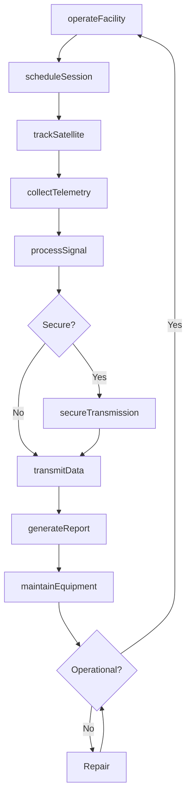
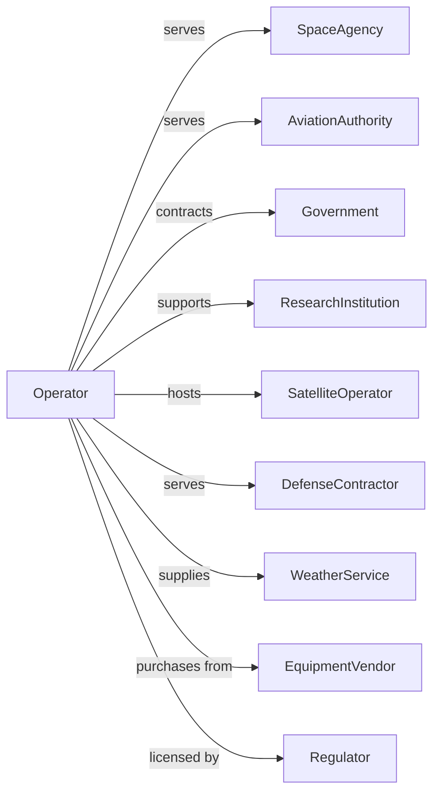

# All Other Telecommunications

> Business-as-Code definition for specialized telecommunications services. Models operations for telemetry, radar, satellite terminals, and other specialized communications.

## Overview

All other telecommunications encompasses specialized services including satellite tracking, communications telemetry, radar station operation, and satellite terminal facilities. This definition exposes actions for equipment operation, data transmission, and facility management, events for tracking service delivery, and searches for facility, customer, and usage data.

## Actors

| Actor | Description |
|-------|-------------|
| SpaceAgency | Contracts for satellite tracking services |
| AviationAuthority | Uses radar and communications services |
| Government | Requires secure telemetry services |
| ResearchInstitution | Contracts for data collection |
| SatelliteOperator | Uses ground terminal services |
| DefenseContractor | Requires specialized communications |
| WeatherService | Collects atmospheric telemetry |
| EquipmentVendor | Supplies specialized systems |
| Regulator | Licenses spectrum and facilities |

## Roles

| Role | Description |
|------|-------------|
| StationOperator | Manages facility operations |
| TelemetryEngineer | Processes and analyzes signal data |
| RadarTechnician | Operates and maintains radar systems |
| NetworkAdministrator | Manages data transmission systems |
| SecurityOfficer | Ensures classified operations compliance |
| MaintenanceTechnician | Services equipment and facilities |

## Entities

| Entity | Description |
|--------|-------------|
| Facility | Ground station or specialized site |
| Antenna | Signal reception or transmission equipment |
| Telemetry | Data transmitted from remote source |
| RadarSystem | Detection and tracking equipment |
| Terminal | Satellite communication endpoint |
| DataFeed | Continuous information stream |
| Spectrum | Radio frequency allocation |
| Track | Object position and trajectory data |
| Session | Active communication period |
| Equipment | Specialized systems and hardware |
| Contract | Service agreement with customer |

## Actions

| Action | Description |
|--------|-------------|
| operateFacility | Manage station daily operations |
| trackSatellite | Monitor spacecraft position and signals |
| collectTelemetry | Receive and process remote data |
| operateRadar | Run detection and tracking systems |
| transmitData | Send information to customer systems |
| processSignal | Analyze and format received data |
| maintainEquipment | Service and calibrate systems |
| provisionTerminal | Enable customer communication link |
| secureTransmission | Encrypt and protect data |
| scheduleSession | Reserve facility time for customer |
| generateReport | Produce data analysis documentation |
| coordinateFrequency | Manage spectrum assignments |

## Events

| Event | Description |
|-------|-------------|
| facilityBecameOperational | Station ready for service |
| satelliteTracked | Spacecraft position confirmed |
| telemetryCollected | Remote data received |
| radarBecameOperational | Detection system active |
| dataTransmitted | Information sent to customer |
| signalProcessed | Data analysis completed |
| equipmentMaintained | Service completed |
| terminalProvisioned | Customer link established |
| transmissionSecured | Encryption applied |
| sessionScheduled | Facility time reserved |
| reportGenerated | Analysis documentation created |
| frequencyCoordinated | Spectrum assignment confirmed |

## Searches

| Search | Description |
|--------|-------------|
| getFacilities | List stations and status |
| getSessions | Retrieve scheduled and completed sessions |
| getTelemetry | Access collected data by source |
| getRadarTracks | View detection and tracking data |
| getContracts | Retrieve active service agreements |
| getEquipment | Check system status and maintenance |
| getFrequencies | View spectrum allocations |
| getReports | Access analysis documentation |

## Workflow



## Actor Relationships



## Usage

### Calling Actions

```typescript
import { connectTelecommunications } from '@headlessly/connect-telecommunications'

const facility = connectTelecommunications()

// Review scheduled sessions and facility status
const sessions = await facility.getSessions({ date: '2025-03-15', facilityId: 'station-goldstone' })
const equipment = await facility.getEquipment({ facilityId: 'station-goldstone', status: 'operational' })

// Schedule tracking session
const session = await facility.scheduleSession({
  facilityId: 'station-goldstone',
  customerId: 'nasa-jpl',
  satellite: 'voyager-1',
  startTime: '2025-03-15T08:00:00Z',
  duration: 8, // hours
  services: ['telemetry', 'tracking', 'command']
})

// Collect and process telemetry
const telemetry = await facility.collectTelemetry({
  sessionId: session.id,
  dataTypes: ['health', 'science', 'navigation'],
  format: 'ccsds'
})

await facility.processSignal({
  telemetryId: telemetry.id,
  analysis: ['frame-sync', 'error-correction', 'decompression'],
  output: 'level-0-data'
})

// Transmit to customer
await facility.transmitData({
  sessionId: session.id,
  destination: 'jpl-mission-control',
  protocol: 'cfdp',
  encryption: 'aes-256'
})
```

### Event-Driven Automation

```typescript
// Auto-report after session
facility.telemetryCollected(async ({ sessionId, satelliteId }) => {
  const data = await facility.getTelemetry({ sessionId })

  await facility.generateReport({
    sessionId,
    satelliteId,
    dataVolume: data.size,
    quality: data.errorRate,
    anomalies: data.anomalies
  })
})

// Auto-coordinate interference
facility.radarBecameOperational(async ({ facilityId, frequency }) => {
  await facility.coordinateFrequency({
    facilityId,
    frequency,
    neighbors: getNearbyFacilities(facilityId),
    avoidConflicts: true
  })
})
```
