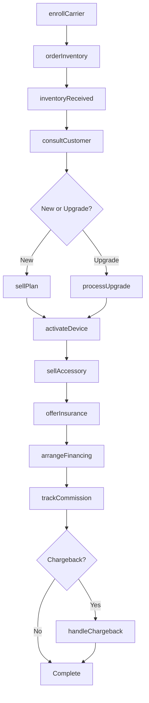
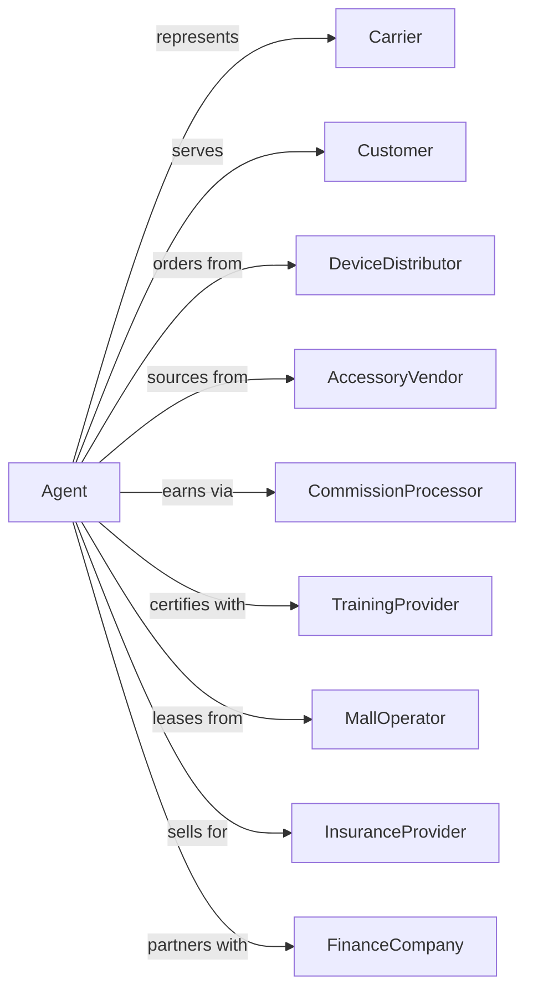

# Agents for Wireless Telecommunications Services

> Business-as-Code definition for wireless agent and dealer operations. Models the complete retail sales cycle from carrier partnership through commission collection.

## Overview

Wireless telecommunications agents operate retail locations selling carrier service plans on a commission basis, along with devices and accessories. This definition exposes actions for sales, activations, and commission management, events for tracking transactions and performance, and searches for inventory, sales, and earnings data.

## Actors

| Actor | Description |
|-------|-------------|
| Carrier | Provides wireless service plans for sale |
| Customer | Purchases devices and service plans |
| DeviceDistributor | Supplies smartphones and accessories |
| AccessoryVendor | Provides cases, chargers, and add-ons |
| CommissionProcessor | Calculates and pays agent earnings |
| TrainingProvider | Certifies staff on products and systems |
| MallOperator | Leases retail space |
| InsuranceProvider | Offers device protection plans |
| FinanceCompany | Provides device payment plans |

## Roles

| Role | Description |
|------|-------------|
| StoreManager | Oversees retail location operations |
| SalesAssociate | Sells plans and devices to customers |
| InventoryManager | Manages device and accessory stock |
| Trainer | Educates staff on products and processes |
| ComplianceOfficer | Ensures carrier policy adherence |
| ActivationSpecialist | Provisions devices and transfers service for customers |

## Entities

| Entity | Description |
|--------|-------------|
| Store | Retail location selling wireless services |
| Device | Smartphone or connected equipment for sale |
| Plan | Carrier service package |
| Accessory | Cases, chargers, and add-on products |
| Activation | New service enrollment transaction |
| Upgrade | Existing customer device replacement |
| Commission | Agent earnings from sale |
| Quota | Sales target for performance |
| Chargeback | Commission reversal for cancellation |
| Inventory | Stock of devices and accessories |
| Agreement | Contract with carrier defining terms |

## Actions

| Action | Description |
|--------|-------------|
| enrollCarrier | Sign agreement to represent carrier |
| orderInventory | Stock devices and accessories |
| consultCustomer | Assess needs and recommend solutions |
| sellPlan | Enroll customer in carrier service |
| activateDevice | Register phone and enable service |
| processUpgrade | Replace existing customer device |
| sellAccessory | Add cases, chargers, or protection |
| offerInsurance | Present device protection options |
| arrangeFinancing | Set up device payment plan |
| trackCommission | Monitor earnings from sales |
| handleChargeback | Process commission reversal |
| trainStaff | Educate associates on products |

## Events

| Event | Description |
|-------|-------------|
| carrierEnrolled | Agent agreement activated |
| inventoryOrdered | Stock purchase submitted |
| inventoryReceived | Devices arrived at store |
| customerConsulted | Needs assessment completed |
| planSold | Customer enrolled in service |
| deviceActivated | Phone registered on network |
| upgradeProcessed | Device replacement completed |
| accessorySold | Add-on item purchased |
| insuranceSold | Protection plan added |
| financingArranged | Payment plan established |
| commissionEarned | Sale earnings recorded |
| chargebackReceived | Commission reversal processed |
| staffTrained | Associate certification completed |

## Searches

| Search | Description |
|--------|-------------|
| getSales | List transactions by store, associate, or date |
| getInventory | Check device and accessory stock |
| getCommissions | Retrieve earnings by period or sale |
| getChargebacks | View reversals and reasons |
| getQuotas | Access sales targets and progress |
| getCarriers | List represented carriers and terms |
| getCustomers | Access customer activation history |
| getPerformance | View associate and store metrics |

## Workflow



## Actor Relationships



## Usage

### Calling Actions

```typescript
import { sellWirelessPlans } from '@headlessly/sell-wireless-plans'

const agent = sellWirelessPlans()

// Consult customer and recommend
const consultation = await agent.consultCustomer({
  storeId: 'store-mall-central',
  customerName: 'Jane Doe',
  currentCarrier: 'competitor',
  needsAssessment: {
    usage: 'heavy-data',
    budget: 100,
    deviceInterest: 'latest-iphone'
  }
})

// Sell plan and activate
const sale = await agent.sellPlan({
  customerId: consultation.customerId,
  carrierId: 'verizon',
  plan: 'unlimited-plus',
  associateId: 'assoc-smith'
})

await agent.activateDevice({
  saleId: sale.id,
  deviceIMEI: '987654321098765',
  deviceModel: 'iphone-15-pro',
  tradeIn: {
    deviceIMEI: '123456789012345',
    value: 350
  }
})

// Add accessories and protection
await agent.sellAccessory({
  saleId: sale.id,
  items: [
    { sku: 'case-clear-15pro', price: 49.99 },
    { sku: 'charger-magsafe', price: 39.99 }
  ]
})

await agent.offerInsurance({
  saleId: sale.id,
  plan: 'total-protection',
  monthly: 17.99
})
```

### Event-Driven Automation

```typescript
// Track commission on sale
agent.planSold(async ({ saleId, plan, carrierId }) => {
  const commission = calculateCommission(plan, carrierId)

  await agent.trackCommission({
    saleId,
    amount: commission,
    type: 'activation',
    payoutDate: getNextPayPeriod()
  })
})

// Alert on chargeback
agent.chargebackReceived(async ({ saleId, amount, reason }) => {
  const sale = await agent.getSales({ saleId })

  await notifyManager({
    store: sale.storeId,
    associate: sale.associateId,
    amount,
    reason,
    originalDate: sale.date
  })
})
```
