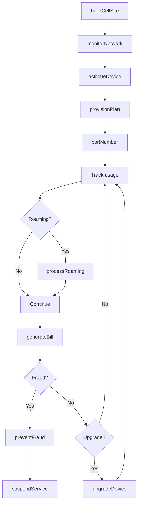
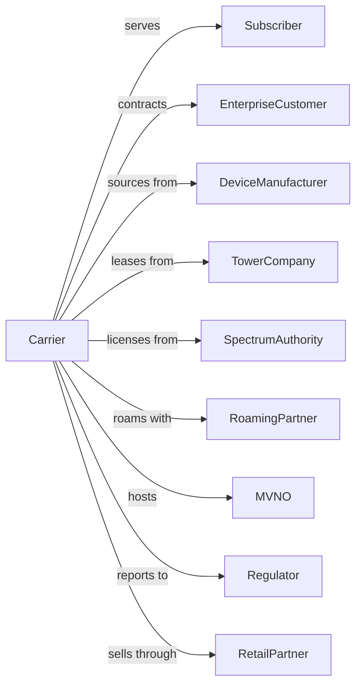

# Wireless Telecommunications Carriers (except Satellite)

> Business-as-Code definition for wireless telecommunications carrier operations. Models the complete mobile service lifecycle from spectrum management through subscriber service.

## Overview

Wireless telecommunications carriers operate cellular networks providing voice, data, and messaging services over licensed radio spectrum. This definition exposes actions for network operations, subscriber management, and device activation, events for tracking network performance and customer lifecycle, and searches for coverage, subscriber, and usage data.

## Actors

| Actor | Description |
|-------|-------------|
| Subscriber | Purchases mobile service plans |
| EnterpriseCustomer | Contracts for business mobile services |
| DeviceManufacturer | Supplies smartphones and connected devices |
| TowerCompany | Owns and leases cell tower infrastructure |
| SpectrumAuthority | Licenses radio frequency bands |
| RoamingPartner | Provides coverage in other regions |
| MVNO | Resells network capacity to end users |
| Regulator | Oversees wireless practices and safety |
| RetailPartner | Sells devices and plans on behalf of carrier |

## Roles

| Role | Description |
|------|-------------|
| RFEngineer | Optimizes radio frequency coverage |
| NetworkOperator | Monitors and maintains wireless infrastructure |
| RetailSalesRep | Sells devices and plans in stores |
| CustomerCare | Assists subscribers with service issues |
| FraudAnalyst | Detects and prevents service abuse |
| ChurnManager | Retains at-risk subscribers |

## Entities

| Entity | Description |
|--------|-------------|
| Network | Wireless infrastructure and coverage |
| CellSite | Tower location with radio equipment |
| Spectrum | Licensed radio frequency band |
| Subscriber | Customer with active service |
| Device | Smartphone or connected equipment |
| Plan | Service package with features and pricing |
| Usage | Voice minutes, data, and messages consumed |
| SIM | Subscriber identity module |
| Roaming | Service outside home network |
| Bill | Invoice for services rendered |
| IMEI | Unique device identifier |

## Actions

| Action | Description |
|--------|-------------|
| buildCellSite | Deploy tower and radio equipment |
| activateDevice | Register device on network |
| provisionPlan | Assign service package to subscriber |
| portNumber | Transfer phone number from other carrier |
| monitorNetwork | Track coverage and performance |
| manageCongestion | Balance traffic across cell sites |
| processRoaming | Handle service on partner networks |
| generateBill | Create invoice for services |
| upgradeDevice | Replace subscriber device |
| suspendService | Temporarily disable service |
| disconnectService | Terminate subscriber account |
| preventFraud | Detect and block suspicious activity |

## Events

| Event | Description |
|-------|-------------|
| cellSiteDeployed | Tower and equipment operational |
| deviceActivated | Phone registered on network |
| planProvisioned | Service package assigned |
| numberPorted | Transfer from other carrier completed |
| congestionDetected | Network capacity strained |
| roamingStarted | Subscriber using partner network |
| roamingEnded | Subscriber returned to home network |
| billGenerated | Invoice created |
| deviceUpgraded | New phone activated |
| serviceSuspended | Account temporarily disabled |
| serviceDisconnected | Account terminated |
| fraudPrevented | Suspicious activity blocked |

## Searches

| Search | Description |
|--------|-------------|
| getSubscribers | List customer accounts and plans |
| getCoverage | Check network reach by location |
| getCellSites | Access tower locations and status |
| getUsage | Retrieve consumption by subscriber |
| getDevices | List activated equipment |
| getBilling | View invoices and payment status |
| getRoaming | Monitor partner network usage |
| getChurn | Identify at-risk subscribers |

## Workflow



## Actor Relationships



## Usage

### Calling Actions

```typescript
import { connectWirelessTelecommunications } from '@headlessly/connect-wireless-telecommunications'

const carrier = connectWirelessTelecommunications()

// Check coverage and churn risk for area
const coverage = await carrier.getCoverage({ location: { lat: 40.7128, lon: -74.0060 }, technology: '5g' })
const churn = await carrier.getChurn({ segment: 'consumer', riskAbove: 0.7 })

// Activate new subscriber
const subscriber = await carrier.activateDevice({
  deviceIMEI: '123456789012345',
  deviceType: 'iphone-15',
  simId: 'sim-abc123',
  customerId: 'cust-67890'
})

await carrier.provisionPlan({
  subscriberId: subscriber.id,
  plan: 'unlimited-premium',
  features: ['5g', 'international-roaming', 'hotspot-50gb'],
  monthlyRate: 85.00
})

// Port existing number
await carrier.portNumber({
  subscriberId: subscriber.id,
  portingNumber: '555-123-4567',
  previousCarrier: 'competitor-wireless',
  accountNumber: 'acct-98765',
  pin: '1234'
})
```

### Event-Driven Automation

```typescript
// Auto-manage congestion
carrier.congestionDetected(async ({ cellSiteId, utilization }) => {
  if (utilization > 90) {
    await carrier.manageCongestion({
      cellSiteId,
      strategy: 'load-balancing',
      redirectTo: getNearestCells(cellSiteId)
    })
  }
})

// Proactive churn prevention
carrier.billGenerated(async ({ subscriberId, tenure }) => {
  const churnRisk = await carrier.getChurn({ subscriberId })

  if (churnRisk.score > 0.7 && tenure > 12) {
    await sendRetentionOffer({
      subscriberId,
      offer: 'loyalty-discount-20'
    })
  }
})
```
