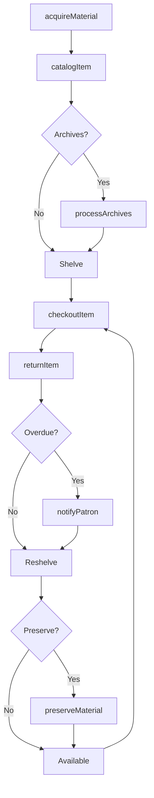
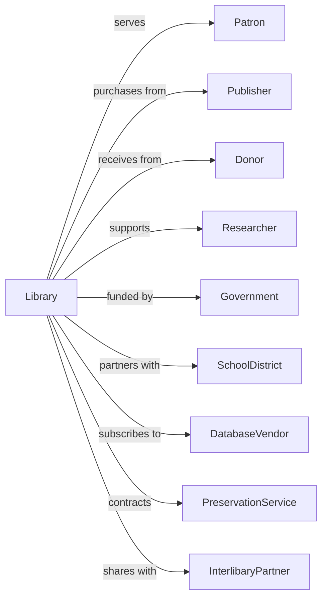

# Libraries and Archives

> Business-as-Code definition for library and archive operations. Models the complete collection lifecycle from acquisition through patron access and preservation.

## Overview

Libraries and archives maintain collections of documents, books, media, and records while facilitating access for research, education, and public use. This definition exposes actions for collection management, patron services, and preservation, events for tracking circulation and access, and searches for catalog, patron, and collection data.

## Actors

| Actor | Description |
|-------|-------------|
| Patron | Accesses and borrows materials |
| Publisher | Supplies books and media |
| Donor | Contributes materials or funding |
| Researcher | Conducts academic inquiry using collections |
| Government | Funds public library operations |
| SchoolDistrict | Partners for student services |
| DatabaseVendor | Provides electronic resource access |
| PreservationService | Treats and conserves materials |
| InterlibaryPartner | Shares materials between institutions |

## Roles

| Role | Description |
|------|-------------|
| Librarian | Manages collections and assists patrons |
| Archivist | Processes and preserves historical records |
| CirculationClerk | Handles checkout and returns |
| ReferenceSpecialist | Assists with research inquiries |
| CatalogingSpecialist | Creates metadata records |
| PreservationOfficer | Oversees conservation activities |

## Entities

| Entity | Description |
|--------|-------------|
| Item | Book, document, or media in collection |
| Collection | Group of related materials |
| Patron | Registered user of services |
| Loan | Temporary borrowing of item |
| Hold | Request for unavailable item |
| Catalog | Searchable database of holdings |
| Record | Archival document or file |
| Finding Aid | Guide to archival collection |
| Program | Educational or community event |
| Database | Licensed electronic resource |
| Preservation | Conservation treatment |

## Actions

| Action | Description |
|--------|-------------|
| acquireMaterial | Add new items to collection |
| catalogItem | Create metadata record for item |
| processArchives | Arrange and describe records |
| checkoutItem | Loan material to patron |
| returnItem | Accept material back from patron |
| placeHold | Reserve unavailable item |
| fulfillHold | Notify patron of available hold |
| answerReference | Assist with research inquiry |
| hostProgram | Conduct educational event |
| preserveMaterial | Apply conservation treatment |
| digitizeItem | Create digital copy |
| requestInterlibrary | Borrow from partner institution |
| deaccessionItem | Remove from collection |

## Events

| Event | Description |
|-------|-------------|
| materialAcquired | Item added to collection |
| itemCataloged | Metadata record created |
| archivesProcessed | Records arranged and described |
| itemCheckedOut | Material loaned |
| itemReturned | Material accepted back |
| holdPlaced | Reservation created |
| holdFulfilled | Patron notified |
| referenceAnswered | Inquiry resolved |
| programHosted | Event concluded |
| materialPreserved | Treatment completed |
| itemDigitized | Digital copy created |
| interlibrarySent | Item sent to partner |
| interlibraryReceived | Item received from partner |
| itemDeaccessioned | Material removed |

## Searches

| Search | Description |
|--------|-------------|
| searchCatalog | Find items by title, author, or subject |
| getPatrons | Access user accounts and history |
| getCirculation | View loans by item or patron |
| getHolds | Check pending reservations |
| getCollections | Browse holdings by type or subject |
| getFindingAids | Access archival guides |
| getPrograms | List upcoming events |
| getOverdues | Identify late returns |

## Workflow



## Actor Relationships



## Usage

### Calling Actions

```typescript
import { searchLibrariesArchives } from '@headlessly/search-libraries-archives'

const library = searchLibrariesArchives()

// Acquire new materials
const item = await library.acquireMaterial({
  type: 'book',
  title: 'The Information: A History, A Theory, A Flood',
  author: 'James Gleick',
  isbn: '978-0375423727',
  source: 'baker-taylor',
  copies: 3,
  fundCode: 'general-collection'
})

// Catalog and process
await library.catalogItem({
  itemId: item.id,
  subjects: ['Information science', 'History', 'Technology'],
  dewey: '003.54',
  location: 'main-stacks'
})

// Checkout to patron
const loan = await library.checkoutItem({
  itemId: item.id,
  patronId: 'patron-12345',
  dueDate: addDays(new Date(), 21),
  renewable: true
})

// Process archival collection
await library.processArchives({
  collectionId: 'coll-local-business',
  boxes: 45,
  dateRange: { start: 1920, end: 1985 },
  creator: 'Smith Manufacturing Co.',
  subjects: ['Industry', 'Local history', 'Labor']
})
```

### Event-Driven Automation

```typescript
// Auto-notify on hold available
library.itemReturned(async ({ itemId }) => {
  const holds = await library.getHolds({ itemId })

  if (holds.length > 0) {
    await library.fulfillHold({
      holdId: holds[0].id,
      itemId,
      notifyPatron: true,
      pickupDeadline: addDays(new Date(), 7)
    })
  }
})

// Auto-flag for preservation
library.itemReturned(async ({ itemId, condition }) => {
  if (condition.damaged || condition.deteriorating) {
    await library.preserveMaterial({
      itemId,
      priority: condition.severity,
      treatments: ['cleaning', 'rebinding']
    })
  }
})
```
