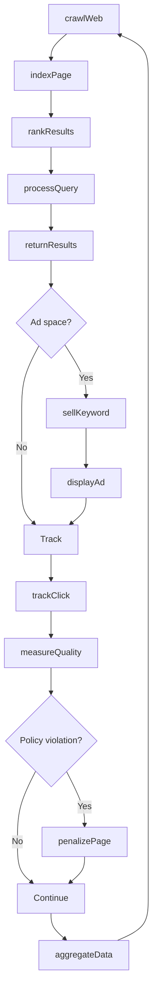
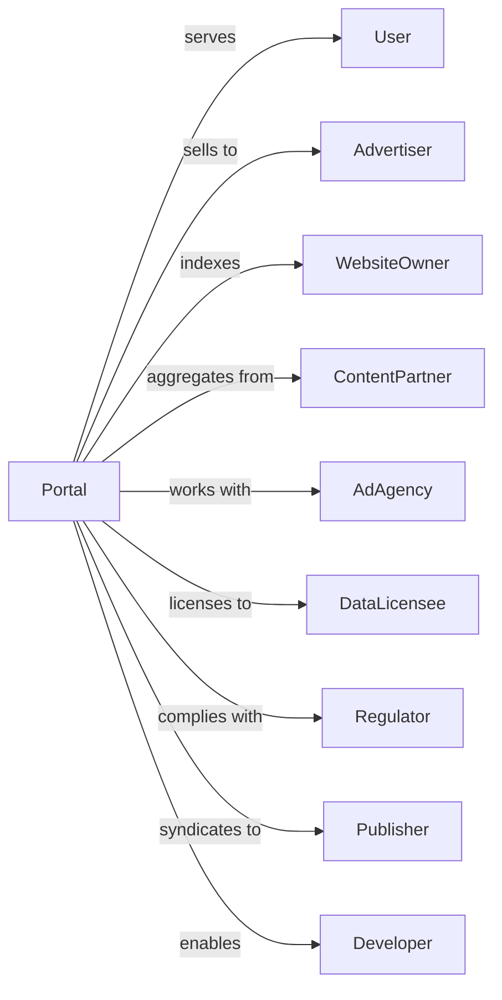

# Web Search Portals and All Other Information Services

> Business-as-Code definition for web search portal and information service operations. Models the complete search lifecycle from web crawling through query results and advertising.

## Overview

Web search portals operate websites using search engines to index internet content and provide searchable databases, often complemented by advertising, email, and other services. This definition exposes actions for crawling, indexing, and query processing, events for tracking search activity and revenue, and searches for index, user, and advertising data.

## Actors

| Actor | Description |
|-------|-------------|
| User | Submits search queries and consumes results |
| Advertiser | Purchases sponsored search placements |
| WebsiteOwner | Seeks indexing and ranking for pages |
| ContentPartner | Provides news, weather, or other content |
| AdAgency | Manages advertising campaigns |
| DataLicensee | Purchases aggregated search data |
| Regulator | Oversees privacy and competition |
| Publisher | Syndicates portal content |
| Developer | Builds applications using search APIs |

## Roles

| Role | Description |
|------|-------------|
| SearchEngineer | Develops ranking algorithms |
| CrawlOperator | Manages web indexing infrastructure |
| ProductManager | Oversees search features and experience |
| AdSalesManager | Sells advertising inventory |
| TrustSafetyManager | Enforces content policies |
| DataScientist | Analyzes search patterns and behavior |

## Entities

| Entity | Description |
|--------|-------------|
| Index | Database of crawled web content |
| Query | User search request |
| Result | Ranked list of relevant pages |
| Crawl | Process of discovering and indexing pages |
| Page | Indexed web document |
| Ranking | Algorithm-determined relevance score |
| Advertisement | Sponsored search placement |
| Keyword | Advertising trigger term |
| Click | User selection of result or ad |
| Impression | Display of result or ad |
| Revenue | Income from advertising |

## Actions

| Action | Description |
|--------|-------------|
| crawlWeb | Discover and fetch web pages |
| indexPage | Add page content to searchable database |
| rankResults | Order pages by relevance |
| processQuery | Execute user search request |
| returnResults | Deliver ranked pages to user |
| displayAd | Show sponsored content with results |
| trackClick | Record user selection |
| sellKeyword | Auction advertising placement |
| measureQuality | Evaluate search result relevance |
| penalizePage | Reduce ranking for policy violation |
| provideAPI | Offer search access to developers |
| aggregateData | Compile search trends and insights |

## Events

| Event | Description |
|-------|-------------|
| webCrawled | Pages discovered and fetched |
| pageIndexed | Content added to database |
| resultsRanked | Relevance scores calculated |
| queryProcessed | Search request executed |
| resultsReturned | Pages delivered to user |
| adDisplayed | Sponsored content shown |
| clickTracked | User selection recorded |
| keywordSold | Advertising auction won |
| qualityMeasured | Relevance evaluation completed |
| pagePenalized | Ranking reduced |
| apiProvided | Developer access granted |
| dataAggregated | Trends compiled |

## Searches

| Search | Description |
|--------|-------------|
| getIndex | Check indexed pages by domain |
| getQueries | Access search volume by keyword |
| getResults | Retrieve ranking for query |
| getAds | View advertising by keyword or advertiser |
| getClicks | Access click-through data |
| getRevenue | View advertising income |
| getTrends | Access popular search topics |
| getQuality | Check result relevance metrics |

## Workflow



## Actor Relationships



## Usage

### Calling Actions

```typescript
import { searchWebSearch } from '@headlessly/search-web-search'

const portal = searchWebSearch()

// Review index coverage and trending queries
const indexStatus = await portal.getIndex({ domain: 'example.com' })
const trends = await portal.getTrends({ period: 'last-24h', category: 'technology' })

// Crawl and index web pages
const crawl = await portal.crawlWeb({
  seed: ['https://example.com'],
  depth: 3,
  respectRobots: true,
  rateLimit: 100 // requests per second
})

for (const page of crawl.pages) {
  await portal.indexPage({
    url: page.url,
    content: page.html,
    metadata: page.meta,
    lastModified: page.lastModified
  })
}

// Process search query
const query = await portal.processQuery({
  query: 'best coffee shops near me',
  userId: 'user-anonymous-123',
  location: { lat: 40.7128, lon: -74.0060 },
  filters: { freshness: '1-month' }
})

const results = await portal.returnResults({
  queryId: query.id,
  count: 10,
  includeAds: true
})

// Sell advertising
await portal.sellKeyword({
  keyword: 'coffee shops',
  advertiserId: 'local-cafe-chain',
  bidAmount: 2.50,
  dailyBudget: 500,
  targetLocation: 'new-york-metro'
})
```

### Event-Driven Automation

```typescript
// Track click and update ranking
portal.clickTracked(async ({ queryId, resultPosition, url }) => {
  await portal.measureQuality({
    queryId,
    clickedPosition: resultPosition,
    dwellTime: measureDwellTime(),
    url
  })
})

// Aggregate trends hourly
portal.queryProcessed(async ({ query, timestamp }) => {
  schedule('hourly', async () => {
    const queries = await portal.getQueries({
      period: 'last-hour'
    })

    await portal.aggregateData({
      period: timestamp,
      topQueries: queries.slice(0, 100),
      risingQueries: calculateRising(queries)
    })
  })
})
```
