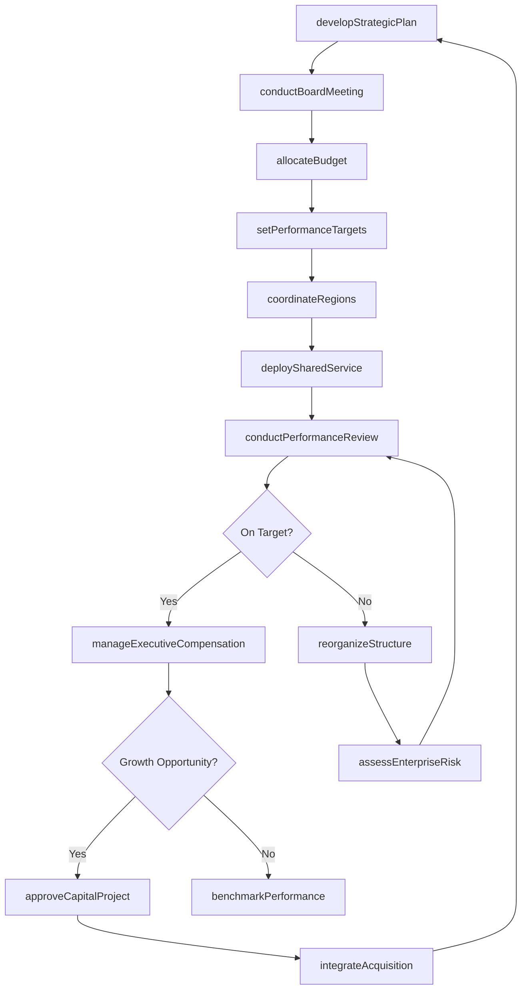
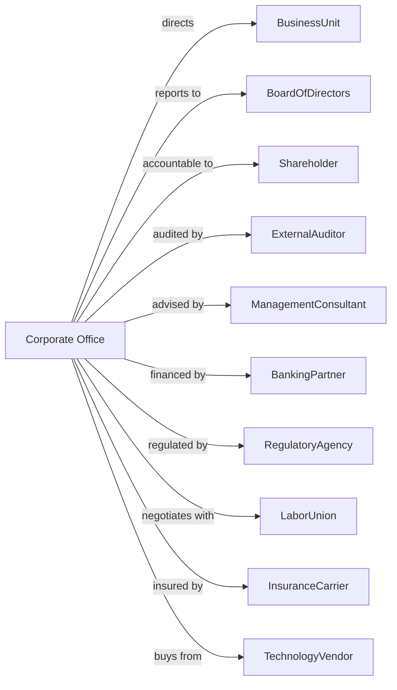

# Corporate, Subsidiary, and Regional Managing Offices

> Business-as-Code definition for corporate headquarters and regional management operations. Models the complete enterprise administration lifecycle from strategic planning through operational oversight and performance management.

## Overview

Corporate, subsidiary, and regional managing offices actively administer, oversee, and manage other establishments within their enterprise. Unlike holding companies, these offices perform strategic planning, resource allocation, and operational direction for business units. This definition exposes actions for enterprise governance, performance management, and organizational coordination, along with events for strategic execution and searches for operational data.

## Actors

| Actor | Description |
|-------|-------------|
| BusinessUnit | Operating division or subsidiary managed by corporate office |
| BoardOfDirectors | Governing body providing strategic oversight |
| Shareholder | Equity owner with voting rights on major decisions |
| ExternalAuditor | Independent firm conducting financial and operational audits |
| ManagementConsultant | Advisory firm engaged for strategic initiatives |
| BankingPartner | Financial institution providing credit facilities |
| RegulatoryAgency | Government body overseeing industry compliance |
| LaborUnion | Collective bargaining representative for employees |
| InsuranceCarrier | Provider of enterprise risk coverage |
| TechnologyVendor | Supplier of enterprise systems and infrastructure |

## Roles

| Role | Description |
|------|-------------|
| ChiefExecutiveOfficer | Sets enterprise strategy and reports to board |
| ChiefOperatingOfficer | Oversees day-to-day operations across business units |
| ChiefFinancialOfficer | Manages financial planning, reporting, and treasury |
| ChiefHumanResourcesOfficer | Directs talent strategy and organizational development |
| ChiefInformationOfficer | Oversees technology infrastructure and digital strategy |
| RegionalPresident | Manages operations within a geographic territory |
| SharedServicesDirector | Consolidates and delivers centralized functions across business units |

## Entities

| Entity | Description |
|--------|-------------|
| StrategicPlan | Multi-year document defining enterprise direction and goals |
| OperatingBudget | Annual financial plan allocating resources to business units |
| PerformanceTarget | Quantitative goal assigned to business unit or region |
| PolicyManual | Documentation of enterprise-wide procedures and standards |
| OrganizationalChart | Structure defining reporting relationships |
| ExecutiveCommittee | Senior leadership team making operational decisions |
| CapitalProject | Major investment initiative approved by corporate |
| SharedService | Centralized function serving multiple business units |
| CompensationPlan | Structure for executive and employee remuneration |
| EnterpriseRisk | Identified threat requiring corporate-level mitigation |
| BudgetVariance | Difference between planned and actual financial results |
| SuccessionPlan | Documentation of leadership continuity strategy |

## Actions

| Action | Description |
|--------|-------------|
| developStrategicPlan | Create multi-year enterprise strategy and objectives |
| allocateBudget | Distribute operating funds across business units and regions |
| setPerformanceTargets | Establish KPIs and goals for business units |
| conductPerformanceReview | Evaluate business unit results against targets |
| approveCapitalProject | Authorize major investment or initiative |
| deploySharedService | Implement centralized function for business units |
| updatePolicy | Revise enterprise-wide procedures or standards |
| reorganizeStructure | Modify organizational hierarchy or reporting lines |
| manageExecutiveCompensation | Administer bonus, equity, and benefit programs |
| assessEnterpriseRisk | Identify and evaluate corporate-level threats |
| coordinateRegions | Align regional operations with corporate strategy |
| conductBoardMeeting | Execute formal session of board of directors |
| integrateAcquisition | Incorporate newly acquired business into enterprise |
| benchmarkPerformance | Compare results against industry peers |
| developSuccessionPlan | Document leadership continuity and talent pipeline |

## Events

| Event | Description |
|-------|-------------|
| strategicPlanApproved | Board ratified multi-year enterprise strategy |
| budgetAllocated | Operating funds distributed to business units |
| performanceTargetsSet | KPIs communicated to business unit leaders |
| performanceReviewCompleted | Business unit evaluation finished with findings |
| capitalProjectApproved | Major investment authorized by executive committee |
| sharedServiceDeployed | Centralized function operational for business units |
| policyUpdated | Enterprise procedure or standard revised |
| structureReorganized | Organizational hierarchy modified |
| compensationReviewed | Executive pay programs evaluated and adjusted |
| enterpriseRiskIdentified | Corporate-level threat flagged for mitigation |
| regionsCoordinated | Regional alignment session completed |
| boardMeetingConducted | Formal board session concluded with resolutions |
| acquisitionIntegrated | New business fully incorporated into enterprise |
| performanceBenchmarked | Peer comparison analysis completed |
| budgetVarianceDetected | Significant deviation from financial plan identified |

## Searches

| Search | Description |
|--------|-------------|
| findBusinessUnits | List operating divisions with filters for region, revenue, or performance |
| getBudgetStatus | Retrieve current spending against allocated budget by unit |
| getPerformanceMetrics | Access KPIs and results across business units |
| findCapitalProjects | List approved and pending investment initiatives |
| getOrganizationalStructure | Retrieve reporting relationships and hierarchy |
| getEnterpriseRisks | Access identified risks and mitigation status |
| getBoardResolutions | Retrieve decisions made at board meetings |
| getRegionalPerformance | Compare results across geographic territories |

## Workflow



## Actor Relationships



## Usage

### Calling Actions

```typescript
import { directBusinessUnits } from '@headlessly/direct-business-units'

const hq = directBusinessUnits()

// Develop annual strategic plan
const plan = await hq.developStrategicPlan({
  horizon: '3-year',
  objectives: [
    { category: 'growth', target: 'revenueCAGR', value: 0.12 },
    { category: 'profitability', target: 'ebitdaMargin', value: 0.22 },
    { category: 'expansion', target: 'newMarkets', value: 3 }
  ],
  initiatives: ['digitalTransformation', 'marketExpansion', 'operationalExcellence']
})

// Allocate budget across business units
await hq.allocateBudget({
  fiscalYear: 2025,
  allocations: [
    { unitId: 'north-america', amount: 450_000_000, growthRate: 0.08 },
    { unitId: 'europe', amount: 280_000_000, growthRate: 0.05 },
    { unitId: 'asia-pacific', amount: 180_000_000, growthRate: 0.15 }
  ],
  contingencyReserve: 50_000_000
})

// Set performance targets for regional units
await hq.setPerformanceTargets({
  unitId: 'north-america',
  period: 'Q1-2025',
  targets: {
    revenue: 125_000_000,
    grossMargin: 0.42,
    customerRetention: 0.94,
    employeeEngagement: 0.78
  }
})
```

### Event-Driven Automation

```typescript
// Auto-respond to budget variances
hq.budgetVarianceDetected(async ({ unitId, category, variance, threshold }) => {
  if (Math.abs(variance) > threshold) {
    await hq.conductPerformanceReview({
      unitId,
      scope: 'urgent',
      focusAreas: [category],
      deadline: '7-days'
    })

    if (variance < -threshold) {
      await hq.assessEnterpriseRisk({
        source: unitId,
        riskType: 'financial',
        severity: 'high',
        mitigationRequired: true
      })
    }
  }
})

// Auto-coordinate regions after strategic plan approval
hq.strategicPlanApproved(async ({ planId, objectives, initiatives }) => {
  const regions = await hq.findBusinessUnits({ type: 'region' })

  for (const region of regions) {
    await hq.coordinateRegions({
      regionId: region.id,
      strategicPlanId: planId,
      localizedObjectives: localizeObjectives(objectives, region),
      implementationTimeline: '90-days'
    })
  }

  await hq.conductBoardMeeting({
    type: 'quarterly',
    agenda: ['strategicPlanRollout', 'regionalAlignment', 'resourceAllocation'],
    requiredAttendees: ['CEO', 'COO', 'CFO', 'regionalPresidents']
  })
})
```
