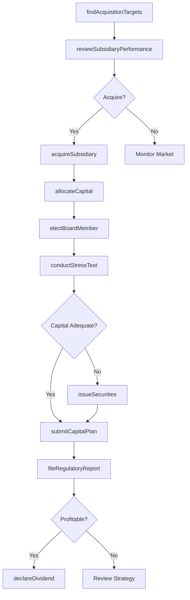
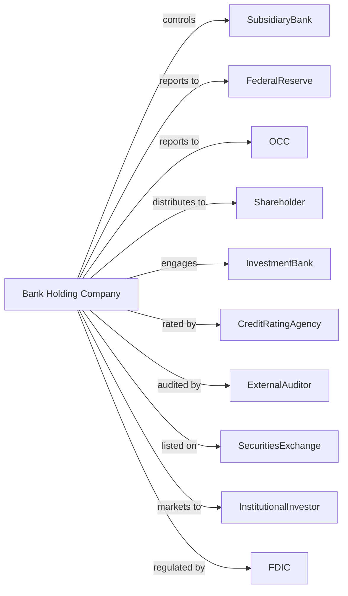

# Offices of Bank Holding Companies

> Business-as-Code definition for bank holding company operations. Models the complete investment oversight lifecycle from acquisition through regulatory compliance and dividend distribution.

## Overview

Bank holding companies hold controlling equity interests in subsidiary banks and financial institutions without directly managing their day-to-day operations. This definition exposes actions for portfolio management, capital allocation, regulatory reporting, and shareholder relations, along with events for compliance automation and searches for financial data retrieval.

## Actors

| Actor | Description |
|-------|-------------|
| SubsidiaryBank | Controlled banking institution within the holding structure |
| FederalReserve | Primary regulator overseeing bank holding company activities |
| OCC | Office of the Comptroller of the Currency for national bank subsidiaries |
| FDIC | Federal Deposit Insurance Corporation for insured deposit institutions |
| Shareholder | Equity owner in the holding company |
| InvestmentBank | Provides advisory services for acquisitions and capital markets |
| CreditRatingAgency | Assesses creditworthiness and assigns ratings |
| ExternalAuditor | Conducts financial statement audits and attestations |
| SecuritiesExchange | Stock exchange where holding company shares trade |
| InstitutionalInvestor | Large-scale investor such as pension funds or mutual funds |

## Roles

| Role | Description |
|------|-------------|
| ChiefExecutiveOfficer | Sets strategic direction and represents the holding company |
| ChiefFinancialOfficer | Oversees capital allocation and financial reporting |
| ChiefRiskOfficer | Manages enterprise-wide risk and regulatory compliance |
| GeneralCounsel | Handles legal matters and regulatory filings |
| TreasuryManager | Manages liquidity and intercompany funding |
| ComplianceOfficer | Ensures adherence to banking regulations |
| BankExaminerLiaison | Interfaces with Federal Reserve and OCC examiners during regulatory reviews |
| CapitalPlanningAnalyst | Models Tier 1 capital adequacy and stress test scenarios for subsidiary banks |

## Entities

| Entity | Description |
|--------|-------------|
| Portfolio | Collection of subsidiary bank investments and equity stakes |
| Subsidiary | Controlled banking entity within the holding structure |
| EquityStake | Ownership percentage in a subsidiary institution |
| CapitalPlan | Strategic document for capital allocation and adequacy |
| RegulatoryFiling | Required reports submitted to federal regulators |
| Dividend | Distribution of profits to shareholders |
| IntercompanyLoan | Funding provided between holding company and subsidiaries |
| StressTest | Regulatory assessment of capital adequacy under adverse scenarios |
| BoardResolution | Formal decision documented by the board of directors |
| ProxyStatement | Disclosure document for shareholder meetings |
| AcquisitionTarget | Potential bank or financial institution for purchase |
| TierOneCapital | Core capital measure required by regulators |

## Actions

| Action | Description |
|--------|-------------|
| acquireSubsidiary | Purchase controlling interest in a bank or financial institution |
| allocateCapital | Distribute funds across subsidiaries based on strategic priorities |
| fileRegulatoryReport | Submit required reports to Federal Reserve, OCC, or FDIC |
| conductStressTest | Execute capital adequacy analysis under adverse economic scenarios |
| declareDividend | Approve and announce distribution of profits to shareholders |
| approveIntercompanyLoan | Authorize funding transfer between holding company and subsidiary |
| electBoardMember | Appoint director to subsidiary bank board |
| reviewSubsidiaryPerformance | Analyze financial results and strategic alignment of subsidiaries |
| issueSecurities | Raise capital through stock or debt offerings |
| submitCapitalPlan | File annual capital plan with Federal Reserve |
| divestSubsidiary | Sell or spin off a subsidiary bank |
| amendCharter | Modify holding company or subsidiary charter documents |
| engageAuditor | Contract external auditor for financial statement audit |
| respondToExamination | Address regulatory examination findings and recommendations |

## Events

| Event | Description |
|-------|-------------|
| subsidiaryAcquired | Purchase of controlling interest in bank completed |
| capitalAllocated | Funds distributed to subsidiary or held at parent level |
| regulatoryReportFiled | Required report submitted to regulatory agency |
| stressTestCompleted | Capital adequacy analysis results available |
| dividendDeclared | Board approved profit distribution to shareholders |
| intercompanyLoanApproved | Funding transfer between entities authorized |
| boardMemberElected | Director appointed to subsidiary board |
| performanceReviewed | Subsidiary financial analysis completed |
| securitiesIssued | Capital raised through public or private offering |
| capitalPlanSubmitted | Annual capital plan filed with Federal Reserve |
| subsidiaryDivested | Sale or spin-off of subsidiary completed |
| charterAmended | Holding company or subsidiary charter modified |
| auditorEngaged | External audit firm contracted for annual audit |
| examinationResponseSubmitted | Reply to regulatory findings delivered |
| capitalAdequacyBreached | Capital ratios fell below required minimums |

## Searches

| Search | Description |
|--------|-------------|
| findSubsidiaries | List subsidiary banks with filters for asset size, charter type, or region |
| getCapitalRatios | Retrieve current capital adequacy metrics for holding company and subsidiaries |
| getRegulatoryFilings | Access submitted reports by type, date, or regulatory agency |
| getShareholderList | Retrieve current shareholders and ownership percentages |
| findAcquisitionTargets | Search potential bank acquisitions by asset size, market, or performance |
| getDividendHistory | Get historical dividend declarations and payment dates |
| getExaminationFindings | Retrieve regulatory examination results and required actions |
| getIntercompanyBalances | List outstanding loans and transfers between entities |

## Workflow



## Actor Relationships



## Usage

### Calling Actions

```typescript
import { overseeBankSubsidiaries } from '@headlessly/oversee-bank-subsidiaries'

const bhc = overseeBankSubsidiaries()

// Analyze potential acquisition
const targets = await bhc.findAcquisitionTargets({
  minAssets: 1_000_000_000,
  maxAssets: 10_000_000_000,
  regions: ['midwest', 'southeast'],
  capitalRating: 'wellCapitalized'
})

// Acquire a subsidiary bank
const acquisition = await bhc.acquireSubsidiary({
  targetId: targets[0].id,
  purchasePrice: 2_500_000_000,
  equityPercentage: 100,
  regulatoryApproval: 'pending'
})

// Allocate capital to new subsidiary
await bhc.allocateCapital({
  subsidiaryId: acquisition.subsidiaryId,
  amount: 500_000_000,
  purpose: 'growthCapital',
  tierOneEligible: true
})
```

### Event-Driven Automation

```typescript
// Auto-respond to capital adequacy issues
bhc.capitalAdequacyBreached(async ({ subsidiaryId, currentRatio, requiredRatio }) => {
  await bhc.approveIntercompanyLoan({
    fromEntity: 'parent',
    toEntity: subsidiaryId,
    amount: calculateCapitalShortfall(currentRatio, requiredRatio),
    terms: 'subordinatedDebt'
  })
})

// Auto-file regulatory reports on schedule
bhc.performanceReviewed(async ({ quarter, subsidiaries }) => {
  for (const subsidiary of subsidiaries) {
    await bhc.fileRegulatoryReport({
      reportType: 'FR-Y9C',
      period: quarter,
      subsidiaryId: subsidiary.id,
      dueDate: getFilingDeadline(quarter)
    })
  }
})
```
