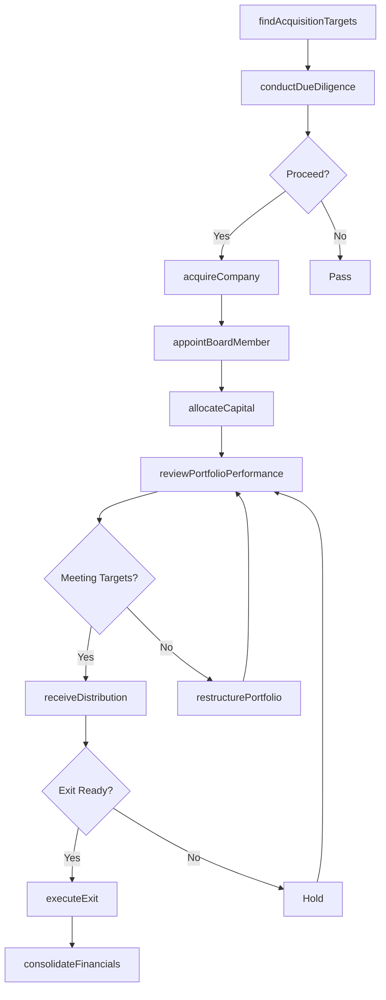
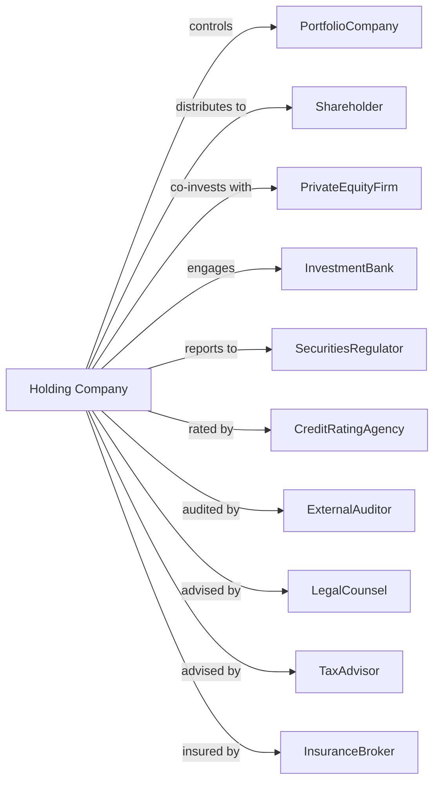

# Offices of Other Holding Companies

> Business-as-Code definition for non-bank holding company operations. Models the complete investment portfolio lifecycle from acquisition through value creation and exit.

## Overview

Non-bank holding companies hold controlling equity interests in subsidiary companies across diverse industries without directly managing their daily operations. This definition exposes actions for portfolio construction, capital deployment, governance oversight, and shareholder value creation, along with events for performance monitoring and searches for investment analysis.

## Actors

| Actor | Description |
|-------|-------------|
| PortfolioCompany | Subsidiary enterprise within the holding structure |
| Shareholder | Equity owner in the holding company |
| PrivateEquityFirm | Investment firm that may co-invest or acquire stakes |
| InvestmentBank | Provides M&A advisory and capital markets services |
| SecuritiesRegulator | Securities and Exchange Commission for public company compliance |
| CreditRatingAgency | Assesses corporate creditworthiness |
| ExternalAuditor | Conducts financial audits and internal control assessments |
| LegalCounsel | External law firm for transactions and regulatory matters |
| TaxAdvisor | Provides tax planning and compliance services |
| InsuranceBroker | Arranges directors and officers liability coverage |

## Roles

| Role | Description |
|------|-------------|
| ChiefExecutiveOfficer | Sets holding company strategy and oversees portfolio |
| ChiefFinancialOfficer | Manages capital structure and financial reporting |
| ChiefInvestmentOfficer | Evaluates and executes acquisition opportunities |
| GeneralCounsel | Oversees legal compliance and transaction documentation |
| PortfolioManager | Monitors subsidiary performance and value creation |
| InvestorRelationsOfficer | Communicates with shareholders and analysts |
| DueDiligenceDirector | Leads investigation teams evaluating potential acquisition targets |

## Entities

| Entity | Description |
|--------|-------------|
| Portfolio | Collection of subsidiary investments and equity stakes |
| Subsidiary | Controlled company within the holding structure |
| EquityStake | Ownership interest percentage in a portfolio company |
| InvestmentThesis | Strategic rationale for acquiring or holding an asset |
| ValuationModel | Financial model determining subsidiary worth |
| ShareholderAgreement | Contract governing ownership rights and obligations |
| BoardSeat | Director position on subsidiary company board |
| Dividend | Distribution of subsidiary profits to holding company |
| IntercompanyAgreement | Contract between holding company and subsidiaries |
| ExitStrategy | Plan for divesting or monetizing a subsidiary |
| DueDiligence | Investigation process before acquisition |
| ConsolidatedFinancials | Combined financial statements of all entities |

## Actions

| Action | Description |
|--------|-------------|
| acquireCompany | Purchase controlling interest in a target company |
| conductDueDiligence | Investigate target company before acquisition |
| allocateCapital | Deploy funds to subsidiaries for growth or operations |
| appointBoardMember | Place director on subsidiary company board |
| reviewPortfolioPerformance | Analyze subsidiary financial results and KPIs |
| receiveDistribution | Collect dividend or profit distribution from subsidiary |
| refinanceDebt | Restructure holding company or subsidiary borrowings |
| executeExit | Sell, spin off, or IPO a portfolio company |
| consolidateFinancials | Prepare combined financial statements |
| fileSecuritiesReport | Submit required filings to securities regulators or exchanges |
| restructurePortfolio | Reorganize holding structure or subsidiary ownership |
| negotiateSynergies | Identify and capture value between portfolio companies |
| updateValuation | Recalculate subsidiary fair market value |
| amendShareholderAgreement | Modify terms of ownership agreements |

## Events

| Event | Description |
|-------|-------------|
| companyAcquired | Purchase of target company completed |
| dueDiligenceCompleted | Target investigation finished with findings report |
| capitalAllocated | Funds deployed to subsidiary |
| boardMemberAppointed | Director placed on subsidiary board |
| portfolioReviewed | Quarterly or annual performance analysis completed |
| distributionReceived | Dividend or profit distribution collected |
| debtRefinanced | New financing terms established |
| exitExecuted | Subsidiary sale, spin-off, or IPO completed |
| financialsConsolidated | Combined statements prepared and approved |
| securitiesReportFiled | Required regulatory filing submitted |
| portfolioRestructured | Holding structure or ownership reorganized |
| synergiesCaptured | Value creation between subsidiaries realized |
| valuationUpdated | New fair market value calculated |
| shareholderAgreementAmended | Ownership terms modified |
| performanceThresholdBreached | Subsidiary missed agreed-upon KPIs |

## Searches

| Search | Description |
|--------|-------------|
| findSubsidiaries | List portfolio companies with filters for industry, size, or performance |
| getPortfolioValuation | Retrieve current fair market values across all holdings |
| findAcquisitionTargets | Search potential acquisitions by industry, size, or strategic fit |
| getDistributionHistory | Access historical dividends and profit distributions |
| getShareholderRegistry | Retrieve current shareholders and ownership percentages |
| getDebtSchedule | List outstanding borrowings and maturity dates |
| getExitOpportunities | Identify potential buyers or IPO windows for subsidiaries |
| getBoardComposition | List directors across all subsidiary boards |

## Workflow



## Actor Relationships



## Usage

### Calling Actions

```typescript
import { overseeInvestmentPortfolios } from '@headlessly/oversee-investment-portfolios'

const holdco = overseeInvestmentPortfolios()

// Search for acquisition opportunities
const targets = await holdco.findAcquisitionTargets({
  industries: ['manufacturing', 'logistics'],
  minRevenue: 50_000_000,
  maxRevenue: 500_000_000,
  ebitdaMargin: { min: 0.15 }
})

// Conduct due diligence on promising target
const ddReport = await holdco.conductDueDiligence({
  targetId: targets[0].id,
  scope: ['financial', 'legal', 'operational', 'tax'],
  timeframe: '60-days'
})

// Acquire the company
const acquisition = await holdco.acquireCompany({
  targetId: targets[0].id,
  purchasePrice: 150_000_000,
  equityPercentage: 80,
  structure: 'stockPurchase',
  earnout: { percentage: 10, conditions: 'ebitdaTarget' }
})
```

### Event-Driven Automation

```typescript
// Auto-respond to performance issues
holdco.performanceThresholdBreached(async ({ subsidiaryId, metric, actual, target }) => {
  await holdco.appointBoardMember({
    subsidiaryId,
    memberId: 'turnaround-specialist',
    role: 'chairman',
    mandate: 'performanceImprovement'
  })

  await holdco.allocateCapital({
    subsidiaryId,
    amount: calculateInterventionCapital(metric, actual, target),
    purpose: 'operationalTurnaround'
  })
})

// Auto-evaluate exit opportunities
holdco.portfolioReviewed(async ({ subsidiaries }) => {
  for (const sub of subsidiaries) {
    if (sub.holdingPeriod > 5 && sub.irr > 0.25) {
      const exits = await holdco.getExitOpportunities({ subsidiaryId: sub.id })

      if (exits.some(e => e.valuationMultiple > 8)) {
        await holdco.executeExit({
          subsidiaryId: sub.id,
          method: 'strategicSale',
          minimumPrice: sub.valuation * 1.1
        })
      }
    }
  }
})
```
