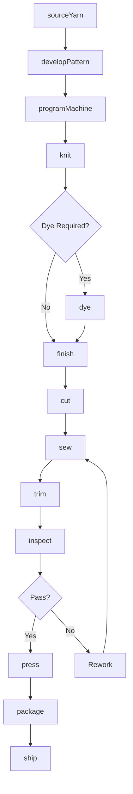
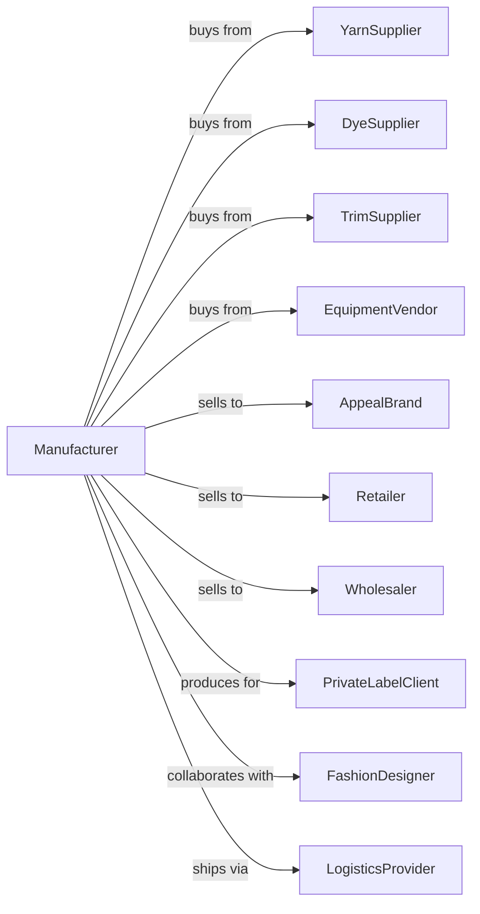

# Apparel Knitting Mills

> Business-as-Code definition for apparel knitting operations. Models the complete production lifecycle from yarn sourcing through finished knitted garment manufacturing.

## Overview

This industry comprises establishments primarily engaged in knitting apparel or knitting fabric and then manufacturing apparel. Jobbers, performing entrepreneurial functions involved in knitting apparel and accessories, are included.

## Actors

| Actor | Description |
|-------|-------------|
| YarnSupplier | Provides cotton, wool, synthetic, and blended yarns |
| DyeSupplier | Supplies dyes and finishing chemicals for fabric treatment |
| EquipmentVendor | Sells and services knitting machinery and equipment |
| AppealBrand | Fashion brands purchasing finished knitted apparel |
| Retailer | Stores purchasing knitted garments for resale |
| Wholesaler | Distributes knitted apparel to regional markets |
| PrivateLabelClient | Brands requiring contract knitting services |
| FashionDesigner | Creates designs for knitted apparel production |
| TrimSupplier | Provides buttons, zippers, labels, and trims |
| LogisticsProvider | Handles warehousing and shipping services |

## Roles

| Role | Description |
|------|-------------|
| PlantManager | Oversees daily knitting and manufacturing operations |
| KnittingMachineOperator | Operates circular, flat, or warp knitting machines |
| PatternProgrammer | Programs knitting machines for pattern production |
| DyeTechnician | Manages yarn and fabric dyeing processes |
| CutterOperator | Cuts knitted fabric into garment pieces |
| SewingOperator | Assembles cut pieces into finished garments |
| QualityInspector | Examines fabric and finished goods for defects |
| ProductDeveloper | Works with clients on new product development |

## Entities

| Entity | Description |
|--------|-------------|
| Garment | Finished knitted apparel item |
| Yarn | Fiber material used for knitting |
| KnitFabric | Interlocked loop fabric produced by knitting |
| Pattern | Design specification for knitted construction |
| Stitch | Basic unit of knitted fabric construction |
| Gauge | Measure of stitch density in knitted fabric |
| Style | Design specification for finished garment |
| Lot | Production batch with consistent specifications |
| Sample | Prototype garment for approval |
| Order | Customer purchase specification |

## Actions

| Action | Description |
|--------|-------------|
| sourceYarn | Procure yarns from approved suppliers |
| developPattern | Create and test knitting patterns for production |
| programMachine | Set up knitting machine with pattern specifications |
| knit | Produce fabric using circular, flat, or warp knitting |
| dye | Apply color to yarn or finished fabric |
| finish | Apply treatments for softness, shrink resistance, or hand |
| cut | Cut knitted fabric into garment components |
| sew | Assemble garment pieces using appropriate techniques |
| trim | Attach labels, buttons, and finishing details |
| inspect | Examine fabric and garments for quality compliance |
| press | Steam and shape finished garments |
| package | Fold, tag, and prepare for shipping |
| sample | Produce prototypes for customer approval |

## Events

| Event | Description |
|-------|-------------|
| yarnReceived | Raw yarn materials delivered to facility |
| patternDeveloped | New knitting pattern tested and approved |
| machineSetUp | Knitting machine programmed and ready |
| fabricKnitted | Knitting operation completed |
| dyeingCompleted | Color application finished |
| finishingCompleted | Fabric treatments applied |
| cuttingCompleted | Fabric cut into garment pieces |
| sewingCompleted | Garment assembly finished |
| inspectionPassed | Quality control approved product |
| inspectionFailed | Quality control identified defects |
| orderReceived | Customer purchase order entered |
| sampleApproved | Prototype garment accepted by customer |
| orderShipped | Finished goods dispatched to customer |

## Searches

| Search | Description |
|--------|-------------|
| findStyles | List garment styles by category, season, or customer |
| getInventory | Check stock levels for yarn, fabric, and finished goods |
| findOrders | List orders by customer, status, or delivery date |
| getYarnStock | Check yarn inventory by type and color |
| findProductionSchedule | View scheduled knitting and sewing runs |
| getQualityMetrics | Retrieve defect rates and inspection results |
| findSamples | List sample requests and approval status |
| getCapacity | Check available production capacity by process |

## Workflow



## Actor Relationships



## Usage

### Calling Actions

```typescript
import { knitApparelKnitting } from '@headlessly/knit-apparel-knitting'

const mill = knitApparelKnitting()

// Check available stock
const stock = await mill.findStyles({ status: 'available' })

// Check finished goods inventory
const inventory = await mill.getInventory({ lowStockOnly: true })

// Produce crew neck sweaters
const yarn = await mill.sourceYarn({
  supplier: 'italian-yarns',
  material: 'merino-wool',
  weight: 'worsted',
  color: 'heather-grey',
  quantity: 2000,
  unit: 'pounds'
})

await mill.developPattern({
  styleType: 'crew-neck-sweater',
  gauge: 7,
  unit: 'stitches-per-inch',
  sizes: ['S', 'M', 'L', 'XL']
})

await mill.programMachine({
  patternId: 'crew-neck-001',
  machineType: 'flat-knitting',
  needleGauge: 12,
  yarnCarriers: 2
})

await mill.knit({
  batchId: yarn.batchId,
  pattern: 'crew-neck-001',
  panelType: 'fully-fashioned',
  quantity: 500
})

await mill.finish({
  batchId: yarn.batchId,
  treatments: ['pre-shrunk', 'softener'],
  dryMethod: 'tumble-low'
})
```

### Event-Driven Automation

```typescript
// Auto-dye after knitting
mill.fabricKnitted(async ({ batchId, dyeRequired, color }) => {
  if (dyeRequired) {
    await mill.dye({
      batchId,
      color,
      method: 'piece-dye',
      temperature: 180,
      unit: 'fahrenheit'
    })
  }
})

// Auto-cut after finishing
mill.finishingCompleted(async ({ batchId, style }) => {
  await mill.cut({
    batchId,
    pattern: style,
    method: 'die-cut',
    bundleSize: 12
  })
})

// Auto-press and package after inspection
mill.inspectionPassed(async ({ batchId, customer }) => {
  await mill.press({
    batchId,
    method: 'steam-tunnel',
    temperature: 300
  })

  await mill.package({
    batchId,
    format: customer.includes('retail') ? 'hang-tag' : 'poly-bag',
    labeling: 'customer-sku'
  })
})

// Handle sample requests
mill.orderReceived(async ({ orderId, sampleRequired }) => {
  if (sampleRequired) {
    await mill.sample({
      orderId,
      quantity: 1,
      sizes: ['M'],
      rushPriority: true
    })
  }
})
```
