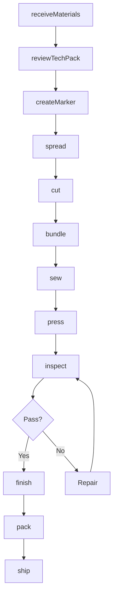
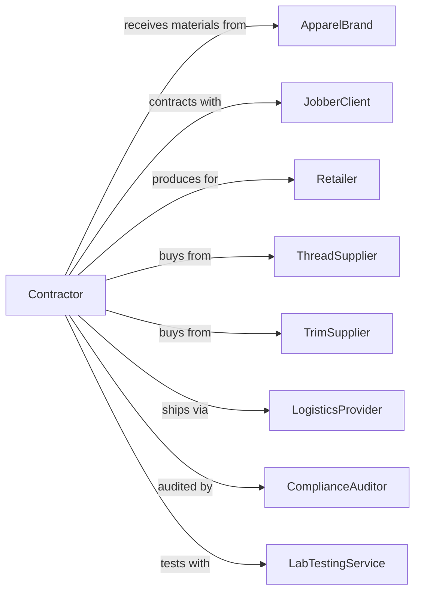

# Cut and Sew Apparel Contractors

> Business-as-Code definition for cut and sew apparel contracting operations. Models the complete contract manufacturing lifecycle from receiving client materials through finished garment delivery.

## Overview

This industry comprises establishments commonly referred to as contractors primarily engaged in (1) cutting materials owned by others for apparel and accessories and/or (2) sewing materials owned by others for apparel and accessories.

## Actors

| Actor | Description |
|-------|-------------|
| ApparelBrand | Fashion brands providing materials for contract production |
| JobberClient | Apparel jobbers coordinating contract manufacturing |
| Retailer | Direct retailers sourcing private label production |
| EquipmentVendor | Sells and services cutting and sewing machinery |
| ThreadSupplier | Provides sewing threads and notions |
| TrimSupplier | Supplies zippers, buttons, and finishing materials |
| LogisticsProvider | Handles material receiving and finished goods shipping |
| ComplianceAuditor | Verifies workplace and quality standards |
| LabTestingService | Tests garments for safety and performance |
| FreightForwarder | Manages international shipping and customs |

## Roles

| Role | Description |
|------|-------------|
| PlantManager | Oversees daily production operations and client relationships |
| ProductionPlanner | Schedules work orders and allocates capacity |
| CuttingOperator | Operates spreading and cutting equipment |
| SewingLineLeader | Supervises sewing operators on production lines |
| SewingOperator | Assembles garment pieces using industrial machines |
| QualityController | Inspects work-in-progress and finished garments |
| PatternGrader | Adjusts patterns for different sizes |
| MarkerMaker | Creates cutting layouts for fabric efficiency |

## Entities

| Entity | Description |
|--------|-------------|
| WorkOrder | Client production request with specifications |
| Fabric | Client-supplied material for garment production |
| Marker | Cutting layout pattern for maximum fabric yield |
| CutPart | Individual garment piece cut from fabric |
| Bundle | Grouped cut parts for sewing operations |
| Garment | Assembled apparel item |
| TechPack | Detailed production specifications from client |
| CutTicket | Production tracking document for cut pieces |
| SewingBundle | Work unit assigned to sewing operators |
| Shipment | Completed order ready for delivery |

## Actions

| Action | Description |
|--------|-------------|
| receiveMaterials | Accept and inventory client-supplied fabrics and trims |
| reviewTechPack | Analyze production specifications and requirements |
| createMarker | Develop cutting layout for optimal fabric utilization |
| spread | Lay fabric in multiple layers for cutting |
| cut | Cut fabric using automated or manual cutting equipment |
| bundle | Group cut parts by size and style for sewing |
| sew | Assemble garments following construction sequence |
| press | Shape garments using steam and pressing equipment |
| inspect | Examine garments for defects and specification compliance |
| finish | Complete final details including trimming and cleaning |
| pack | Package finished garments per client requirements |
| ship | Deliver completed orders to designated locations |

## Events

| Event | Description |
|-------|-------------|
| materialsReceived | Client fabric and trims arrived at facility |
| techPackApproved | Production specifications confirmed |
| markerCompleted | Cutting layout finalized |
| spreadingCompleted | Fabric laid and ready for cutting |
| cuttingCompleted | All pieces cut for work order |
| bundlingCompleted | Cut parts grouped for sewing |
| sewingStarted | Production line began assembly |
| sewingCompleted | Garment assembly finished |
| inspectionPassed | Garments met quality standards |
| inspectionFailed | Defects identified requiring correction |
| orderCompleted | All units finished and packed |
| orderShipped | Finished goods dispatched to client |

## Searches

| Search | Description |
|--------|-------------|
| findWorkOrders | List work orders by client, status, or due date |
| getMaterialsInventory | Check client material stock levels |
| getProductionStatus | View work-in-progress by style and order |
| findCapacity | Check available production capacity by process |
| getEfficiencyMetrics | Retrieve operator and line productivity data |
| findQualityIssues | List defects by type, style, or operator |
| getShipmentSchedule | View upcoming delivery commitments |
| findClients | List active client accounts and contacts |

## Workflow



## Actor Relationships



## Usage

### Calling Actions

```typescript
import { manufactureContractApparel } from '@headlessly/manufacture-contract-apparel'

const contractor = manufactureContractApparel()

// Process client work order for dresses
const materials = await contractor.receiveMaterials({
  client: 'fashion-brand-x',
  workOrderId: 'WO-2024-1234',
  items: [
    { material: 'silk-charmeuse', color: 'blush', quantity: 500, unit: 'yards' },
    { material: 'lining-poly', color: 'nude', quantity: 400, unit: 'yards' }
  ],
  trims: ['invisible-zippers', 'care-labels', 'hang-tags']
})

await contractor.reviewTechPack({
  workOrderId: materials.workOrderId,
  techPackVersion: '2.1',
  sizes: ['2', '4', '6', '8', '10', '12'],
  sewingOperations: 42
})

await contractor.createMarker({
  workOrderId: materials.workOrderId,
  efficiency: 85,
  unit: 'percent',
  plies: 40
})

await contractor.spread({
  workOrderId: materials.workOrderId,
  method: 'face-to-face',
  plies: 40,
  length: 20,
  unit: 'yards'
})

await contractor.cut({
  workOrderId: materials.workOrderId,
  method: 'automated-cutter',
  pieces: 24,
  perSize: true
})
```

### Event-Driven Automation

```typescript
// Auto-bundle after cutting
contractor.cuttingCompleted(async ({ workOrderId, cutTickets }) => {
  await contractor.bundle({
    workOrderId,
    bundleSize: 12,
    method: 'size-and-shade',
    ticketSystem: 'barcode'
  })
})

// Auto-assign to sewing lines
contractor.bundlingCompleted(async ({ workOrderId, bundleCount }) => {
  const capacity = await contractor.findCapacity({ process: 'sewing' })

  await contractor.sew({
    workOrderId,
    lineAssignment: capacity.recommendedLine,
    targetDaily: Math.ceil(bundleCount / 5)
  })
})

// Quality escalation
contractor.inspectionFailed(async ({ workOrderId, defectType, rate }) => {
  if (rate > 5) {
    await contractor.alertQuality({
      workOrderId,
      issue: `${defectType} defect rate at ${rate}%`,
      action: 'halt-production-review'
    })
  }
})

// Auto-ship on completion
contractor.orderCompleted(async ({ workOrderId, client }) => {
  await contractor.ship({
    workOrderId,
    destination: client.warehouse,
    carrier: 'fedex-freight',
    packingList: true
  })
})
```
