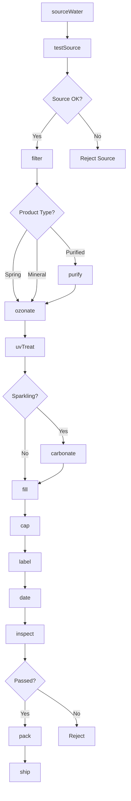
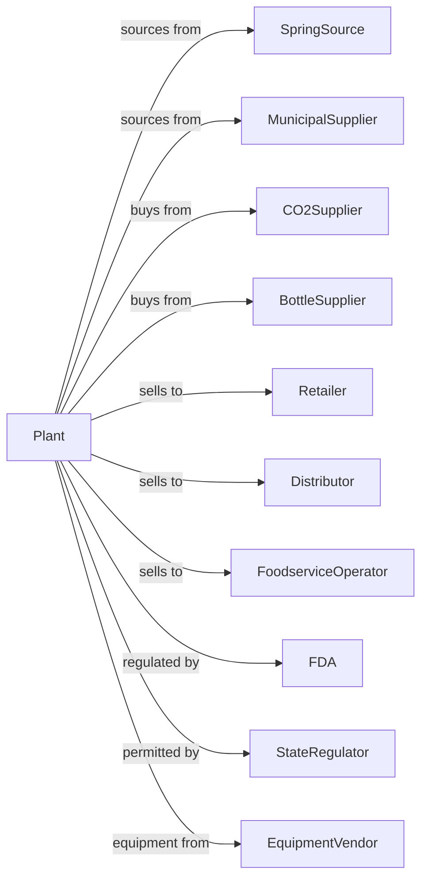

# Bottled Water Manufacturing

> Business-as-Code definition for bottled water manufacturing operations. Models water sourcing, purification, treatment, and packaging of spring, purified, mineral, and sparkling water products.

## Overview

This U.S. industry comprises establishments primarily engaged in purifying and bottling water (including naturally carbonated). This definition exposes actions for water sourcing, filtration, treatment, carbonation, and bottling for still and sparkling water products.

## Actors

| Actor | Description |
|-------|-------------|
| SpringSource | Provides natural spring water from protected sources |
| MunicipalSupplier | Supplies municipal water for purification |
| CO2Supplier | Provides food-grade carbon dioxide for sparkling water |
| BottleSupplier | Supplies PET bottles, glass, and closures |
| Retailer | Purchases bottled water for consumer sale |
| Distributor | Warehouses and delivers to retail accounts |
| FoodserviceOperator | Serves bottled water in restaurants |
| FDA | Regulates bottled water safety and labeling |
| StateRegulator | Oversees water source permits and testing |
| EquipmentVendor | Supplies filtration and filling equipment |

## Roles

| Role | Description |
|------|-------------|
| PlantManager | Oversees bottling operations |
| QualityManager | Ensures water safety and compliance |
| WaterTreatmentOperator | Controls filtration and treatment systems |
| SourceMonitor | Tests and monitors water sources |
| FillingOperator | Runs bottling lines |
| PackagingOperator | Operates labeling and case packing |
| MaintenanceTech | Maintains filtration and filling equipment |
| ComplianceManager | Manages permits and regulatory reporting |

## Entities

| Entity | Description |
|--------|-------------|
| SpringWater | Water from natural underground spring |
| PurifiedWater | Treated water meeting purification standards |
| MineralWater | Water with natural mineral content |
| SparklingWater | Carbonated water product |
| Source | Protected water source or well |
| TreatmentSystem | Filtration and purification equipment |
| Bottle | Container for packaged water |
| Batch | Traceable production lot |
| TestResult | Water quality analysis data |
| Permit | Regulatory authorization for water source |

## Actions

| Action | Description |
|--------|-------------|
| sourceWater | Extract water from spring or municipal supply |
| testSource | Analyze source water for contaminants |
| filter | Remove particles through microfiltration |
| purify | Apply reverse osmosis or distillation |
| ozonate | Treat with ozone for disinfection |
| uvTreat | Apply ultraviolet light for sterilization |
| carbonate | Add CO2 for sparkling products |
| addMinerals | Enhance water with minerals for taste |
| fill | Dispense water into bottles |
| cap | Apply closures to bottles |
| label | Apply product labels |
| date | Print production codes |
| inspect | Check quality and fill level |
| pack | Assemble into cases |
| ship | Dispatch to customers |

## Events

| Event | Description |
|-------|-------------|
| waterSourced | Water extracted from source |
| sourceTested | Water quality analysis completed |
| waterFiltered | Particles removed |
| waterPurified | Treatment completed |
| waterOzonated | Ozone treatment applied |
| waterCarbonated | CO2 added for sparkle |
| bottlesFilled | Containers filled |
| bottlesCapped | Closures applied |
| batchLabeled | Labels applied |
| qualityApproved | Batch passed testing |
| qualityFailed | Batch failed testing |
| orderShipped | Product dispatched |

## Searches

| Search | Description |
|--------|-------------|
| getSourceTests | Retrieve source water quality data |
| findBatches | List batches by product or date |
| getInventory | Check finished goods stock |
| getOrders | Retrieve orders by customer |
| getComplianceStatus | View permit and testing status |
| getQualityReports | Retrieve batch test results |
| getProductionSchedule | View planned runs |
| findSources | List water sources and permits |

## Workflow



## Actor Relationships



## Usage

### Calling Actions

```typescript
import { brewBottledWater } from '@headlessly/brew-bottled-water'

const plant = brewBottledWater()

// Source and test water
const water = await plant.sourceWater({
  source: 'mountain-spring-01',
  volume: 10000,
  unit: 'gallons'
})

await plant.testSource({
  sourceId: water.sourceId,
  tests: ['microbiological', 'chemical', 'radiological']
})

// Treat and bottle
await plant.filter({
  batchId: water.batchId,
  filterSize: 0.2,
  unit: 'microns'
})

await plant.ozonate({
  batchId: water.batchId,
  concentration: 0.4,
  contactTime: 4
})

await plant.fill({
  batchId: water.batchId,
  bottleSize: '500ml',
  lineSpeed: 400
})
```

### Event-Driven Automation

```typescript
// Auto-process based on product type
plant.waterFiltered(async ({ batchId, productType }) => {
  if (productType === 'purified') {
    await plant.purify({
      batchId,
      method: 'reverse-osmosis',
      tdsTarget: 10
    })
  }

  await plant.ozonate({ batchId })
  await plant.uvTreat({ batchId })
})

// Auto-ship when quality approved
plant.qualityApproved(async ({ batchId }) => {
  const orders = await plant.getOrders({ status: 'pending' })

  if (orders.length > 0) {
    await plant.pack({
      batchId,
      orderId: orders[0].id,
      caseSize: orders[0].caseSize
    })
  }
})
```
