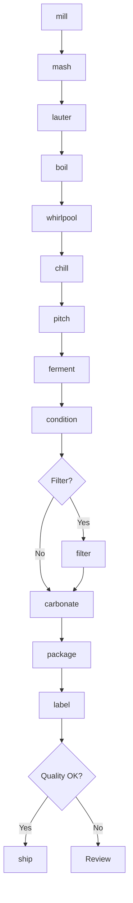
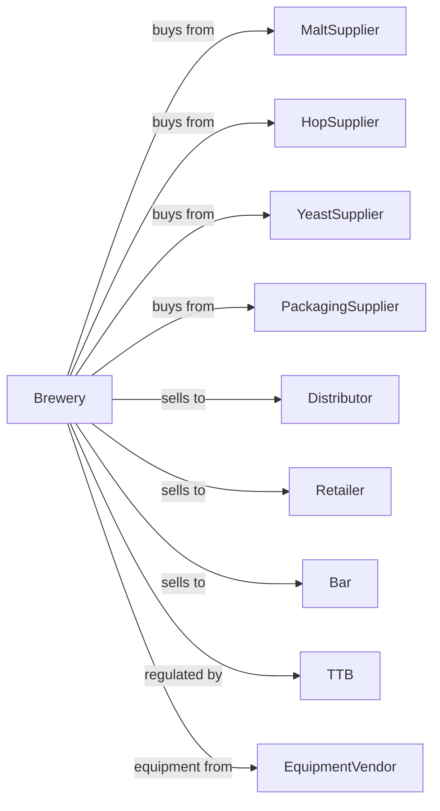

# Breweries

> Business-as-Code definition for brewery operations. Models beer production from grain mashing through fermentation, conditioning, packaging, and distribution of ales, lagers, and specialty beers.

## Overview

This industry comprises establishments primarily engaged in brewing beer, ale, lager, malt liquors, and nonalcoholic beer. This definition exposes actions for mashing, lautering, boiling, fermentation, conditioning, filtering, and packaging for craft and commercial beer production.

## Actors

| Actor | Description |
|-------|-------------|
| MaltSupplier | Provides base and specialty malts |
| HopSupplier | Supplies hops and hop products |
| YeastSupplier | Provides brewing yeast strains |
| WaterTreatment | Supplies water treatment chemicals |
| PackagingSupplier | Provides bottles, cans, kegs, and closures |
| Distributor | Warehouses and delivers to retailers |
| Retailer | Sells packaged beer to consumers |
| Bar | Serves draft beer on-premise |
| TTB | Regulates alcohol production and taxation |
| EquipmentVendor | Supplies brewing and packaging equipment |

## Roles

| Role | Description |
|------|-------------|
| Brewmaster | Develops recipes and oversees brewing |
| HeadBrewer | Manages day-to-day brewing operations |
| QualityManager | Ensures beer consistency and safety |
| CellarPerson | Manages fermentation and conditioning |
| PackagingOperator | Runs bottling, canning, and kegging lines |
| TaproomManager | Manages on-site sales and events |
| SalesManager | Manages distributor and account relationships |
| ComplianceManager | Handles TTB reporting and permits |

## Entities

| Entity | Description |
|--------|-------------|
| Recipe | Formula specifying ingredients and process |
| Mash | Grain and water mixture for sugar extraction |
| Wort | Sweet liquid extracted from mash |
| Beer | Fermented alcoholic beverage |
| Batch | Traceable production lot |
| Fermenter | Vessel for fermentation |
| BriteTank | Tank for conditioning and carbonation |
| Keg | Pressurized container for draft beer |
| Can | Aluminum container for packaged beer |
| Bottle | Glass container for packaged beer |

## Actions

| Action | Description |
|--------|-------------|
| mill | Crush malt to expose starches |
| mash | Combine milled grain with hot water |
| lauter | Separate sweet wort from grain |
| boil | Cook wort with hops for bitterness and flavor |
| whirlpool | Settle trub and hop matter |
| chill | Cool wort to fermentation temperature |
| pitch | Add yeast to cooled wort |
| ferment | Allow yeast to convert sugars to alcohol |
| condition | Age beer for flavor development |
| carbonate | Add CO2 for carbonation |
| filter | Remove yeast and haze particles |
| package | Fill kegs, cans, or bottles |
| label | Apply product labels and date codes |
| ship | Dispatch to distributors and accounts |

## Events

| Event | Description |
|-------|-------------|
| grainMilled | Malt crushed and ready |
| mashComplete | Sugars extracted from grain |
| wortBoiled | Wort cooked with hops |
| wortChilled | Wort cooled for fermentation |
| yeastPitched | Fermentation started |
| fermentationComplete | Primary fermentation finished |
| beerConditioned | Aging complete |
| beerCarbonated | Carbonation achieved |
| beerPackaged | Beer filled into containers |
| batchLabeled | Labels applied |
| qualityApproved | Beer passed tasting and analysis |
| orderShipped | Product dispatched to customer |

## Searches

| Search | Description |
|--------|-------------|
| findBatches | List batches by recipe, date, or status |
| getInventory | Check packaged beer and raw material stock |
| getFermenterStatus | View fermentation progress |
| getTankSchedule | View tank assignments and timing |
| getOrders | Retrieve orders by customer or date |
| getQualityReports | Retrieve lab analysis and tasting notes |
| getRecipes | Retrieve beer recipes |
| getSalesData | View sales by product and channel |

## Workflow



## Actor Relationships



## Usage

### Calling Actions

```typescript
import { brewBreweries } from '@headlessly/brew-breweries'

const brewery = brewBreweries()

// Start a batch of IPA
const batch = await brewery.mill({
  recipe: 'west-coast-ipa',
  grainBill: [
    { malt: 'pale-2row', pounds: 200 },
    { malt: 'crystal-40', pounds: 20 },
    { malt: 'carapils', pounds: 10 }
  ]
})

await brewery.mash({
  batchId: batch.id,
  strikeTemp: 164,
  mashTemp: 152,
  duration: 60
})

await brewery.lauter({ batchId: batch.id })

await brewery.boil({
  batchId: batch.id,
  duration: 60,
  hopAdditions: [
    { hop: 'centennial', ounces: 16, time: 60 },
    { hop: 'simcoe', ounces: 8, time: 15 },
    { hop: 'citra', ounces: 8, time: 0 }
  ]
})
```

### Event-Driven Automation

```typescript
// Auto-pitch yeast when wort is chilled
brewery.wortChilled(async ({ batchId, originalGravity, temperature }) => {
  const recipe = await brewery.getRecipes({ batchId })

  await brewery.pitch({
    batchId,
    yeast: recipe.yeast,
    pitchRate: recipe.cellsPerML,
    temperature
  })
})

// Auto-package when conditioning complete
brewery.beerConditioned(async ({ batchId, finalGravity, abv }) => {
  await brewery.carbonate({
    batchId,
    targetVolumes: 2.5,
    method: 'forced'
  })

  const orders = await brewery.getOrders({ status: 'pending' })

  await brewery.package({
    batchId,
    format: orders[0]?.packageFormat || 'keg',
    quantity: orders[0]?.quantity || 10
  })
})
```
