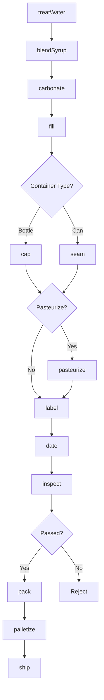
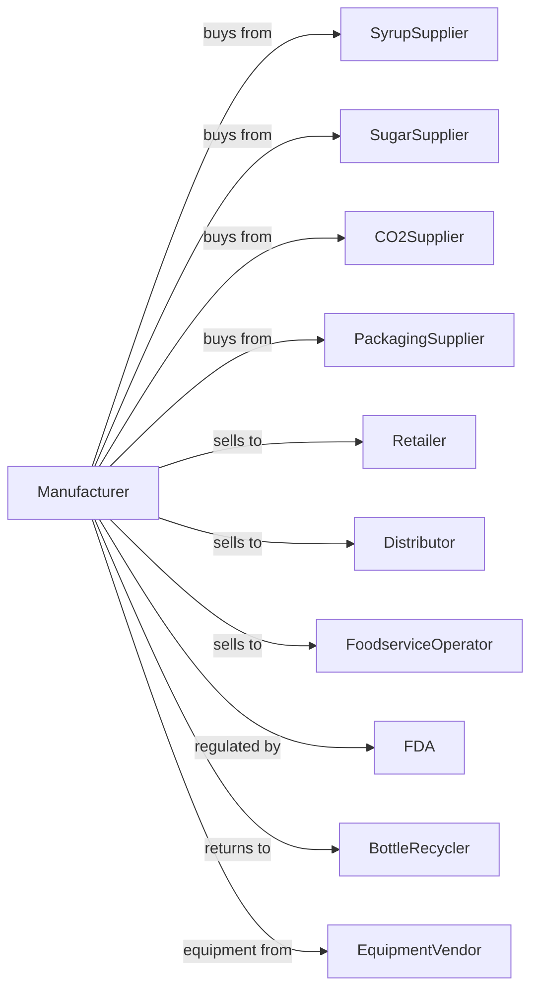

# Soft Drink Manufacturing

> Business-as-Code definition for soft drink manufacturing operations. Models beverage production from syrup preparation through carbonation, filling, and distribution of sodas, energy drinks, and flavored waters.

## Overview

This U.S. industry comprises establishments primarily engaged in manufacturing soft drinks and artificially carbonated waters. This definition exposes actions for syrup blending, water treatment, carbonation, filling, and packaging for carbonated and non-carbonated soft drinks.

## Actors

| Actor | Description |
|-------|-------------|
| SyrupSupplier | Provides concentrate and flavoring syrups |
| SugarSupplier | Supplies sugar, HFCS, and artificial sweeteners |
| CO2Supplier | Provides food-grade carbon dioxide |
| PackagingSupplier | Supplies bottles, cans, and closures |
| Retailer | Purchases beverages for consumer sale |
| Distributor | Warehouses and delivers to retail accounts |
| FoodserviceOperator | Serves beverages in restaurants and venues |
| FDA | Regulates food safety and labeling |
| BottleRecycler | Collects and processes returnable containers |
| EquipmentVendor | Supplies filling and packaging equipment |

## Roles

| Role | Description |
|------|-------------|
| PlantManager | Oversees beverage production operations |
| QualityManager | Ensures product safety and consistency |
| SyrupBlender | Prepares beverage formulations |
| WaterTreatmentOperator | Controls water purification systems |
| FillingOperator | Runs bottling and canning lines |
| PackagingOperator | Operates labeling and case packing |
| MaintenanceTech | Maintains filling and carbonation equipment |
| WarehouseManager | Manages inventory and distribution |

## Entities

| Entity | Description |
|--------|-------------|
| Concentrate | Flavoring syrup from brand owner |
| Syrup | Blended sweetener and concentrate mixture |
| TreatedWater | Purified water for beverage production |
| Carbonation | Dissolved CO2 for fizz |
| Beverage | Finished soft drink ready for packaging |
| Bottle | Glass or PET container for product |
| Can | Aluminum container for product |
| Case | Multiple units packaged for distribution |
| Batch | Traceable production lot |
| Formula | Recipe specifying ingredients and ratios |

## Actions

| Action | Description |
|--------|-------------|
| treatWater | Purify and condition water for beverage use |
| blendSyrup | Combine concentrate with sweetener and water |
| carbonate | Dissolve CO2 into beverage |
| fill | Dispense beverage into containers |
| cap | Apply closures to bottles |
| seam | Seal cans with lids |
| pasteurize | Heat treat to extend shelf life |
| label | Apply product labels to containers |
| date | Print production date and lot codes |
| inspect | Check fill level, cap integrity, and quality |
| pack | Assemble units into cases or multipacks |
| palletize | Stack cases for warehouse storage |
| chill | Cool product for immediate distribution |
| ship | Dispatch orders to customers |

## Events

| Event | Description |
|-------|-------------|
| waterTreated | Water purified and ready for use |
| syrupBlended | Syrup prepared to formula |
| beverageCarbonated | CO2 dissolved to specification |
| containersFilled | Bottles or cans filled |
| containersCapped | Closures applied |
| containersLabeled | Labels applied |
| batchInspected | Quality checks completed |
| casesPacked | Units packaged for distribution |
| palletized | Cases stacked on pallets |
| qualityApproved | Batch passed testing |
| qualityFailed | Batch failed testing |
| orderShipped | Product dispatched to customer |

## Searches

| Search | Description |
|--------|-------------|
| findBatches | List batches by product, date, or status |
| getInventory | Check finished goods and packaging stock |
| getOrders | Retrieve orders by customer or ship date |
| getSyrupLevels | Check concentrate and syrup inventory |
| getQualityReports | Retrieve test results by batch |
| getLineEfficiency | View production line performance |
| findCustomers | List customers by volume or channel |
| getProductionSchedule | View planned production runs |

## Workflow



## Actor Relationships



## Usage

### Calling Actions

```typescript
import { brewSoftDrink } from '@headlessly/brew-soft-drink'

const plant = brewSoftDrink()

// Prepare water and syrup
await plant.treatWater({
  source: 'municipal',
  targetTDS: 50,
  chlorineLevel: 0
})

const syrup = await plant.blendSyrup({
  concentrate: 'cola-formula-7',
  sweetener: 'hfcs-55',
  brix: 55
})

// Carbonate and fill
await plant.carbonate({
  syrupBatch: syrup.batchId,
  co2Volumes: 3.8,
  temperature: 38
})

await plant.fill({
  batchId: syrup.batchId,
  container: 'pet-20oz',
  fillLevel: 591,
  lineSpeed: 600
})
```

### Event-Driven Automation

```typescript
// Auto-inspect after filling
plant.containersFilled(async ({ batchId, containerType }) => {
  await plant.cap({
    batchId,
    torqueSpec: containerType === 'pet' ? 18 : null
  })

  await plant.label({ batchId })
  await plant.date({ batchId })

  await plant.inspect({
    batchId,
    checks: ['fillLevel', 'capTorque', 'labelPlacement']
  })
})

// Route based on quality
plant.qualityApproved(async ({ batchId, product }) => {
  const orders = await plant.getOrders({
    product,
    status: 'pending'
  })

  await plant.pack({
    batchId,
    caseSize: orders[0]?.caseSize || 24
  })
})
```
