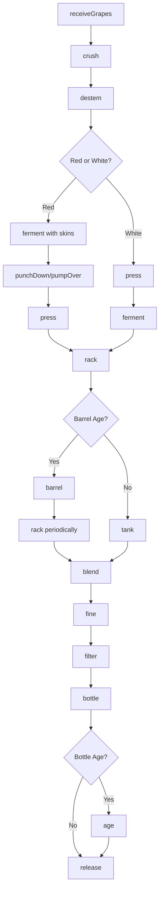
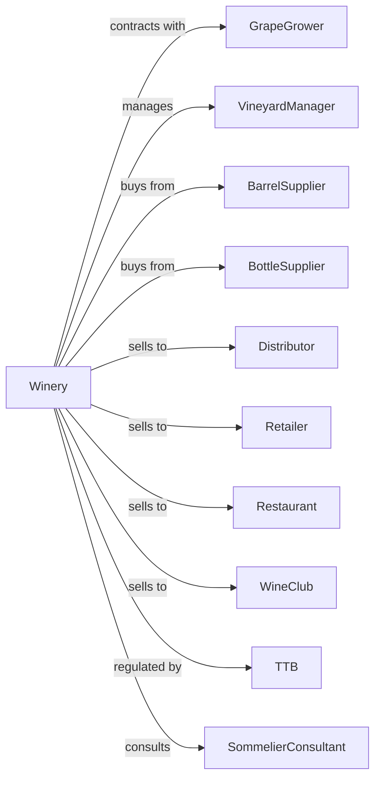

# Wineries

> Business-as-Code definition for winery operations. Models wine production from grape crushing through fermentation, aging, blending, and bottling of still and sparkling wines.

## Overview

This industry comprises establishments primarily engaged in growing grapes and manufacturing wines and brandies, manufacturing wines and brandies from grapes and other fruits grown elsewhere, and blending wines and brandies. This definition exposes actions for crushing, pressing, fermentation, barrel aging, blending, and bottling.

## Actors

| Actor | Description |
|-------|-------------|
| GrapeGrower | Produces wine grapes under contract |
| VineyardManager | Manages owned or leased vineyards |
| BarrelSupplier | Provides oak barrels for aging |
| BottleSupplier | Supplies bottles, corks, and closures |
| Distributor | Warehouses and delivers to retailers |
| Retailer | Sells wine to consumers |
| Restaurant | Purchases wine for on-premise service |
| WineClub | Subscribes to regular wine shipments |
| TTB | Regulates wine production and labeling |
| SommelierConsultant | Advises on blending and style |

## Roles

| Role | Description |
|------|-------------|
| Winemaker | Crafts wines and makes production decisions |
| AssistantWinemaker | Supports winemaking operations |
| CellarMaster | Manages barrel room and aging |
| LabTechnician | Conducts wine analysis and testing |
| VineyardManager | Oversees grape growing and harvest |
| TastingRoomManager | Manages direct-to-consumer sales |
| WineClubManager | Manages membership and shipments |
| ComplianceManager | Handles TTB reporting and permits |

## Entities

| Entity | Description |
|--------|-------------|
| Grape | Wine grape variety with vintage |
| Must | Crushed grape juice, skins, and seeds |
| Wine | Fermented grape juice product |
| Lot | Traceable production batch |
| Barrel | Oak vessel for wine aging |
| Tank | Stainless steel fermentation vessel |
| Blend | Combination of wines for final product |
| Vintage | Year of grape harvest |
| Appellation | Geographic designation of origin |
| Label | Approved wine label with required information |

## Actions

| Action | Description |
|--------|-------------|
| receiveGrapes | Accept and weigh incoming grapes |
| crush | Break grape skins to release juice |
| destem | Remove grape stems |
| press | Extract juice from crushed grapes |
| ferment | Convert grape sugars to alcohol with yeast |
| punchDown | Submerge cap during red fermentation |
| pumpOver | Circulate wine over cap |
| press | Separate wine from skins after fermentation |
| rack | Transfer wine off sediment |
| barrel | Age wine in oak barrels |
| blend | Combine wines for final cuvee |
| fine | Clarify wine with fining agents |
| filter | Remove particles before bottling |
| bottle | Fill, cork, and label bottles |
| age | Cellar bottles before release |

## Events

| Event | Description |
|-------|-------------|
| grapesReceived | Harvest delivered and weighed |
| grapesCrushed | Must prepared for fermentation |
| fermentationStarted | Yeast activity detected |
| fermentationCompleted | Sugars converted to alcohol |
| winePressed | Wine separated from skins |
| wineRacked | Wine transferred off lees |
| wineBarreled | Wine placed in oak barrels |
| blendApproved | Final blend decided |
| wineBottled | Wine packaged in bottles |
| wineReleased | Wine approved for sale |
| qualityApproved | Wine passed evaluation |
| orderShipped | Wine dispatched to customer |

## Searches

| Search | Description |
|--------|-------------|
| findLots | List wine lots by variety, vintage, or status |
| getBarrelInventory | Check barrel locations and contents |
| getTankStatus | View fermentation and storage tanks |
| getBlends | Retrieve blend components and recipes |
| getInventory | Check bottled wine stock |
| getOrders | Retrieve orders by customer or date |
| getLabResults | Retrieve wine analysis data |
| getWineClubMembers | List members and shipment status |

## Workflow



## Actor Relationships



## Usage

### Calling Actions

```typescript
import { produceWine } from '@headlessly/produce-wine'

const winery = produceWine()

// Check available stock
const stock = await winery.findLots({ status: 'available' })

// Check finished goods inventory
const inventory = await winery.getBarrelInventory({ lowStockOnly: true })

// Receive harvest
const grapes = await winery.receiveGrapes({
  variety: 'cabernet-sauvignon',
  vineyard: 'estate-block-7',
  tons: 15,
  brix: 25.5,
  vintage: 2024
})

// Crush and ferment
await winery.crush({ lotId: grapes.lotId })
await winery.destem({ lotId: grapes.lotId })

await winery.ferment({
  lotId: grapes.lotId,
  yeast: 'BM45',
  targetTemp: 82,
  tank: 'FT-12'
})

// Manage cap during fermentation
await winery.punchDown({
  lotId: grapes.lotId,
  frequency: 3,
  unit: 'per-day'
})
```

### Event-Driven Automation

```typescript
// Auto-press when fermentation complete
winery.fermentationCompleted(async ({ lotId, variety, residualSugar }) => {
  if (residualSugar < 2) {
    await winery.press({
      lotId,
      pressProgram: variety === 'pinot-noir' ? 'gentle' : 'standard'
    })
  }
})

// Auto-barrel after pressing
winery.winePressed(async ({ lotId, variety, quality }) => {
  if (quality === 'reserve') {
    await winery.barrel({
      lotId,
      barrelType: 'french-oak',
      newOakPercent: 50,
      duration: 18,
      unit: 'months'
    })
  } else {
    await winery.barrel({
      lotId,
      barrelType: 'american-oak',
      newOakPercent: 20,
      duration: 12
    })
  }
})
```
