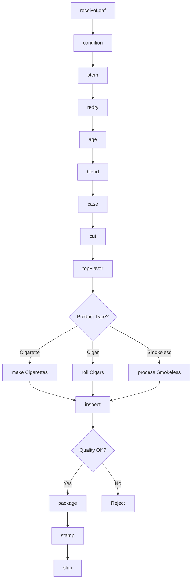
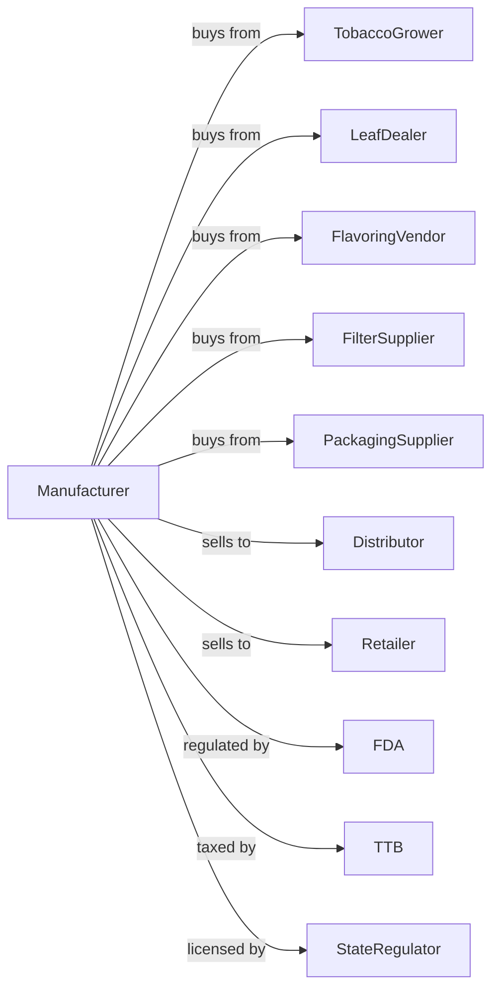

# Tobacco Manufacturing

> Business-as-Code definition for tobacco product manufacturing operations. Models tobacco processing from leaf stemming and curing through blending, cutting, and manufacturing of cigarettes, cigars, and smokeless tobacco products.

## Overview

This industry comprises establishments primarily engaged in stemming and redrying tobacco and/or manufacturing cigarettes, cigars, chewing tobacco, snuff, and pipe tobacco. This definition exposes actions for leaf processing, blending, cutting, rolling, and packaging of tobacco products.

## Actors

| Actor | Description |
|-------|-------------|
| TobaccoGrower | Produces tobacco leaf under contract |
| LeafDealer | Supplies processed tobacco leaf |
| FlavoringVendor | Provides casings and top flavors |
| FilterSupplier | Supplies cigarette filters |
| PackagingSupplier | Provides packs, cartons, and tins |
| Distributor | Warehouses and delivers to retailers |
| Retailer | Sells tobacco products to consumers |
| FDA | Regulates tobacco products and labeling |
| TTB | Administers tobacco excise taxes |
| StateRegulator | Enforces state tobacco laws |

## Roles

| Role | Description |
|------|-------------|
| PlantManager | Oversees tobacco manufacturing |
| BlendMaster | Develops and maintains tobacco blends |
| QualityManager | Ensures product consistency and compliance |
| LeafBuyer | Procures tobacco from growers and dealers |
| ProcessingOperator | Operates stemming and cutting equipment |
| CigarRoller | Hand-rolls premium cigars using binder and wrapper leaves |
| RollingOperator | Runs cigarette or cigar making machines |
| PackagingOperator | Operates packaging lines |
| ComplianceManager | Manages FDA and TTB reporting |

## Entities

| Entity | Description |
|--------|-------------|
| Leaf | Raw tobacco leaf by type and grade |
| Strip | Stemmed tobacco leaf |
| Blend | Formulated tobacco mixture |
| Casing | Humectant and flavor mixture |
| Filler | Tobacco inside cigarette or cigar |
| Wrapper | Outer leaf of cigar |
| Binder | Leaf holding cigar filler |
| Cigarette | Manufactured cigarette product |
| Cigar | Rolled tobacco product |
| SmokelessTobacco | Chewing tobacco or snuff |

## Actions

| Action | Description |
|--------|-------------|
| receiveLeaf | Accept and grade incoming tobacco |
| condition | Add moisture to prepare for processing |
| stem | Remove leaf midrib from lamina |
| redry | Reduce moisture for storage |
| age | Store tobacco for flavor development |
| blend | Combine tobaccos per formula |
| case | Apply humectants and base flavors |
| cut | Shred tobacco to target width |
| topFlavor | Apply finishing flavors |
| make | Manufacture cigarettes or cigars |
| inspect | Check product weight and appearance |
| package | Fill packs, cartons, or tins |
| stamp | Apply tax stamps |
| ship | Dispatch to distributors |

## Events

| Event | Description |
|-------|-------------|
| leafReceived | Tobacco graded and accepted |
| leafConditioned | Moisture adjusted |
| leafStemmed | Strips separated from stems |
| leafRedried | Moisture reduced for storage |
| tobaccoAged | Aging period complete |
| blendMixed | Tobacco blend combined |
| tobaccoCased | Casing applied |
| tobaccoCut | Tobacco shredded |
| topFlavorApplied | Finishing flavors added |
| productsMade | Cigarettes or cigars manufactured |
| productsPackaged | Products packaged |
| productsStamped | Tax stamps applied |
| orderShipped | Product dispatched |

## Searches

| Search | Description |
|--------|-------------|
| findLeafLots | List tobacco inventory by type and grade |
| getBlends | Retrieve blend formulas |
| getAgingStatus | Check tobacco aging progress |
| getInventory | Check finished goods stock |
| getOrders | Retrieve orders by customer |
| getProductionSchedule | View planned manufacturing runs |
| getComplianceStatus | View regulatory filings and status |
| getTaxReports | Retrieve excise tax data |

## Workflow



## Actor Relationships



## Usage

### Calling Actions

```typescript
import { manufactureTobacco } from '@headlessly/manufacture-tobacco'

const plant = manufactureTobacco()

// Receive tobacco leaf
const leaf = await plant.receiveLeaf({
  type: 'virginia-flue-cured',
  grade: 'B1F',
  quantity: 10000,
  unit: 'pounds',
  origin: 'north-carolina'
})

// Process through stemming
await plant.condition({
  lotId: leaf.lotId,
  targetMoisture: 22
})

await plant.stem({
  lotId: leaf.lotId,
  stripWidth: 'standard'
})

await plant.redry({
  lotId: leaf.lotId,
  targetMoisture: 11
})
```

### Event-Driven Automation

```typescript
// Auto-blend after aging
plant.tobaccoAged(async ({ lotId, type, months }) => {
  if (months >= 24) {
    const blend = await plant.getBlends({ requires: type })

    await plant.blend({
      blendId: blend.id,
      components: [{ lotId, percentage: blend.typePercentage }]
    })
  }
})

// Auto-manufacture based on orders
plant.topFlavorApplied(async ({ batchId, blend }) => {
  const orders = await plant.getOrders({
    blend,
    status: 'pending'
  })

  if (orders.length > 0) {
    await plant.make({
      batchId,
      productType: orders[0].productType,
      quantity: orders[0].quantity
    })
  }
})
```
