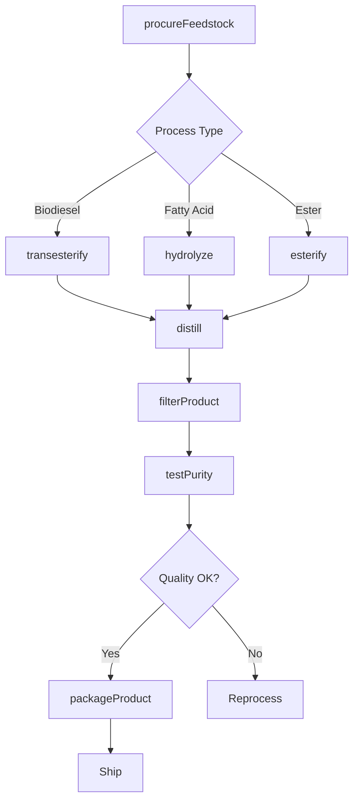
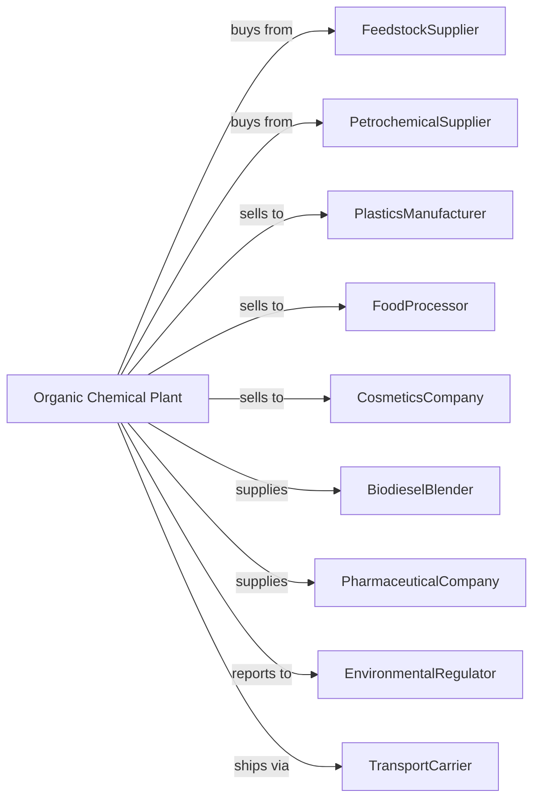

# All Other Basic Organic Chemical Manufacturing

> Business-as-Code definition for basic organic chemical production operations. Models the complete manufacturing lifecycle from raw material synthesis through specialty organic chemical distribution.

## Overview

All other basic organic chemical manufacturing involves producing organic chemical products including biodiesel fuels, fatty acids, organic acids, plasticizers, synthetic sweeteners, and other organic compounds not classified elsewhere. This definition exposes actions for each phase of production, events for workflow automation, and searches for data retrieval.

## Actors

| Actor | Description |
|-------|-------------|
| FeedstockSupplier | Provides vegetable oils, fats, and chemical intermediates |
| PetrochemicalSupplier | Supplies petroleum-derived raw materials |
| PlasticsManufacturer | Purchases plasticizers and organic intermediates |
| FoodProcessor | Uses organic acids, sweeteners, and food-grade chemicals |
| CosmeticsCompany | Employs fatty acids and esters in formulations |
| BiodieselBlender | Purchases biodiesel for fuel blending |
| PharmaceuticalCompany | Uses organic intermediates in drug synthesis |
| EnvironmentalRegulator | Oversees emissions and chemical handling |
| TransportCarrier | Handles bulk chemical shipments |

## Roles

| Role | Description |
|------|-------------|
| PlantManager | Oversees facility operations and product portfolio |
| ProcessChemist | Develops and scales up synthesis routes |
| ReactorOperator | Executes chemical reactions and monitors conditions |
| PurificationTechnician | Operates distillation and separation equipment |
| QualityAnalyst | Tests product purity and specifications |
| ApplicationEngineer | Supports customers with technical guidance |
| EnvironmentalEngineer | Manages waste treatment and emissions control |
| SupplyChainManager | Coordinates raw material and product logistics |

## Entities

| Entity | Description |
|--------|-------------|
| FattyAcid | Carboxylic acids derived from fats and oils |
| OrganicAcid | Acids like citric, acetic, and lactic acid |
| Plasticizer | Compound that increases polymer flexibility |
| Ester | Product of acid and alcohol reaction |
| Biodiesel | Renewable fuel from vegetable oil transesterification |
| Glycerin | Coproduct of biodiesel and soap production |
| Sweetener | Synthetic sugar substitute compounds |
| Solvent | Organic liquid for dissolving other substances |
| Intermediate | Chemical building block for further synthesis |
| Reactor | Vessel where organic reactions occur |

## Actions

| Action | Description |
|--------|-------------|
| procureFeedstock | Source and receive raw materials |
| transesterify | Convert oils to biodiesel and glycerin |
| esterify | React acids with alcohols to form esters |
| hydrolyze | Break down fats into fatty acids and glycerin |
| distill | Separate products by boiling point differences |
| crystallize | Purify products by controlled crystallization |
| neutralize | Adjust pH of products and intermediates |
| filterProduct | Remove solid impurities from liquid products |
| dryProduct | Remove moisture from solid chemicals |
| testPurity | Analyze product composition and quality |
| packageProduct | Fill containers for storage and shipment |
| blendBiodiesel | Mix biodiesel with petroleum diesel |

## Events

| Event | Description |
|-------|-------------|
| feedstockReceived | Raw materials delivered and verified |
| reactionCompleted | Chemical synthesis finished |
| productDistilled | Separation and purification completed |
| productCrystallized | Solid product formed and collected |
| qualityApproved | Product meets specification requirements |
| batchPackaged | Product containerized for shipment |
| biodieselBlended | Fuel mixture prepared to specification |
| byproductRecovered | Glycerin or other coproduct collected |
| equipmentCleaned | Reactor prepared for next batch |
| emissionLimitExceeded | Air quality threshold breached |

## Searches

| Search | Description |
|--------|-------------|
| findProducts | List chemicals by type, grade, or application |
| getInventory | Retrieve stock levels and batch information |
| checkQuality | Get purity and composition test results |
| findFeedstock | List available raw materials and pricing |
| findCustomers | List buyers by industry and volume |
| getProductionMetrics | Retrieve yield and efficiency data |
| getPricing | Get current market prices |
| getComplianceData | Retrieve regulatory and environmental data |

## Workflow

## Actor Relationships

