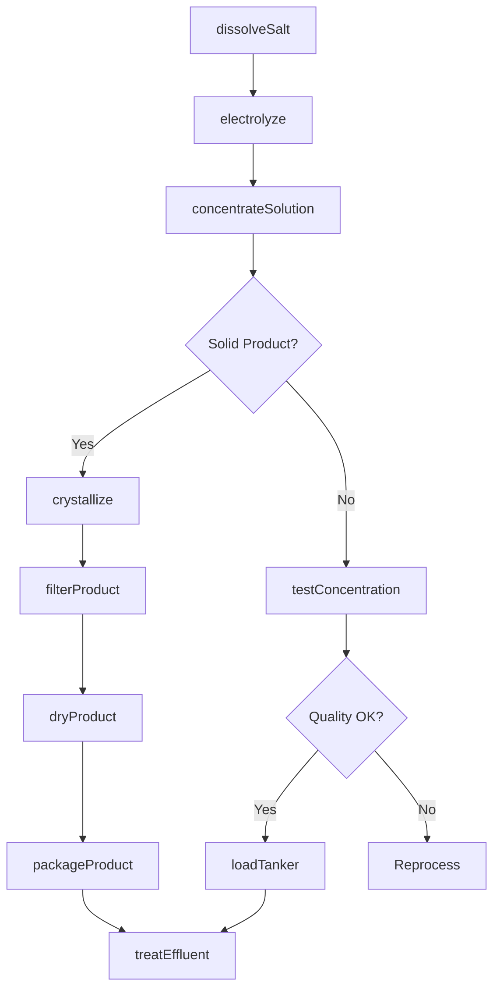
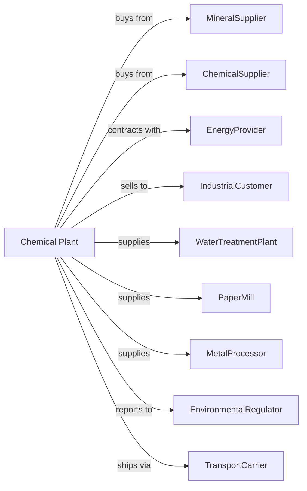

# Other Basic Inorganic Chemical Manufacturing

> Business-as-Code definition for basic inorganic chemical production operations. Models the complete manufacturing lifecycle from raw material processing through chemical product distribution.

## Overview

Other basic inorganic chemical manufacturing involves producing chemicals such as alkalies, aluminum compounds, carbides, carbon black, chlorine, hydrochloric acid, sulfuric acid, and potassium compounds. These chemicals serve as building blocks for numerous industrial processes. This definition exposes actions for each phase of production, events for workflow automation, and searches for data retrieval.

## Actors

| Actor | Description |
|-------|-------------|
| MineralSupplier | Provides ores, salts, and mineral raw materials |
| ChemicalSupplier | Supplies acids, bases, and processing chemicals |
| EnergyProvider | Supplies electricity, natural gas, and steam |
| IndustrialCustomer | Purchases bulk chemicals for manufacturing |
| WaterTreatmentPlant | Uses chemicals for purification processes |
| PaperMill | Consumes caustic soda and chlorine compounds |
| MetalProcessor | Uses acids and alkalis for metal treatment |
| EnvironmentalRegulator | Oversees emissions and hazardous waste handling |
| TransportCarrier | Handles bulk chemical shipments by rail and truck |

## Roles

| Role | Description |
|------|-------------|
| PlantManager | Oversees facility operations and safety compliance |
| ProcessEngineer | Designs and optimizes chemical production processes |
| ReactorOperator | Monitors and controls chemical reactions |
| ElectrolysisOperator | Operates electrolytic cells for chlor-alkali production |
| QualityAnalyst | Tests products for concentration and purity |
| SafetyCoordinator | Manages hazardous material handling protocols |
| EnvironmentalEngineer | Monitors emissions and waste treatment systems |
| LogisticsCoordinator | Manages bulk chemical storage and shipment |

## Entities

| Entity | Description |
|--------|-------------|
| Alkali | Basic hydroxides such as sodium and potassium hydroxide |
| Acid | Mineral acids including sulfuric, hydrochloric, and nitric |
| Chlorine | Elemental chlorine produced by electrolysis |
| CarbonBlack | Fine carbon particles used as reinforcing filler |
| Carbide | Compounds like calcium carbide and silicon carbide |
| Salt | Sodium chloride feedstock for chlor-alkali process |
| Electrolyte | Conductive solution in electrolytic cells |
| Brine | Concentrated salt solution for processing |
| Reactor | Vessel where chemical transformations occur |
| StorageTank | Container for bulk liquid chemicals |

## Actions

| Action | Description |
|--------|-------------|
| dissolveSalt | Prepare brine solution from solid salt |
| electrolyze | Pass current through brine to produce chlorine and caustic |
| reactChemicals | Combine raw materials to form target compounds |
| concentrateSolution | Remove water to increase product concentration |
| crystallize | Form solid crystals from concentrated solutions |
| filterProduct | Separate solid products from liquid streams |
| dryProduct | Remove moisture from solid chemical products |
| packageProduct | Fill drums, bags, or bulk containers |
| loadTanker | Transfer liquid chemicals to transport vessels |
| testConcentration | Measure product strength and purity |
| treatEffluent | Process wastewater before discharge |
| neutralizeWaste | Render hazardous waste safe for disposal |

## Events

| Event | Description |
|-------|-------------|
| brinePrepared | Salt solution prepared for electrolysis |
| electrolysisCompleted | Chlorine and caustic produced |
| reactionCompleted | Chemical synthesis finished |
| productConcentrated | Solution reached target strength |
| productCrystallized | Solid crystals formed and collected |
| qualityApproved | Product meets specification requirements |
| tankerLoaded | Bulk shipment ready for transport |
| emissionLimitExceeded | Emission level exceeded permitted threshold |
| equipmentFaulted | Process equipment malfunction detected |
| spillDetected | Chemical release identified |

## Searches

| Search | Description |
|--------|-------------|
| findProducts | List chemicals by type, grade, or application |
| getInventory | Retrieve stock levels for all products |
| checkQuality | Get concentration and purity test results |
| findCustomers | List customers by industry and volume |
| getProductionMetrics | Retrieve yield and efficiency data |
| getPricing | Get current prices and contract terms |
| getComplianceReports | Retrieve environmental and safety data |
| getShipmentStatus | Track bulk chemical deliveries |

## Workflow

## Actor Relationships

