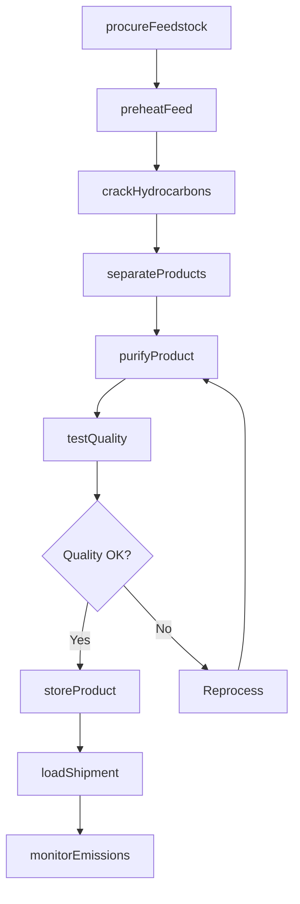
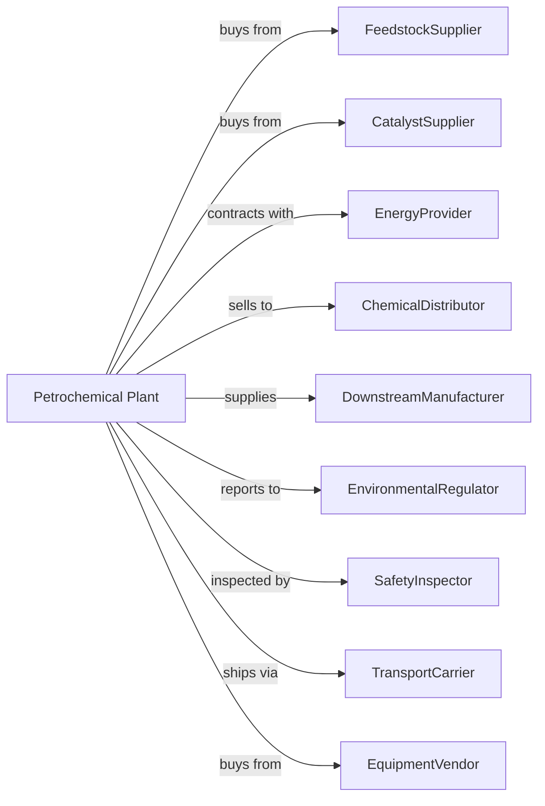

# Petrochemical Manufacturing

> Business-as-Code definition for petrochemical production operations. Models the complete chemical manufacturing lifecycle from feedstock procurement through product distribution.

## Overview

Petrochemical manufacturing involves producing acyclic hydrocarbons such as ethylene, propylene, and butylene from refined petroleum or liquid hydrocarbons, as well as cyclic aromatic hydrocarbons including benzene, toluene, styrene, xylene, ethyl benzene, and cumene. This definition exposes actions for each phase of production, events for workflow automation, and searches for data retrieval.

## Actors

| Actor | Description |
|-------|-------------|
| FeedstockSupplier | Provides naphtha, ethane, propane, and other raw materials |
| EquipmentVendor | Supplies and services cracking units, reactors, and processing equipment |
| CatalystSupplier | Provides catalysts for chemical reactions and conversions |
| EnergyProvider | Supplies natural gas, electricity, and steam for operations |
| ChemicalDistributor | Purchases and distributes finished petrochemicals |
| DownstreamManufacturer | Uses petrochemicals as feedstock for plastics, fibers, and resins |
| EnvironmentalRegulator | Oversees emissions, waste disposal, and environmental compliance |
| SafetyInspector | Conducts process safety audits and incident investigations |
| TransportCarrier | Handles bulk transport via pipeline, rail, and tanker |

## Roles

| Role | Description |
|------|-------------|
| PlantManager | Oversees entire facility operations and strategic decisions |
| ProcessEngineer | Designs and optimizes chemical production processes |
| ControlRoomOperator | Monitors and adjusts process parameters in real time |
| MaintenanceTechnician | Maintains and repairs equipment and instrumentation |
| QualityAnalyst | Tests product purity and ensures specification compliance |
| SafetyCoordinator | Manages safety protocols and emergency response |
| EnvironmentalEngineer | Monitors emissions and manages environmental compliance |
| SupplyChainManager | Coordinates feedstock procurement and product logistics |

## Entities

| Entity | Description |
|--------|-------------|
| Feedstock | Raw materials like naphtha, ethane, or propane for cracking |
| Cracker | Steam cracking unit that breaks down hydrocarbons |
| Product | Output chemicals like ethylene, propylene, or benzene |
| Catalyst | Material that accelerates chemical reactions |
| Reactor | Vessel where chemical transformations occur |
| Distillation | Separation process to purify products by boiling point |
| Storage | Tanks and vessels for raw materials and finished products |
| Pipeline | Infrastructure for transporting feedstock and products |
| Emission | Gases and particulates released during production |
| Batch | Quantity of product from a single production run |

## Actions

| Action | Description |
|--------|-------------|
| procureFeedstock | Purchase and receive raw hydrocarbon materials |
| preheatFeed | Heat feedstock to required cracking temperature |
| crackHydrocarbons | Break down feedstock in steam cracker to produce olefins |
| separateProducts | Use distillation to isolate individual chemical products |
| purifyProduct | Remove impurities to meet specification requirements |
| testQuality | Analyze product samples for purity and composition |
| storeProduct | Transfer finished chemicals to storage tanks |
| loadShipment | Prepare and load products for transport |
| monitorEmissions | Track and report air emissions and waste streams |
| performMaintenance | Execute scheduled and corrective equipment maintenance |
| optimizeProcess | Adjust parameters to maximize yield and efficiency |
| respondToAlarm | Address process upsets and safety alerts |

## Events

| Event | Description |
|-------|-------------|
| feedstockReceived | Raw materials delivered and verified |
| crackerStarted | Steam cracker brought online and operating |
| productSeparated | Distillation completed and products isolated |
| qualityApproved | Product meets specification requirements |
| batchCompleted | Production run finished and recorded |
| shipmentLoaded | Product transferred to transport vessel |
| emissionLimitExceeded | Air quality threshold breached |
| equipmentFailed | Machinery malfunction detected |
| maintenanceCompleted | Repair or service work finished |
| safetyIncidentOccurred | Accident or near-miss reported |

## Searches

| Search | Description |
|--------|-------------|
| findFeedstock | List available feedstock with price and delivery terms |
| getInventory | Retrieve current stock levels for all products |
| checkProductQuality | Get quality test results for specific batches |
| getProductionMetrics | Retrieve yield, throughput, and efficiency data |
| findBuyers | List potential customers and current demand |
| getEmissionReports | Retrieve environmental monitoring data |
| getMaintenanceSchedule | List upcoming and overdue maintenance tasks |
| getPricing | Get current market prices for petrochemicals |

## Workflow

## Actor Relationships

