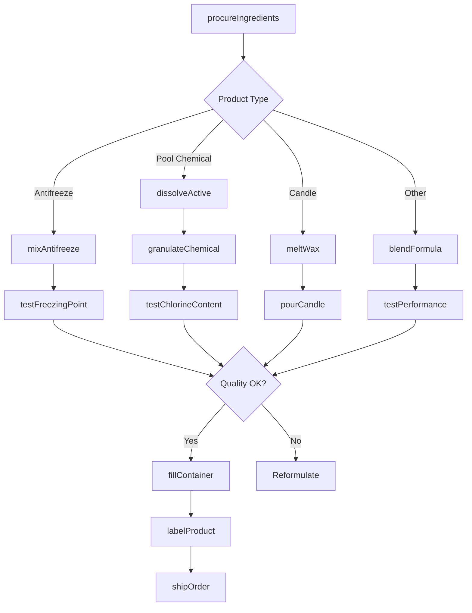
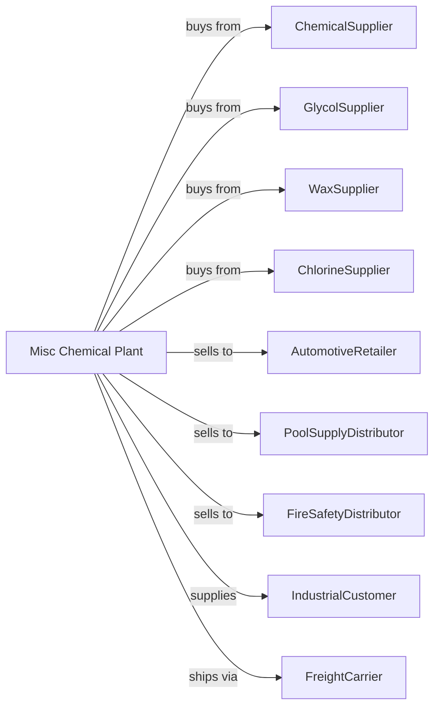

# All Other Miscellaneous Chemical Product and Preparation Manufacturing

> Business-as-Code definition for miscellaneous specialty chemical manufacturing operations. Models the complete production lifecycle from formulation through specialty chemical product distribution.

## Overview

All other miscellaneous chemical product manufacturing involves producing specialty chemicals not classified elsewhere, including fire extinguishing preparations, antifreeze, de-icing fluids, swimming pool chemicals, water treatment chemicals, candles, lighter fluid, and other specialty preparations. This definition exposes actions for each phase of production, events for workflow automation, and searches for data retrieval.

## Actors

| Actor | Description |
|-------|-------------|
| ChemicalSupplier | Provides base chemicals and active ingredients |
| GlycolSupplier | Supplies ethylene and propylene glycol |
| WaxSupplier | Provides paraffin and specialty waxes |
| ChlorineSupplier | Supplies chlorine compounds for pool chemicals |
| AutomotiveRetailer | Sells antifreeze and car care products |
| PoolSupplyDistributor | Distributes water treatment chemicals |
| FireSafetyDistributor | Sells fire extinguishing products |
| IndustrialCustomer | Uses specialty chemicals in operations |
| FreightCarrier | Handles chemical product shipments |

## Roles

| Role | Description |
|------|-------------|
| PlantManager | Oversees facility operations and quality |
| FormulationChemist | Develops specialty product formulations |
| MixingOperator | Blends ingredients for chemical products |
| FillingOperator | Packages products in containers |
| QualityTechnician | Tests performance and specifications |
| RegulatorySpecialist | Manages compliance and labeling |
| ApplicationEngineer | Supports customers with technical guidance |
| WarehouseManager | Manages inventory and distribution |

## Entities

| Entity | Description |
|--------|-------------|
| Antifreeze | Engine coolant preventing freeze and boil |
| DeIcer | Fluid or solid for melting ice |
| PoolChemical | Water treatment for swimming pools |
| FireExtinguishant | Agent suppressing combustion |
| WaterTreatment | Chemicals for industrial water systems |
| Candle | Solid fuel product for illumination |
| LighterFluid | Flammable liquid for ignition |
| Glycol | Primary antifreeze ingredient |
| Chlorine | Disinfectant for pool water |
| Batch | Quantity produced in single run |

## Actions

| Action | Description |
|--------|-------------|
| procureIngredients | Source and receive raw materials |
| blendFormula | Combine chemicals to create product |
| dissolveActive | Prepare solutions of active ingredients |
| meltWax | Liquefy wax for candle production |
| pourCandle | Fill molds with melted wax |
| mixAntifreeze | Combine glycol with additives |
| granulateChemical | Form solid chemical granules |
| testFreezingPoint | Verify antifreeze protection level |
| testChlorineContent | Measure pool chemical concentration |
| fillContainer | Package products in bottles or drums |
| labelProduct | Apply required hazmat and safety labels |
| shipOrder | Dispatch products to customers |

## Events

| Event | Description |
|-------|-------------|
| ingredientsReceived | Raw materials delivered and verified |
| formulaBlended | Product mixture completed |
| waxMelted | Candle base ready for pouring |
| candlesPoured | Candles formed in molds |
| freezingPointVerified | Antifreeze meets specification |
| chlorineContentApproved | Pool chemical meets concentration |
| productPackaged | Items containerized for shipment |
| orderShipped | Products dispatched |
| hazmatComplianceChecked | Safety labeling verified |
| qualityHoldPlaced | Product quarantined for investigation |

## Searches

| Search | Description |
|--------|-------------|
| findProducts | List chemicals by type and application |
| getInventory | Retrieve stock levels and batch availability |
| checkQuality | Get performance and specification test results |
| findFormulas | List product formulations |
| findCustomers | List buyers by industry and channel |
| getProductionMetrics | Retrieve throughput and efficiency data |
| getPricing | Get current wholesale prices |
| getSeasonalDemand | Forecast demand by product type |

## Workflow

## Actor Relationships

