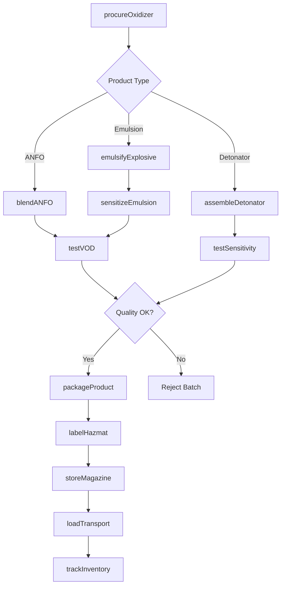
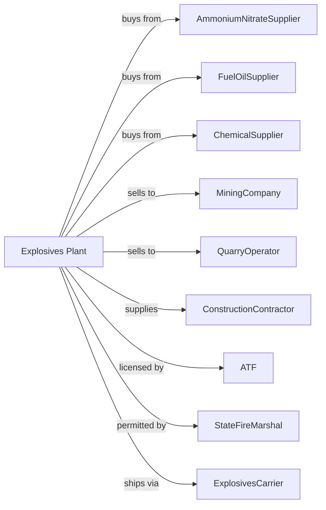

# Explosives Manufacturing

> Business-as-Code definition for commercial explosives production operations. Models the complete manufacturing lifecycle from chemical processing through blasting product distribution.

## Overview

Explosives manufacturing involves producing commercial explosives for mining, quarrying, construction, and demolition applications. Products include dynamite, emulsion explosives, ANFO, detonators, boosters, and blasting agents. This definition exposes actions for each phase of production, events for workflow automation, and searches for data retrieval.

## Actors

| Actor | Description |
|-------|-------------|
| AmmoniumNitrateSupplier | Provides oxidizer for explosive formulations |
| FuelOilSupplier | Supplies fuel component for ANFO |
| ChemicalSupplier | Provides emulsifiers and sensitizers |
| MiningCompany | Purchases explosives for ore extraction |
| QuarryOperator | Uses explosives for stone and aggregate |
| ConstructionContractor | Employs explosives for demolition and excavation |
| ATF | Regulates explosives manufacturing and storage |
| StateFireMarshal | Oversees local explosives permits |
| ExplosivesCarrier | Handles regulated transport of explosives |

## Roles

| Role | Description |
|------|-------------|
| PlantManager | Oversees facility operations and security |
| ExplosivesChemist | Develops and tests explosive formulations |
| ProductionOperator | Manufactures explosive products |
| BlendingOperator | Mixes ANFO and emulsion explosives |
| QualityTechnician | Tests velocity of detonation and sensitivity |
| SecurityOfficer | Manages access control and inventory tracking |
| SafetyCoordinator | Ensures compliance with safety protocols |
| TechnicalBlaster | Supports customers with blast design |

## Entities

| Entity | Description |
|--------|-------------|
| ANFO | Ammonium nitrate fuel oil blasting agent |
| Emulsion | Water-in-oil explosive with high energy |
| Dynamite | Nitroglycerin-based high explosive |
| Detonator | Device initiating explosive reaction |
| Booster | High-energy product amplifying detonation |
| Primer | Cartridge sensitive to detonator initiation |
| VelocityOfDetonation | Speed of explosive reaction propagation |
| Magazine | Licensed storage facility for explosives |
| ATFLicense | Federal authorization for manufacturing |
| BlastingAgent | Insensitive explosive requiring booster |

## Actions

| Action | Description |
|--------|-------------|
| procureOxidizer | Source and receive ammonium nitrate |
| blendANFO | Mix ammonium nitrate with fuel oil |
| emulsifyExplosive | Create water-in-oil emulsion explosive |
| sensitizeEmulsion | Add gas bubbles or microspheres |
| assembleDetonator | Combine initiator components |
| testVOD | Measure velocity of detonation |
| testSensitivity | Evaluate minimum initiation energy |
| packageProduct | Load explosives into containers |
| labelHazmat | Apply required hazardous materials labels |
| storeMagazine | Place products in licensed storage |
| loadTransport | Prepare shipments for regulated carriers |
| trackInventory | Maintain ATF-required records |

## Events

| Event | Description |
|-------|-------------|
| oxidizerReceived | Ammonium nitrate delivered and verified |
| anfoBlended | ANFO mixture completed |
| emulsionManufactured | Emulsion explosive produced |
| detonatorAssembled | Initiating device completed |
| vodVerified | Velocity of detonation confirmed |
| sensitivityApproved | Product meets safety specifications |
| productPackaged | Explosives containerized |
| shipmentLoaded | Transport vehicle loaded |
| inventoryReconciled | ATF records updated |
| securityIncidentOccurred | Unauthorized access or loss detected |

## Searches

| Search | Description |
|--------|-------------|
| findProducts | List explosives by type and application |
| getInventory | Retrieve stock levels and magazine locations |
| checkQuality | Get VOD and sensitivity test results |
| findCustomers | List mining and construction customers |
| getATFRecords | Retrieve regulatory inventory reports |
| getShipmentManifests | Track transported explosives |
| getSecurityLogs | Review access and incident records |
| getBlastDesigns | Access technical support documentation |

## Workflow

## Actor Relationships

