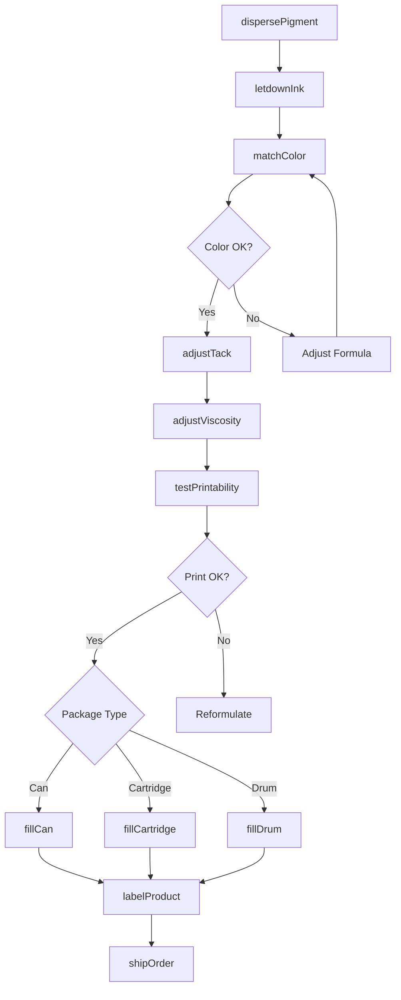
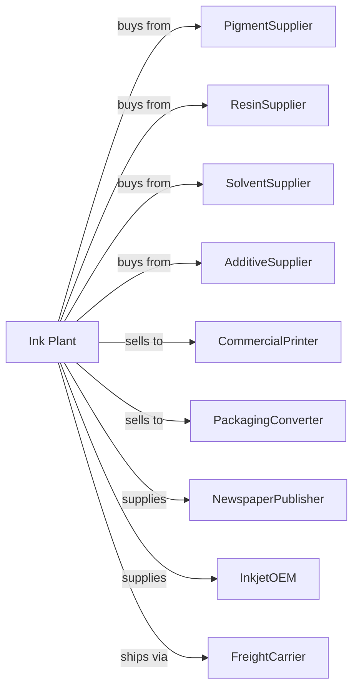

# Printing Ink Manufacturing

> Business-as-Code definition for printing ink and inkjet ink production operations. Models the complete manufacturing lifecycle from pigment dispersion through ink distribution.

## Overview

Printing ink manufacturing involves producing inks for offset, flexographic, gravure, digital, and inkjet printing applications. Products include process color inks, spot colors, UV-curable inks, water-based inks, and inkjet cartridges. This definition exposes actions for each phase of production, events for workflow automation, and searches for data retrieval.

## Actors

| Actor | Description |
|-------|-------------|
| PigmentSupplier | Provides organic and inorganic colorants |
| ResinSupplier | Supplies binders and varnishes |
| SolventSupplier | Provides petroleum and water-based carriers |
| AdditiveSupplier | Supplies waxes, dryers, and modifiers |
| CommercialPrinter | Purchases inks for printing operations |
| PackagingConverter | Uses inks for flexible and rigid packaging |
| NewspaperPublisher | Buys newsprint and coldset inks |
| InkjetOEM | Purchases bulk ink for cartridge filling |
| FreightCarrier | Handles ink shipments |

## Roles

| Role | Description |
|------|-------------|
| PlantManager | Oversees production operations and quality |
| InkChemist | Develops ink formulations for applications |
| MillOperator | Operates dispersion mills and mixers |
| ColorMatcher | Matches inks to customer color standards |
| QualityTechnician | Tests viscosity, tack, and print properties |
| TechnicalSalesRep | Supports printers with product selection |
| PackagingOperator | Fills cans, cartridges, and drums |
| EnvironmentalCoordinator | Manages VOC compliance and waste |

## Entities

| Entity | Description |
|--------|-------------|
| ProcessInk | CMYK inks for four-color printing |
| SpotColor | Custom-mixed ink for specific colors |
| UVInk | Ink that cures under ultraviolet light |
| WaterBasedInk | Ink using water as primary carrier |
| InkjetInk | Liquid ink for digital inkjet printing |
| Pigment | Colorant providing opacity and hue |
| Varnish | Binder carrying pigment to substrate |
| Tack | Stickiness affecting ink transfer |
| Viscosity | Flow property for press performance |
| Cartridge | Filled container for inkjet printers |

## Actions

| Action | Description |
|--------|-------------|
| dispersePigment | Mill pigment into varnish base |
| letdownInk | Add varnish to adjust strength and flow |
| matchColor | Adjust formula to meet color standard |
| adjustTack | Modify ink stickiness for press |
| adjustViscosity | Set flow properties for application |
| testPrintability | Evaluate ink on press or proofer |
| testColorStrength | Measure pigment loading and density |
| fillCan | Package ink in metal containers |
| fillCartridge | Load ink into inkjet cartridges |
| fillDrum | Package bulk ink for large customers |
| labelProduct | Apply required labels and data sheets |
| shipOrder | Dispatch products to customers |

## Events

| Event | Description |
|-------|-------------|
| pigmentDispersed | Mill operation completed |
| inkLetdownCompleted | Varnish added and adjusted |
| colorMatched | Ink matches customer standard |
| tackAdjusted | Stickiness set for press |
| viscosityAdjusted | Flow properties confirmed |
| printabilityApproved | Ink performs on press |
| productPackaged | Ink containerized for shipment |
| orderShipped | Products dispatched |
| batchRejected | Ink fails quality specifications |
| vocLimitExceeded | Emission threshold breached |

## Searches

| Search | Description |
|--------|-------------|
| findProducts | List inks by type, color, and application |
| getInventory | Retrieve stock levels and batch availability |
| checkQuality | Get viscosity, tack, and color test results |
| findFormulas | List ink formulations and specifications |
| findCustomers | List printers and converters by volume |
| getProductionMetrics | Retrieve throughput and efficiency data |
| getPricing | Get current wholesale prices |
| getColorLibrary | Access standard and custom color matches |

## Workflow

## Actor Relationships

