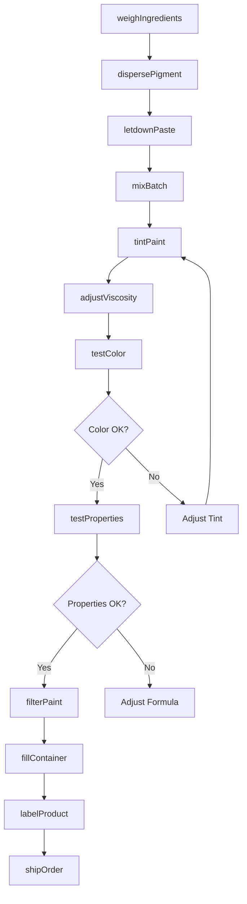
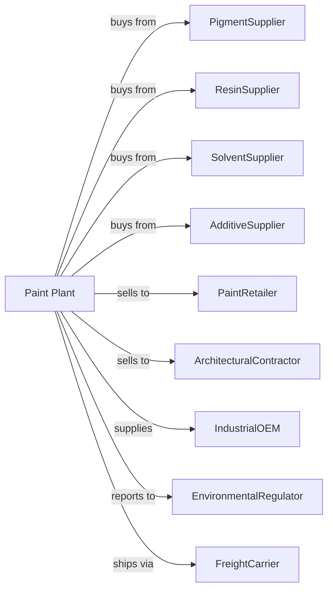

# Paint and Coating Manufacturing

> Business-as-Code definition for paint and coating production operations. Models the complete manufacturing lifecycle from pigment dispersion through finished coating distribution.

## Overview

Paint and coating manufacturing involves mixing pigments, solvents, and binders into paints and other coatings including stains, varnishes, lacquers, enamels, shellacs, and water-repellent coatings. Allied products include putties, paint removers, and brush cleaners. This definition exposes actions for each phase of production, events for workflow automation, and searches for data retrieval.

## Actors

| Actor | Description |
|-------|-------------|
| PigmentSupplier | Provides color pigments and extenders |
| ResinSupplier | Supplies binders and film-forming polymers |
| SolventSupplier | Provides water, organic solvents, and coalescents |
| AdditiveSupplier | Supplies dispersants, thickeners, and biocides |
| PaintRetailer | Purchases consumer paints for retail sale |
| ArchitecturalContractor | Buys coatings for building projects |
| IndustrialOEM | Uses coatings for manufactured products |
| EnvironmentalRegulator | Oversees VOC emissions and chemical compliance |
| FreightCarrier | Handles paint shipments by truck and rail |

## Roles

| Role | Description |
|------|-------------|
| PlantManager | Oversees production operations and quality |
| ColorMatching | Develops and matches custom paint colors |
| MillOperator | Operates dispersion mills and mixing equipment |
| BatchMaker | Combines ingredients and adjusts formulations |
| QualityTechnician | Tests viscosity, color, and coating properties |
| FormulationChemist | Develops new paint and coating products |
| TechnicalSalesRep | Provides product recommendations to customers |
| EnvironmentalCoordinator | Manages VOC compliance and waste handling |

## Entities

| Entity | Description |
|--------|-------------|
| Paint | Pigmented coating for decorative and protective use |
| Stain | Penetrating finish that colors wood |
| Varnish | Clear coating providing protective film |
| Primer | Base coat promoting adhesion |
| Pigment | Solid particles providing color and opacity |
| Binder | Resin that forms coating film |
| Solvent | Liquid that dissolves binder and controls viscosity |
| Additive | Chemical modifying paint performance |
| VOC | Volatile organic compound subject to regulation |
| Batch | Quantity produced in single mixing operation |

## Actions

| Action | Description |
|--------|-------------|
| weighIngredients | Measure components per formula |
| dispersePigment | Mill pigment into binder to form paste |
| letdownPaste | Thin paste with additional binder and solvent |
| mixBatch | Combine all ingredients and homogenize |
| tintPaint | Add colorant to achieve target color |
| adjustViscosity | Modify consistency for application method |
| testColor | Compare batch to standard for color match |
| testProperties | Measure hiding, gloss, and film properties |
| filterPaint | Remove oversized particles before packaging |
| fillContainer | Package paint in cans, pails, or drums |
| labelProduct | Apply required labels and safety information |
| shipOrder | Dispatch products to customers |

## Events

| Event | Description |
|-------|-------------|
| ingredientsWeighed | Components measured for batch |
| pigmentDispersed | Mill operation completed |
| batchMixed | All ingredients combined |
| colorMatched | Paint matches target standard |
| viscosityAdjusted | Consistency set for application |
| propertiesApproved | Batch meets performance specifications |
| batchFiltered | Particles removed before fill |
| containersLabeled | Paint packaged for shipment |
| orderShipped | Products dispatched to customer |
| vocLimitExceeded | Emission threshold breached |

## Searches

| Search | Description |
|--------|-------------|
| findProducts | List paints by type, color, and application |
| getInventory | Retrieve stock levels and batch availability |
| checkQuality | Get color and performance test results |
| findFormulas | List product formulations and specifications |
| findCustomers | List buyers by channel and volume |
| getProductionMetrics | Retrieve throughput and efficiency data |
| getPricing | Get current wholesale and retail prices |
| getVOCData | Review solvent content and compliance |

## Workflow

## Actor Relationships

