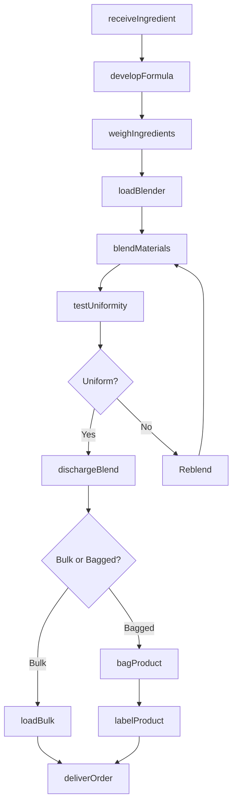
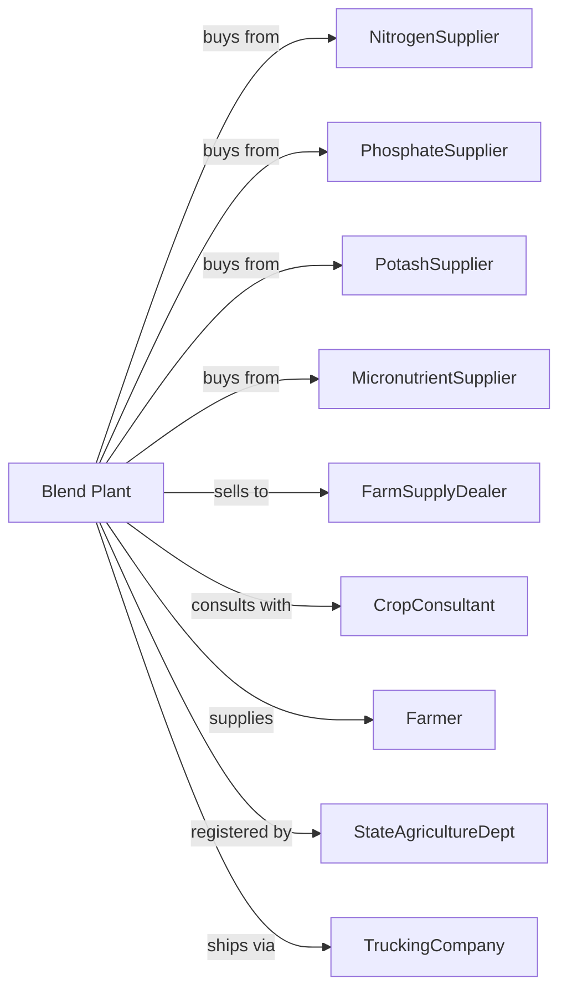

# Fertilizer (Mixing Only) Manufacturing

> Business-as-Code definition for fertilizer blending and mixing operations. Models the complete blending process from ingredient sourcing through custom fertilizer distribution.

## Overview

Fertilizer mixing manufacturing involves blending purchased nitrogen, phosphorus, potassium, and micronutrient ingredients into custom fertilizer formulations. Operations do not produce base fertilizer materials but combine them to meet specific crop and soil requirements. This definition exposes actions for each phase of production, events for workflow automation, and searches for data retrieval.

## Actors

| Actor | Description |
|-------|-------------|
| NitrogenSupplier | Provides urea, ammonium nitrate, and nitrogen solutions |
| PhosphateSupplier | Supplies DAP, MAP, and other phosphate materials |
| PotashSupplier | Provides potassium chloride and sulfate |
| MicronutrientSupplier | Supplies zinc, boron, iron, and other trace elements |
| FarmSupplyDealer | Purchases blended fertilizer for retail |
| CropConsultant | Specifies custom blends based on soil tests |
| Farmer | Applies custom fertilizer to fields |
| StateAgricultureDept | Registers fertilizer products and inspects labels |
| TruckingCompany | Delivers bulk and bagged fertilizer |

## Roles

| Role | Description |
|------|-------------|
| PlantManager | Oversees blending operations and inventory |
| BlendOperator | Operates mixing and conveying equipment |
| FormulaSpecialist | Develops custom fertilizer formulations |
| QualityTechnician | Tests blend uniformity and nutrient content |
| WarehouseManager | Manages ingredient and finished product inventory |
| SalesAgronomist | Advises farmers on fertilizer selection |
| TruckDispatcher | Coordinates deliveries during planting season |
| EquipmentMaintainer | Services blenders, conveyors, and scales |

## Entities

| Entity | Description |
|--------|-------------|
| Blend | Custom fertilizer mixture of multiple nutrients |
| Formula | Specified ratio of ingredients for a blend |
| Ingredient | Base fertilizer material purchased for blending |
| NPKRatio | Nitrogen-phosphorus-potassium content designation |
| Micronutrient | Trace element added to blends in small quantities |
| Blender | Rotating drum or mixer for combining ingredients |
| Scale | Equipment for weighing ingredients |
| Hopper | Storage bin for individual ingredients |
| Bag | Packaged unit of blended fertilizer |
| Spreader | Customer equipment for field application |

## Actions

| Action | Description |
|--------|-------------|
| receiveIngredient | Accept and store base fertilizer materials |
| developFormula | Create blend recipe based on soil test results |
| weighIngredients | Measure precise quantities of each component |
| loadBlender | Transfer ingredients to mixing equipment |
| blendMaterials | Combine ingredients to uniform mixture |
| dischargeBend | Transfer blended product to storage or packaging |
| bagProduct | Fill bags with blended fertilizer |
| loadBulk | Transfer bulk blend to truck or wagon |
| testUniformity | Verify consistent nutrient distribution |
| labelProduct | Apply required nutrient and registration labels |
| deliverOrder | Transport fertilizer to farm or dealer |
| trackSeason | Monitor seasonal demand and inventory |

## Events

| Event | Description |
|-------|-------------|
| ingredientReceived | Base fertilizer material delivered |
| formulaApproved | Custom blend recipe finalized |
| blendCompleted | Mixing operation finished |
| qualityVerified | Blend uniformity confirmed |
| bagsFilled | Product packaged for delivery |
| bulkLoaded | Truck filled with blend |
| orderDelivered | Fertilizer arrived at customer site |
| seasonOpened | Spring planting demand begins |
| ingredientDepleted | Ingredient stock fell below threshold |
| equipmentCleaned | Blender prepared for next formula |

## Searches

| Search | Description |
|--------|-------------|
| findFormulas | List available blends by NPK ratio |
| getInventory | Retrieve ingredient and finished product stock |
| checkQuality | Get uniformity test results for batches |
| findOrders | List pending customer orders |
| getIngredientPrices | Retrieve current costs for base materials |
| getDeliverySchedule | List upcoming delivery appointments |
| getSoilTestResults | Retrieve customer soil analysis data |
| getSeasonalDemand | Forecast blend requirements by region |

## Workflow

## Actor Relationships

