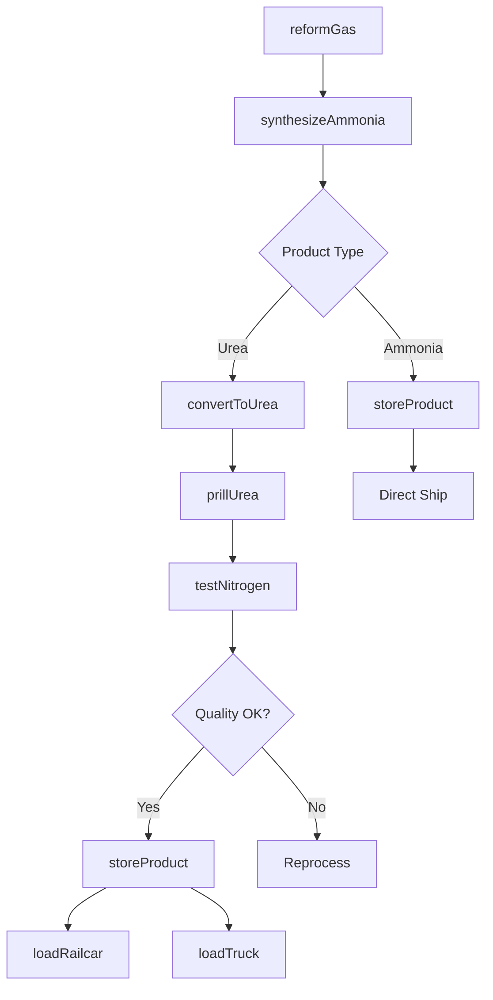
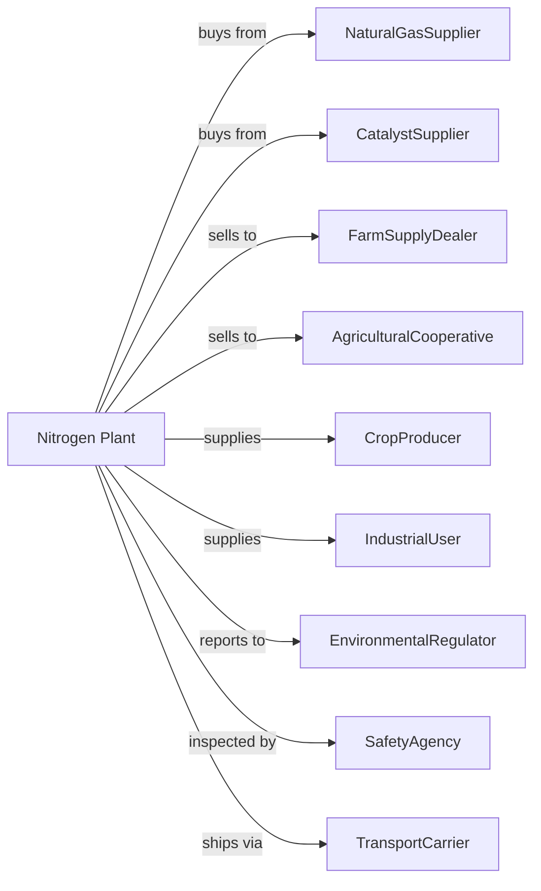

# Nitrogenous Fertilizer Manufacturing

> Business-as-Code definition for nitrogenous fertilizer production operations. Models the complete manufacturing lifecycle from ammonia synthesis through fertilizer distribution.

## Overview

Nitrogenous fertilizer manufacturing involves producing nitrogen-based fertilizers including ammonia, urea, ammonium nitrate, ammonium sulfate, and nitrogen solutions. Feedstocks include natural gas and recovered nitrogen from organic waste. This definition exposes actions for each phase of production, events for workflow automation, and searches for data retrieval.

## Actors

| Actor | Description |
|-------|-------------|
| NaturalGasSupplier | Provides methane feedstock for ammonia synthesis |
| CatalystSupplier | Supplies catalysts for synthesis and conversion |
| FarmSupplyDealer | Purchases fertilizer for retail distribution |
| AgriculturalCooperative | Buys bulk fertilizer for member farmers |
| CropProducer | Applies fertilizer to agricultural fields |
| IndustrialUser | Uses ammonia for chemical manufacturing |
| EnvironmentalRegulator | Oversees emissions and safety compliance |
| SafetyAgency | Regulates storage and handling of hazardous materials |
| TransportCarrier | Handles bulk fertilizer by rail, truck, and pipeline |

## Roles

| Role | Description |
|------|-------------|
| PlantManager | Oversees facility operations and safety programs |
| ProcessEngineer | Optimizes synthesis and conversion processes |
| ReactorOperator | Monitors ammonia synthesis and urea reactors |
| ControlRoomOperator | Manages plant operations from central control |
| QualityAnalyst | Tests product nitrogen content and specifications |
| MaintenanceTechnician | Maintains high-pressure equipment and instrumentation |
| SafetyCoordinator | Manages process safety and emergency response |
| LogisticsManager | Coordinates bulk storage and distribution |

## Entities

| Entity | Description |
|--------|-------------|
| Ammonia | Primary nitrogen compound synthesized from hydrogen and nitrogen |
| Urea | Solid nitrogen fertilizer with 46% nitrogen content |
| AmmoniumNitrate | High-nitrogen fertilizer used in solutions and solids |
| NitrogenSolution | Liquid fertilizer containing dissolved nitrogen compounds |
| Catalyst | Material enabling ammonia synthesis at lower temperatures |
| SynthesisLoop | High-pressure reactor system for ammonia production |
| Prilling | Process forming spherical fertilizer particles |
| Granule | Coated or formed fertilizer particle |
| Tank | Storage vessel for ammonia or liquid fertilizers |
| Railcar | Transportation unit for bulk fertilizer shipment |

## Actions

| Action | Description |
|--------|-------------|
| reformGas | Convert natural gas to hydrogen and carbon dioxide |
| synthesizeAmmonia | React hydrogen and nitrogen under high pressure |
| convertToUrea | React ammonia with carbon dioxide to form urea |
| prillUrea | Form molten urea into spherical particles |
| granulate | Create coated or enlarged fertilizer granules |
| dissolveNitrogen | Prepare liquid nitrogen solutions |
| testNitrogen | Analyze nitrogen content and product quality |
| storeProduct | Transfer fertilizer to tanks, bins, or warehouses |
| loadRailcar | Fill rail cars for bulk shipment |
| loadTruck | Prepare truck shipments for local delivery |
| blendProduct | Mix with other nutrients for custom formulations |
| trackInventory | Monitor storage levels and product availability |

## Events

| Event | Description |
|-------|-------------|
| gasReceived | Natural gas feedstock delivered |
| ammoniaProduced | Synthesis loop operating and producing |
| ureaConverted | Urea reaction completed |
| productPrilled | Fertilizer particles formed |
| qualityApproved | Product meets nitrogen specifications |
| productStored | Fertilizer transferred to storage |
| shipmentLoaded | Bulk shipment ready for transport |
| seasonalDemandPeaked | Planting season drives high demand |
| safetyViolationDetected | Safety violation or hazard detected |
| inventoryDepleted | Stock fell below threshold |

## Searches

| Search | Description |
|--------|-------------|
| findProducts | List fertilizers by type and nitrogen content |
| getInventory | Retrieve stock levels and storage locations |
| checkQuality | Get nitrogen analysis and test results |
| findBuyers | List customers by region and volume |
| getProductionMetrics | Retrieve throughput and efficiency data |
| getPricing | Get current fertilizer market prices |
| getSeasonalForecast | Predict demand based on planting schedules |
| getShipmentStatus | Track deliveries to customers |

## Workflow

## Actor Relationships

