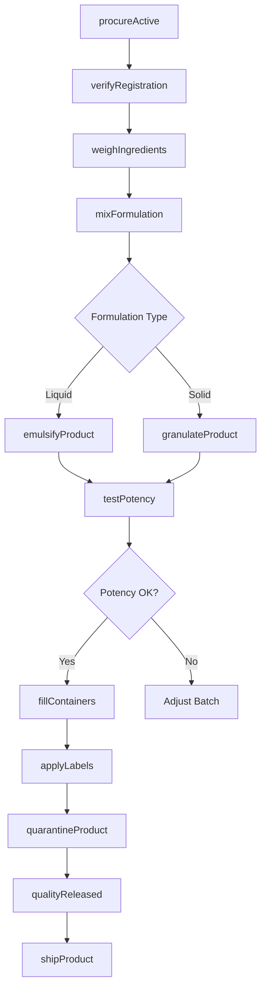
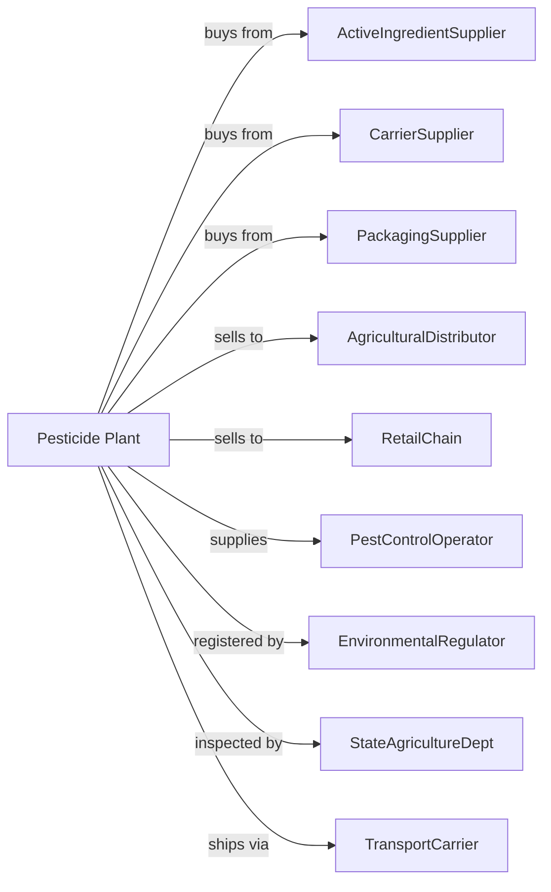

# Pesticide and Other Agricultural Chemical Manufacturing

> Business-as-Code definition for pesticide and agricultural chemical production operations. Models the complete formulation lifecycle from active ingredient sourcing through crop protection product distribution.

## Overview

Pesticide and agricultural chemical manufacturing involves formulating and preparing herbicides, insecticides, fungicides, rodenticides, and other pest control chemicals for agricultural and household use. Operations include mixing active ingredients with carriers, adjuvants, and packaging for application. This definition exposes actions for each phase of production, events for workflow automation, and searches for data retrieval.

## Actors

| Actor | Description |
|-------|-------------|
| ActiveIngredientSupplier | Provides technical-grade pesticide compounds |
| CarrierSupplier | Supplies inert carriers, solvents, and adjuvants |
| PackagingSupplier | Provides containers, labels, and application equipment |
| AgriculturalDistributor | Purchases products for farm supply channels |
| RetailChain | Buys household pest control products |
| PestControlOperator | Uses commercial-grade products for services |
| EnvironmentalRegulator | Registers pesticide products and oversees compliance |
| StateAgricultureDept | Enforces pesticide regulations and licensing |
| TransportCarrier | Handles hazardous material shipments |

## Roles

| Role | Description |
|------|-------------|
| PlantManager | Oversees formulation operations and regulatory compliance |
| FormulationChemist | Develops product formulations and specifications |
| BatchOperator | Mixes and processes pesticide formulations |
| PackagingOperator | Fills containers and applies labels |
| QualityAnalyst | Tests active ingredient content and stability |
| RegulatoryAffairs | Manages pesticide registrations and label compliance |
| SafetyCoordinator | Ensures worker protection and spill prevention |
| TechnicalSalesRep | Provides application guidance to customers |

## Entities

| Entity | Description |
|--------|-------------|
| ActiveIngredient | Chemical compound with pesticidal activity |
| Formulation | Finished product combining active and inert ingredients |
| Carrier | Inert material that dilutes and delivers active ingredient |
| Adjuvant | Additive improving product performance |
| Emulsion | Liquid formulation of oil-in-water or water-in-oil |
| Granule | Solid formulation for direct application |
| Label | environmentalregulator-approved product instructions and warnings |
| Registration | Regulatory approval required for product sale |
| Batch | Quantity produced in single formulation run |
| Container | Packaging for product storage and application |

## Actions

| Action | Description |
|--------|-------------|
| procureActive | Source and receive active ingredients |
| verifyRegistration | Confirm registration status for formulation |
| weighIngredients | Measure precise quantities for batch |
| mixFormulation | Combine active and inert ingredients |
| millProduct | Reduce particle size for suspensions |
| emulsifyProduct | Create stable liquid emulsion |
| granulateProduct | Form solid granular products |
| testPotency | Analyze active ingredient concentration |
| fillContainers | Package formulation in approved containers |
| applyLabels | Attach environmentalregulator-compliant labels to packages |
| quarantineProduct | Hold for quality release |
| shipProduct | Dispatch approved product to customers |

## Events

| Event | Description |
|-------|-------------|
| activeReceived | Active ingredient delivered and verified |
| registrationConfirmed | Registration approval validated for batch |
| formulationMixed | Batch blending completed |
| potencyVerified | Active ingredient content confirmed |
| productPackaged | Containers filled and sealed |
| labelsApplied | Regulatory labels attached |
| qualityReleased | Batch approved for sale |
| shipmentDispatched | Product transported to customer |
| regulatoryAuditOccurred | Regulatory or state inspection conducted |
| recallInitiated | Product withdrawal ordered |

## Searches

| Search | Description |
|--------|-------------|
| findProducts | List formulations by pest target and crop |
| getInventory | Retrieve stock levels and batch availability |
| checkQuality | Get potency and stability test results |
| getRegistrations | List registration status and expiration |
| findCustomers | List distributors and retailers by region |
| getProductionMetrics | Retrieve batch yield and throughput |
| getPricing | Get current wholesale prices |
| getComplianceStatus | Review regulatory standing and audits |

## Workflow

## Actor Relationships

