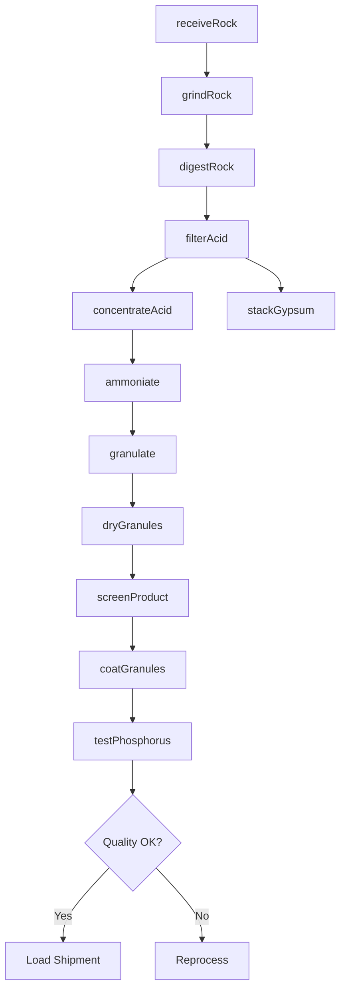
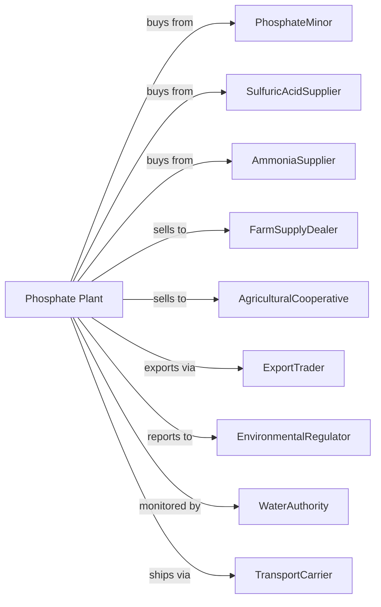

# Phosphatic Fertilizer Manufacturing

> Business-as-Code definition for phosphatic fertilizer production operations. Models the complete manufacturing lifecycle from phosphate rock processing through fertilizer distribution.

## Overview

Phosphatic fertilizer manufacturing involves producing phosphorus-based fertilizers including phosphoric acid, monoammonium phosphate (MAP), diammonium phosphate (DAP), triple superphosphate, and other phosphate compounds. This definition exposes actions for each phase of production, events for workflow automation, and searches for data retrieval.

## Actors

| Actor | Description |
|-------|-------------|
| PhosphateMinor | Supplies phosphate rock ore from mining operations |
| SulfuricAcidSupplier | Provides acid for phosphate rock digestion |
| AmmoniaSupplier | Supplies ammonia for ammonium phosphate production |
| FarmSupplyDealer | Purchases fertilizer for retail distribution |
| AgriculturalCooperative | Buys bulk fertilizer for member farmers |
| ExportTrader | Purchases fertilizer for international markets |
| EnvironmentalRegulator | Oversees phosphogypsum disposal and emissions |
| WaterAuthority | Monitors discharge to waterways |
| TransportCarrier | Handles bulk fertilizer by rail and ship |

## Roles

| Role | Description |
|------|-------------|
| PlantManager | Oversees facility operations and environmental compliance |
| ProcessEngineer | Optimizes acidulation and granulation processes |
| ReactorOperator | Monitors digestion and reaction vessels |
| GranulationOperator | Controls granulation and drying equipment |
| QualityAnalyst | Tests phosphorus content and product quality |
| EnvironmentalEngineer | Manages phosphogypsum stacks and water treatment |
| MaintenanceTechnician | Maintains corrosion-resistant equipment |
| LogisticsManager | Coordinates bulk storage and export shipments |

## Entities

| Entity | Description |
|--------|-------------|
| PhosphateRock | Ore containing phosphorus for processing |
| PhosphoricAcid | Intermediate product from rock acidulation |
| DAP | Diammonium phosphate fertilizer granules |
| MAP | Monoammonium phosphate fertilizer granules |
| TSP | Triple superphosphate fertilizer |
| Phosphogypsum | Byproduct from phosphoric acid production |
| Granulator | Equipment for forming fertilizer granules |
| Dryer | Rotary equipment for moisture removal |
| Digester | Vessel for reacting rock with acid |
| Stack | Storage area for phosphogypsum byproduct |

## Actions

| Action | Description |
|--------|-------------|
| receiveRock | Accept and stockpile phosphate rock |
| grindRock | Reduce rock particle size for processing |
| digestRock | React ground rock with sulfuric acid |
| filterAcid | Separate phosphoric acid from gypsum |
| concentrateAcid | Evaporate water to increase acid strength |
| ammoniate | React phosphoric acid with ammonia |
| granulate | Form fertilizer particles in rotating drum |
| dryGranules | Remove moisture in rotary dryer |
| screenProduct | Separate granules by size |
| coatGranules | Apply anti-caking and dust control agents |
| testPhosphorus | Analyze P2O5 content and specifications |
| stackGypsum | Dispose phosphogypsum in engineered stacks |

## Events

| Event | Description |
|-------|-------------|
| rockReceived | Phosphate ore delivered to plant |
| acidProduced | Phosphoric acid separated and filtered |
| acidConcentrated | Acid strength increased to specification |
| productGranulated | Fertilizer particles formed |
| productDried | Moisture removed to target level |
| qualityApproved | Product meets phosphorus specifications |
| shipmentLoaded | Bulk fertilizer ready for transport |
| gypsumStacked | Byproduct disposed in storage area |
| waterTreated | Process water meets discharge limits |
| seasonalDemandPeaked | Planting season drives high demand |

## Searches

| Search | Description |
|--------|-------------|
| findProducts | List fertilizers by grade and phosphorus content |
| getInventory | Retrieve stock levels and storage locations |
| checkQuality | Get P2O5 analysis and test results |
| findBuyers | List customers by region and volume |
| getRockSupply | Monitor phosphate rock inventory |
| getProductionMetrics | Retrieve throughput and efficiency data |
| getPricing | Get current fertilizer market prices |
| getEnvironmentalData | Retrieve water and air quality monitoring |

## Workflow

## Actor Relationships

