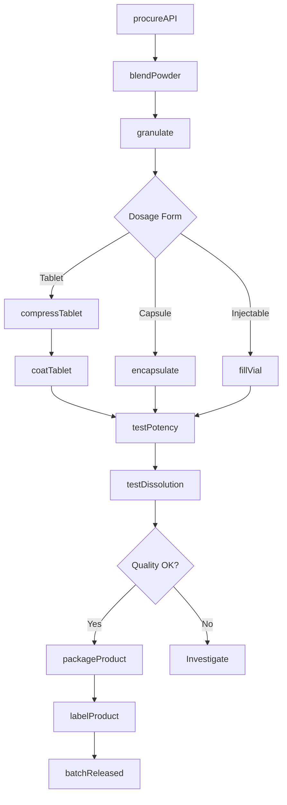
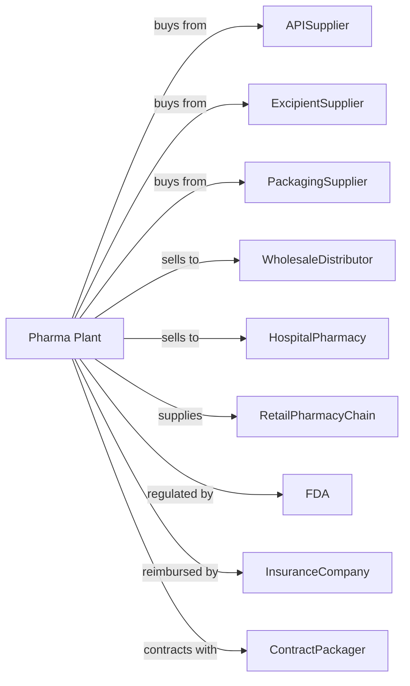

# Pharmaceutical Preparation Manufacturing

> Business-as-Code definition for pharmaceutical preparation manufacturing operations. Models the complete drug manufacturing lifecycle from formulation development through finished dosage form distribution.

## Overview

Pharmaceutical preparation manufacturing involves producing pharmaceutical preparations intended for internal and external consumption in dose forms such as tablets, capsules, ampoules, vials, ointments, powders, solutions, and suspensions. Products include prescription drugs, over-the-counter medications, and in-vivo diagnostic substances. This definition exposes actions for each phase of production, events for workflow automation, and searches for data retrieval.

## Actors

| Actor | Description |
|-------|-------------|
| APISupplier | Provides active pharmaceutical ingredients |
| ExcipientSupplier | Supplies binders, fillers, and inactive ingredients |
| PackagingSupplier | Provides bottles, blister packs, and labels |
| WholesaleDistributor | Purchases finished drugs for distribution |
| HospitalPharmacy | Buys medications for patient care |
| RetailPharmacyChain | Stocks medications for consumer purchase |
| FDA | Regulates drug approval and GMP compliance |
| InsuranceCompany | Provides reimbursement for covered drugs |
| ContractPackager | Offers packaging and labeling services |

## Roles

| Role | Description |
|------|-------------|
| PlantManager | Oversees manufacturing operations and compliance |
| FormulationScientist | Develops drug formulations and dosage forms |
| ManufacturingOperator | Operates tablet presses, encapsulators, and filling lines |
| QualityControlAnalyst | Tests finished products for potency and purity |
| QualityAssuranceManager | Ensures GMP compliance and batch release |
| RegulatoryAffairs | Manages NDA/ANDA submissions and labeling |
| ValidationSpecialist | Qualifies equipment and validates processes |
| PackagingTechnician | Operates packaging and labeling equipment |

## Entities

| Entity | Description |
|--------|-------------|
| Tablet | Solid dosage form created by compression |
| Capsule | Encapsulated powder or liquid dosage form |
| Injectable | Sterile liquid for injection |
| Ointment | Semi-solid topical preparation |
| Suspension | Liquid with dispersed solid particles |
| Batch | Quantity produced in single manufacturing run |
| Lot | Packaging lot linked to batch records |
| NDA | New Drug Application for approval |
| ANDA | Abbreviated NDA for generic drugs |
| GMP | Good Manufacturing Practice requirements |

## Actions

| Action | Description |
|--------|-------------|
| procureAPI | Source and receive active ingredients |
| blendPowder | Mix API with excipients to uniform mixture |
| granulate | Form powder into granules for compression |
| compressTablet | Form tablets using rotary press |
| coatTablet | Apply film or sugar coating to tablets |
| encapsulate | Fill capsules with powder or liquid |
| fillVial | Aseptically fill sterile liquids into vials |
| mixOintment | Combine ingredients for topical products |
| testPotency | Analyze drug content per dose |
| testDissolution | Measure drug release rate |
| packageProduct | Fill bottles, blisters, or cartons |
| labelProduct | Apply required drug labeling |

## Events

| Event | Description |
|-------|-------------|
| apiReceived | Active ingredient delivered and quarantined |
| blendCompleted | Powder mixture uniform and sampled |
| tabletsCompressed | Batch tablets formed |
| coatingCompleted | Film or sugar coat applied |
| vialsFilledIntact | Sterile fill completed without contamination |
| potencyVerified | Drug content meets specification |
| dissolutionPassed | Release rate within limits |
| batchReleased | QA approved for distribution |
| recallInitiated | Product withdrawal ordered |
| fdaInspection | Regulatory audit conducted |

## Searches

| Search | Description |
|--------|-------------|
| findProducts | List drugs by name, strength, and dosage form |
| getInventory | Retrieve stock levels and lot availability |
| checkQuality | Get potency and dissolution test results |
| findCustomers | List distributors and pharmacies by volume |
| getProductionSchedule | View manufacturing queue and capacity |
| getBatchRecords | Retrieve complete production documentation |
| getRegulatoryStatus | Check NDA/ANDA approval status |
| getStabilityData | Review product shelf life studies |

## Workflow

## Actor Relationships

