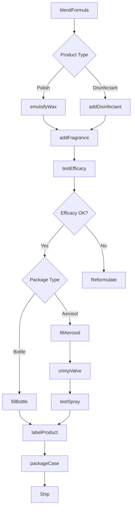
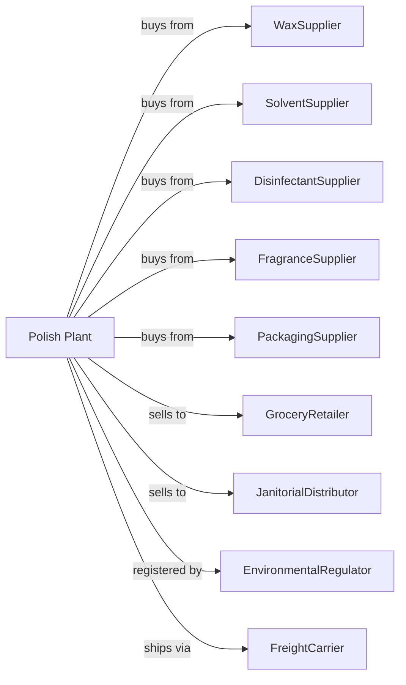

# Polish and Other Sanitation Good Manufacturing

> Business-as-Code definition for polish and specialty cleaning product manufacturing operations. Models the complete production lifecycle from formulation through packaged sanitation goods distribution.

## Overview

Polish and sanitation good manufacturing involves producing and packaging polishes, waxes, specialty cleaning preparations, disinfectants, and sanitizing products. Products include furniture polish, floor wax, metal polish, glass cleaners, toilet bowl cleaners, and disinfectant sprays. This definition exposes actions for each phase of production, events for workflow automation, and searches for data retrieval.

## Actors

| Actor | Description |
|-------|-------------|
| WaxSupplier | Provides natural and synthetic waxes |
| SolventSupplier | Supplies cleaning solvents and carriers |
| DisinfectantSupplier | Provides antimicrobial active ingredients |
| FragranceSupplier | Supplies scents for cleaning products |
| PackagingSupplier | Provides aerosol cans, bottles, and triggers |
| GroceryRetailer | Stocks household cleaning products |
| JanitorialDistributor | Serves commercial cleaning operations |
| EnvironmentalRegulator | Registers disinfectant products |
| FreightCarrier | Handles product shipments |

## Roles

| Role | Description |
|------|-------------|
| PlantManager | Oversees production operations and compliance |
| FormulationChemist | Develops polish and cleaner formulations |
| MixingOperator | Blends ingredients for products |
| AerosolFiller | Operates aerosol filling and propellant lines |
| QualityTechnician | Tests shine, cleaning, and antimicrobial efficacy |
| RegulatorySpecialist | Manages product registrations and labeling |
| PackagingOperator | Fills bottles and aerosol cans |
| WarehouseManager | Manages inventory and shipments |

## Entities

| Entity | Description |
|--------|-------------|
| Polish | Product that cleans and adds shine to surfaces |
| Wax | Film-forming ingredient providing protection |
| Disinfectant | Product that kills germs on surfaces |
| Sanitizer | Product reducing microbial contamination |
| Solvent | Liquid dissolving soils and delivering actives |
| Aerosol | Pressurized spray delivery system |
| Propellant | Gas providing aerosol spray force |
| Fragrance | Scent masking chemicals or adding appeal |
| EPARegistration | Required approval for antimicrobial claims |
| Batch | Quantity produced in single formulation run |

## Actions

| Action | Description |
|--------|-------------|
| blendFormula | Combine waxes, solvents, and additives |
| emulsifyWax | Create stable wax-water emulsion |
| addDisinfectant | Incorporate antimicrobial active |
| addFragrance | Include scent in formulation |
| testEfficacy | Evaluate cleaning or germicidal performance |
| fillBottle | Package liquid products |
| fillAerosol | Load product and propellant into cans |
| crimpValve | Seal aerosol cans |
| testSpray | Verify aerosol spray pattern and rate |
| labelProduct | Apply required labels and warnings |
| packageCase | Pack finished goods for shipment |
| registerProduct | Obtain registration for disinfectants |

## Events

| Event | Description |
|-------|-------------|
| formulaBlended | Ingredients combined and mixed |
| waxEmulsified | Stable emulsion created |
| efficacyVerified | Cleaning or antimicrobial performance confirmed |
| bottlesFilled | Liquid products packaged |
| aerosolsFilled | Cans charged with product and propellant |
| valvesCrimped | Aerosol cans sealed |
| labelsApplied | Product labeling completed |
| orderShipped | Products dispatched to customer |
| epaRegistered | Disinfectant approval received |
| recallIssued | Product withdrawal ordered |

## Searches

| Search | Description |
|--------|-------------|
| findProducts | List polishes and cleaners by type and surface |
| getInventory | Retrieve stock levels and batch availability |
| checkQuality | Get efficacy and performance test results |
| findFormulas | List product specifications |
| findCustomers | List retailers and distributors |
| getEPAStatus | Check registration status for disinfectants |
| getProductionMetrics | Retrieve throughput and efficiency data |
| getPricing | Get current wholesale prices |

## Workflow

## Actor Relationships

