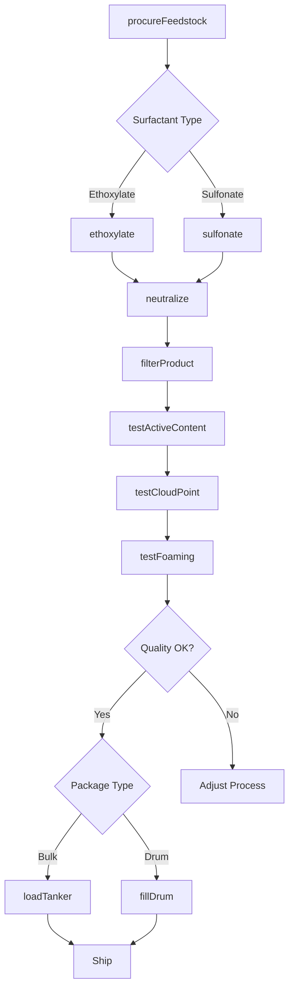
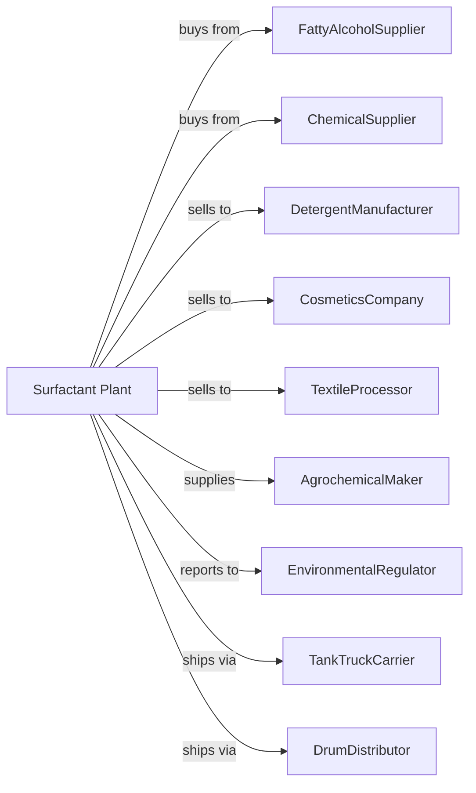

# Surface Active Agent Manufacturing

> Business-as-Code definition for surfactant and surface active agent production operations. Models the complete manufacturing lifecycle from chemical synthesis through bulk surfactant distribution.

## Overview

Surface active agent manufacturing involves producing bulk surfactants used as wetting agents, emulsifiers, penetrants, dispersants, and foam stabilizers. Products also include textile and leather finishing agents. Surfactants are essential ingredients in detergents, cosmetics, and industrial formulations. This definition exposes actions for each phase of production, events for workflow automation, and searches for data retrieval.

## Actors

| Actor | Description |
|-------|-------------|
| FattyAlcoholSupplier | Provides fatty alcohols and ethoxylates |
| ChemicalSupplier | Supplies ethylene oxide, sulfuric acid, and reagents |
| DetergentManufacturer | Purchases surfactants for cleaning products |
| CosmeticsCompany | Uses surfactants in personal care formulations |
| TextileProcessor | Employs finishing agents for fabric treatment |
| AgrochemicalMaker | Uses surfactants as spray adjuvants |
| EnvironmentalRegulator | Oversees chemical handling and emissions |
| TankTruckCarrier | Handles bulk liquid surfactant shipments |
| DrumDistributor | Supplies surfactants in smaller quantities |

## Roles

| Role | Description |
|------|-------------|
| PlantManager | Oversees facility operations and safety |
| ProcessChemist | Develops and optimizes surfactant synthesis |
| ReactorOperator | Executes ethoxylation and sulfonation reactions |
| PurificationOperator | Neutralizes and refines finished surfactants |
| QualityAnalyst | Tests active content, pH, and cloud point |
| ApplicationChemist | Supports customers with formulation guidance |
| SafetyCoordinator | Manages hazardous chemical handling |
| LogisticsManager | Coordinates bulk and drum shipments |

## Entities

| Entity | Description |
|--------|-------------|
| Surfactant | Surface-active molecule with hydrophilic and lipophilic parts |
| Ethoxylate | Surfactant made by reacting with ethylene oxide |
| Sulfonate | Anionic surfactant with sulfonic acid group |
| Betaine | Amphoteric surfactant for mild formulations |
| Quaternary | Cationic surfactant for conditioning and softening |
| HLB | Hydrophilic-lipophilic balance value |
| ActiveContent | Concentration of surfactant in product |
| CloudPoint | Temperature at which product becomes cloudy |
| Reactor | Vessel for ethoxylation or sulfonation |
| ToteTank | Intermediate bulk container for shipment |

## Actions

| Action | Description |
|--------|-------------|
| procureFeedstock | Source fatty alcohols and chemical reagents |
| ethoxylate | React fatty alcohol with ethylene oxide |
| sulfonate | React with sulfuric acid or sulfur trioxide |
| neutralize | Adjust pH to target specification |
| blendProduct | Combine surfactants for specific performance |
| filterProduct | Remove particles and clarify |
| testActiveContent | Measure surfactant concentration |
| testCloudPoint | Determine temperature stability |
| testFoaming | Evaluate foam generation and stability |
| loadTanker | Fill bulk truck or rail tank |
| fillDrum | Package in drums for smaller customers |
| provideTechSupport | Assist customers with applications |

## Events

| Event | Description |
|-------|-------------|
| feedstockReceived | Raw materials delivered and verified |
| ethoxylationCompleted | Ethylene oxide addition finished |
| sulfonationCompleted | Sulfonic acid formation finished |
| productNeutralized | pH adjusted to specification |
| activeContentVerified | Surfactant concentration confirmed |
| cloudPointApproved | Temperature stability validated |
| tankerLoaded | Bulk shipment ready |
| drumsFilledReady | Drum packaging completed |
| orderShipped | Product dispatched to customer |
| reactorCleaned | Equipment ready for next batch |

## Searches

| Search | Description |
|--------|-------------|
| findProducts | List surfactants by type, HLB, and application |
| getInventory | Retrieve stock levels and tank availability |
| checkQuality | Get active content and property test results |
| findCustomers | List buyers by industry and volume |
| getProductionMetrics | Retrieve yield and throughput data |
| getPricing | Get current bulk and drum prices |
| getSpecifications | Retrieve technical data sheets |
| getApplicationGuides | Access formulation recommendations |

## Workflow

## Actor Relationships

