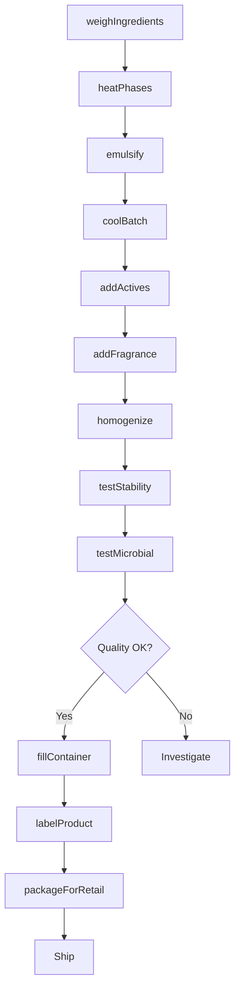
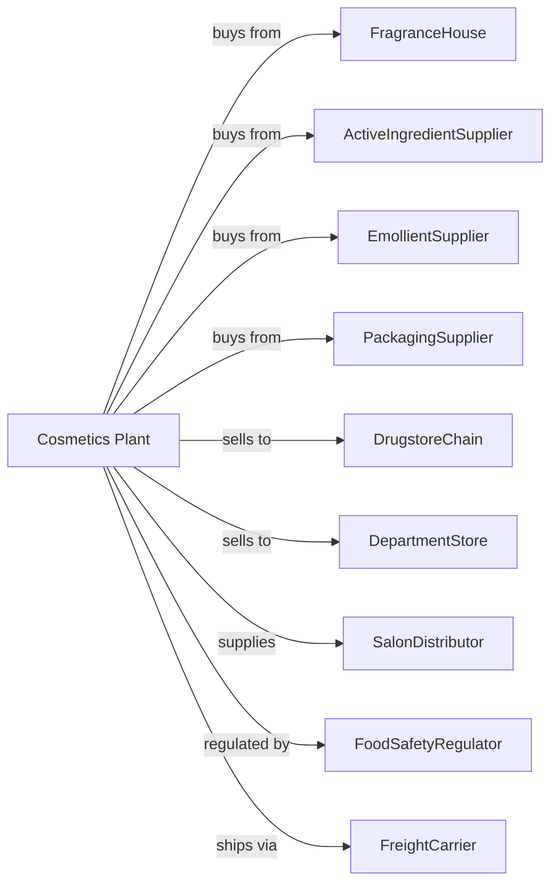

# Toilet Preparation Manufacturing

> Business-as-Code definition for cosmetic and personal care product manufacturing operations. Models the complete production lifecycle from formulation through packaged beauty product distribution.

## Overview

Toilet preparation manufacturing involves preparing, blending, compounding, and packaging cosmetics and personal care products including perfumes, shaving preparations, hair care products, face creams, lotions, sunscreens, makeup, and other beauty preparations. This definition exposes actions for each phase of production, events for workflow automation, and searches for data retrieval.

## Actors

| Actor | Description |
|-------|-------------|
| FragranceHouse | Provides perfume compounds and scents |
| ActiveIngredientSupplier | Supplies vitamins, retinoids, and actives |
| EmollientSupplier | Provides oils, butters, and moisturizers |
| PackagingSupplier | Supplies jars, tubes, bottles, and pumps |
| DrugstoreChain | Retails mass-market personal care products |
| DepartmentStore | Sells prestige cosmetics and fragrances |
| SalonDistributor | Supplies professional hair and skin products |
| FoodSafetyRegulator | Regulates cosmetic safety and labeling |
| FreightCarrier | Handles product distribution |

## Roles

| Role | Description |
|------|-------------|
| PlantManager | Oversees production operations and compliance |
| CosmeticChemist | Develops product formulations |
| CompoundingOperator | Blends ingredients for creams and lotions |
| FillingOperator | Packages products in containers |
| QualityTechnician | Tests stability, pH, and microbial limits |
| RegulatorySpecialist | Manages regulatory compliance and ingredient labeling |
| Perfumer | Creates fragrance compositions |
| MarketingLiaison | Coordinates product launches with sales |

## Entities

| Entity | Description |
|--------|-------------|
| Cream | Semi-solid emulsion for skin care |
| Lotion | Lighter liquid emulsion for body care |
| Perfume | Fragrance product in various concentrations |
| Shampoo | Hair cleansing product |
| Makeup | Color cosmetics for face and eyes |
| Sunscreen | UV-protective skin product |
| Emulsion | Mixture of oil and water phases |
| Preservative | Antimicrobial preventing product spoilage |
| Stability | Product integrity over time and conditions |
| Batch | Quantity produced in single compounding run |

## Actions

| Action | Description |
|--------|-------------|
| weighIngredients | Measure raw materials per formula |
| heatPhases | Warm oil and water phases separately |
| emulsify | Combine phases to form stable emulsion |
| coolBatch | Reduce temperature while mixing |
| addActives | Incorporate heat-sensitive ingredients |
| addFragrance | Include perfume at appropriate temperature |
| homogenize | Ensure uniform particle size and consistency |
| testStability | Evaluate product under storage conditions |
| testMicrobial | Check for contamination and preservative efficacy |
| fillContainer | Package into jars, tubes, or bottles |
| labelProduct | Apply required cosmetic labeling |
| packageForRetail | Prepare finished goods for shipment |

## Events

| Event | Description |
|-------|-------------|
| ingredientsWeighed | Raw materials measured |
| phasesHeated | Oil and water warmed for mixing |
| emulsionFormed | Stable cream or lotion created |
| batchCooled | Product at filling temperature |
| activesAdded | Specialty ingredients incorporated |
| fragranceAdded | Scent blended into product |
| stabilityPassed | Product stable through shelf life |
| microbialPassed | Product free of contamination |
| productFilled | Containers packaged |
| orderShipped | Products dispatched to customer |

## Searches

| Search | Description |
|--------|-------------|
| findProducts | List cosmetics by category and brand |
| getInventory | Retrieve stock levels and batch availability |
| checkQuality | Get stability and microbial test results |
| findFormulas | List product formulations and specifications |
| findCustomers | List retailers and distributors |
| getProductionSchedule | View compounding and filling capacity |
| getPricing | Get current wholesale prices |
| getIngredientStatus | Check raw material availability |

## Workflow

## Actor Relationships

