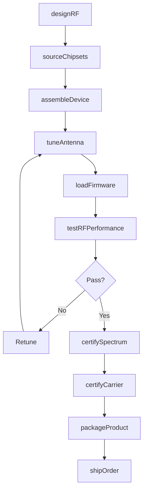
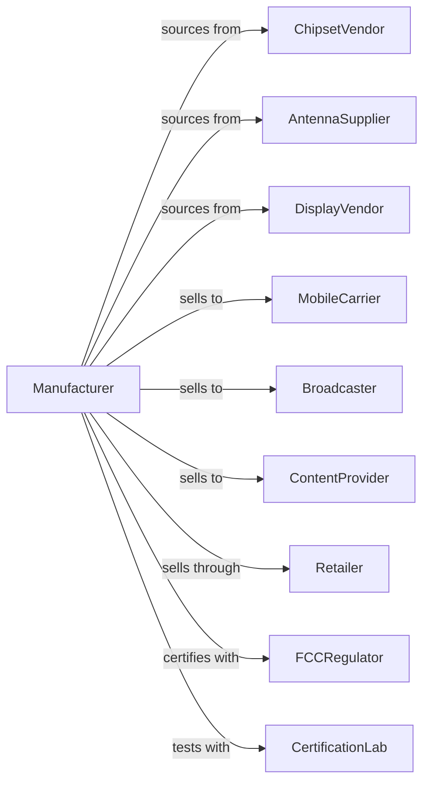

# Radio and Television Broadcasting and Wireless Communications Equipment Manufacturing

> Business-as-Code definition for wireless and broadcast equipment manufacturing. Models the production of cellular devices, broadcast transmitters, antennas, GPS equipment, and studio systems.

## Overview

This industry manufactures radio and television broadcast equipment, cellular phones, wireless infrastructure, antennas, GPS devices, and mobile communications systems. This definition covers RF engineering, antenna design, wireless protocol implementation, and rigorous certification for spectrum compliance.

## Actors

| Actor | Description |
|-------|-------------|
| ChipsetVendor | Provides RF, baseband, and modem chipsets |
| AntennaSupplier | Manufactures antenna arrays and RF components |
| DisplayVendor | Supplies screens for mobile devices |
| MobileCarrier | Purchases network infrastructure and subsidizes devices |
| Broadcaster | Deploys transmitters and studio equipment |
| ContentProvider | Requires set-top boxes and streaming devices |
| Retailer | Sells consumer wireless devices |
| FCCRegulator | Enforces spectrum and equipment regulations |
| CertificationLab | Tests wireless protocol and safety compliance |

## Roles

| Role | Description |
|------|-------------|
| RFEngineer | Designs radio frequency circuits and antennas |
| BasebandEngineer | Develops signal processing and modem firmware |
| AntennaEngineer | Optimizes antenna patterns and gain |
| ProtocolEngineer | Implements wireless standards such as 5G or Wi-Fi |
| QualityEngineer | Ensures EMC compliance and reliability |
| TestEngineer | Validates RF performance and protocol conformance |
| ProductManager | Manages device features and carrier requirements |
| RegulatorySpecialist | Navigates FCC and international certifications |

## Entities

| Entity | Description |
|--------|-------------|
| MobileDevice | Smartphone, feature phone, or mobile hotspot |
| BaseStation | Cellular tower equipment for network coverage |
| Transmitter | Broadcast equipment for radio or TV signals |
| Antenna | Directional or omnidirectional RF radiator |
| GPSReceiver | Navigation device with satellite positioning |
| SetTopBox | Consumer device for receiving broadcast content |
| Modem | Wireless data transceiver module |
| Firmware | Embedded software controlling wireless functions |
| Spectrum | Radio frequency allocation for transmission |
| Certification | FCC, carrier, and protocol compliance approval |

## Actions

| Action | Description |
|--------|-------------|
| designRF | Create radio frequency circuit and antenna designs |
| sourceChipsets | Procure modem, baseband, and RF components |
| assembleDevice | Integrate components into wireless equipment |
| tuneAntenna | Optimize antenna performance and matching |
| loadFirmware | Program modem and device operating software |
| testRFPerformance | Measure signal strength, sensitivity, and interference |
| certifySpectrum | Obtain FCC and international spectrum approvals |
| certifyCarrier | Pass carrier acceptance testing for devices |
| packageProduct | Prepare for retail or network deployment |
| shipOrder | Dispatch to carriers, broadcasters, or retail |
| updateOTA | Deploy over-the-air software and firmware updates |
| provisionNetwork | Configure base stations for carrier networks |

## Events

| Event | Description |
|-------|-------------|
| rfDesigned | Radio frequency design completed |
| chipsetsSourced | Wireless components procured |
| deviceAssembled | Equipment integration completed |
| antennaTuned | RF performance optimized |
| firmwareLoaded | Device software programmed |
| rfTestPassed | Signal performance validated |
| spectrumCertified | FCC approval obtained |
| carrierCertified | Carrier acceptance achieved |
| productPackaged | Equipment ready for distribution |
| orderShipped | Products dispatched to customer |
| otaUpdated | Field devices updated wirelessly |
| networkProvisioned | Base station activated on network |

## Searches

| Search | Description |
|--------|-------------|
| findDevices | List wireless products by type or band support |
| getInventory | Check stock levels by SKU or location |
| getOrders | Retrieve orders by carrier or customer |
| findCertifications | List spectrum and carrier approvals |
| getRFTestResults | Retrieve performance test data |
| getDeployments | Track base station installations |
| getFirmwareVersions | List available OTA updates |

## Workflow

## Actor Relationships

