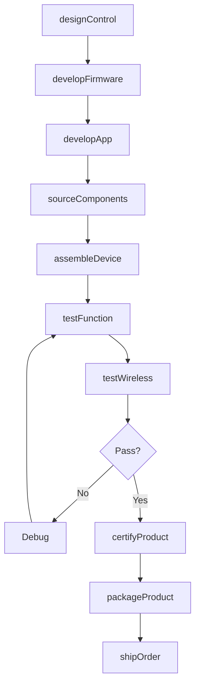
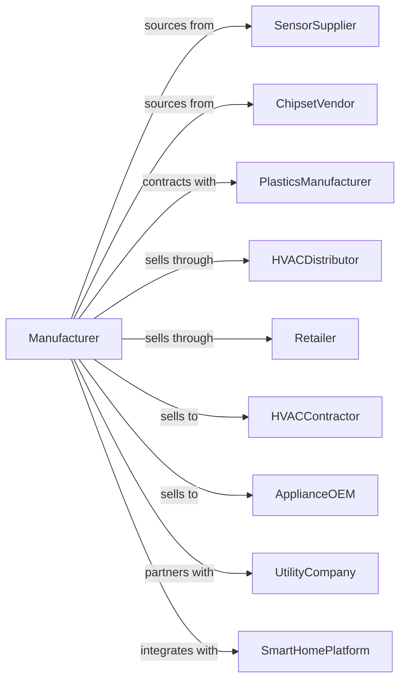

# Automatic Environmental Control Manufacturing for Residential, Commercial, and Appliance Use

> Business-as-Code definition for HVAC controls and thermostat manufacturing. Models the production of thermostats, humidity controllers, and smart building automation equipment.

## Overview

This industry manufactures automatic controls for heating, air-conditioning, refrigeration, and appliances. Products include programmable thermostats, smart home controllers, humidity sensors, refrigeration controls, and building automation systems. This definition covers IoT integration, energy efficiency compliance, and distribution to HVAC contractors and retailers.

## Actors

| Actor | Description |
|-------|-------------|
| SensorSupplier | Provides temperature, humidity, and occupancy sensors |
| ChipsetVendor | Supplies microcontrollers and wireless modules |
| PlasticsManufacturer | Produces housings and mounting hardware |
| HVACDistributor | Channels products to contractors and dealers |
| Retailer | Sells consumer thermostats through stores |
| HVACContractor | Installs controls in residential and commercial buildings |
| ApplianceOEM | Integrates controls into refrigerators and HVAC units |
| UtilityCompany | Partners for demand response and rebate programs |
| SmartHomePlatform | Integrates with Alexa, Google Home, or Apple HomeKit |

## Roles

| Role | Description |
|------|-------------|
| ControlsEngineer | Designs thermostat and building automation systems |
| FirmwareEngineer | Develops embedded software and wireless protocols |
| MechanicalEngineer | Creates enclosure and mounting designs |
| AppDeveloper | Builds mobile and web applications |
| QualityEngineer | Ensures reliability and safety compliance |
| ProductManager | Defines features for residential and commercial markets |
| ApplicationsEngineer | Supports OEM integration and customization |
| TechnicalSupport | Assists contractors and end users |

## Entities

| Entity | Description |
|--------|-------------|
| Thermostat | Temperature control device for HVAC systems |
| HumidityController | Device managing moisture levels |
| SmartController | Connected device with app and voice control |
| RefrigerationControl | Temperature regulation for cooling equipment |
| BuildingAutomation | Integrated system managing multiple zones |
| Sensor | Temperature, humidity, or occupancy detector |
| Firmware | Embedded software controlling device functions |
| MobileApp | Smartphone application for remote control |
| Protocol | Communication standard such as Zigbee or Z-Wave |
| Certification | UL, Energy Star, or wireless compliance |

## Actions

| Action | Description |
|--------|-------------|
| designControl | Create thermostat or controller specifications |
| developFirmware | Build embedded control algorithms |
| developApp | Create mobile application for user control |
| sourceComponents | Procure sensors, chips, and housings |
| assembleDevice | Integrate components into complete control |
| testFunction | Validate temperature control and scheduling |
| testWireless | Verify connectivity and protocol compliance |
| certifyProduct | Obtain UL, FCC, and Energy Star certifications |
| packageProduct | Prepare with mounting hardware and documentation |
| shipOrder | Dispatch to distributors, OEMs, or retail |
| integrateOEM | Customize controls for appliance manufacturers |
| updateFirmware | Deploy over-the-air software updates |

## Events

| Event | Description |
|-------|-------------|
| controlDesigned | Specifications approved for production |
| firmwareDeveloped | Embedded software completed |
| appDeveloped | Mobile application released |
| componentsSourced | Parts procured and received |
| deviceAssembled | Controller integration completed |
| functionTested | Control performance validated |
| wirelessTested | Connectivity verified |
| productCertified | Regulatory approvals obtained |
| productPackaged | Ready for distribution |
| orderShipped | Products dispatched |
| oemIntegrated | OEM customization completed |
| firmwareUpdated | Field devices updated |

## Searches

| Search | Description |
|--------|-------------|
| findProducts | List controls by type or compatibility |
| getInventory | Check stock levels by SKU |
| getOrders | Retrieve orders by customer or channel |
| findCertifications | List regulatory approvals |
| getConnectedDevices | Track installed smart controllers |
| getEnergyData | Retrieve usage analytics from connected devices |
| getOEMProjects | Track integration projects by customer |

## Workflow

## Actor Relationships

