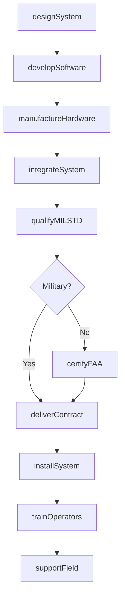
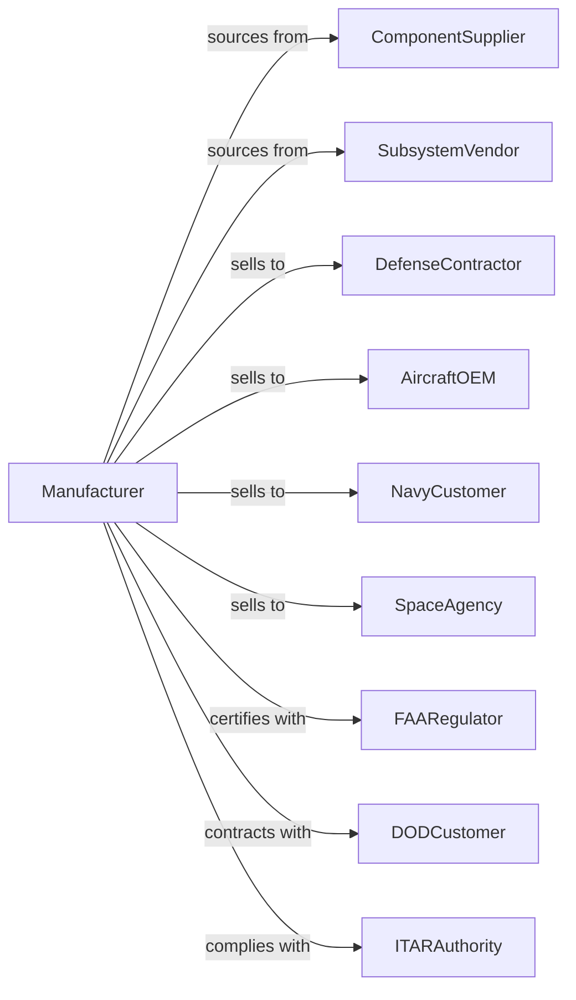

# Search, Detection, Navigation, Guidance, Aeronautical, and Nautical System and Instrument Manufacturing

> Business-as-Code definition for aerospace and defense electronics manufacturing. Models the production of radar systems, flight instruments, navigation equipment, and guidance systems.

## Overview

This industry manufactures search, detection, navigation, and guidance systems for aerospace and maritime applications. Products include radar systems, sonar equipment, flight instruments, autopilots, flight data recorders, and inertial navigation systems. This definition covers defense contracting, ITAR compliance, and rigorous qualification testing.

## Actors

| Actor | Description |
|-------|-------------|
| ComponentSupplier | Provides military-grade electronic components |
| SubsystemVendor | Supplies radar, sonar, or sensor modules |
| DefenseContractor | Integrates systems into military platforms |
| AircraftOEM | Purchases avionics for commercial and military aircraft |
| NavyCustomer | Acquires nautical and sonar systems |
| SpaceAgency | Requires guidance systems for spacecraft |
| FAARegulator | Certifies avionics for commercial aviation |
| DODCustomer | Procures defense electronics through contracts |
| ITARAuthority | Regulates export of defense articles |

## Roles

| Role | Description |
|------|-------------|
| SystemsEngineer | Designs complex navigation and detection systems |
| RFEngineer | Develops radar and antenna subsystems |
| SoftwareEngineer | Creates flight control and mission software |
| TestEngineer | Executes DO-178C and MIL-STD qualification |
| ProgramManager | Manages defense contracts and deliverables |
| QualityEngineer | Ensures AS9100 and defense quality standards |
| RegulatorySpecialist | Manages FAA certification and ITAR compliance |
| FieldEngineer | Supports installation and field maintenance |

## Entities

| Entity | Description |
|--------|-------------|
| RadarSystem | Detection and tracking equipment using RF |
| SonarSystem | Underwater detection using acoustic waves |
| FlightInstrument | Altimeters, airspeed indicators, and displays |
| NavigationSystem | INS, GPS, or hybrid positioning equipment |
| GuidanceSystem | Missile or spacecraft trajectory control |
| FlightRecorder | Black box capturing flight data and voice |
| Autopilot | Automatic flight control system |
| Software | DO-178C certified flight software |
| Certification | FAA TSO, STC, or military qualification |
| Contract | Defense procurement agreement |

## Actions

| Action | Description |
|--------|-------------|
| designSystem | Create system architecture and specifications |
| developSoftware | Build DO-178C compliant flight software |
| manufactureHardware | Produce qualified electronic assemblies |
| integrateSystem | Combine subsystems into complete solution |
| qualifyMILSTD | Execute military standard testing |
| certifyFAA | Obtain TSO or STC certification |
| deliverContract | Ship systems under defense contract |
| installSystem | Deploy on aircraft, ship, or platform |
| supportField | Provide maintenance and upgrades |
| manageITAR | Control export of defense technology |
| trainOperators | Instruct users on system operation |
| upgradeSystem | Modernize installed base with new capabilities |

## Events

| Event | Description |
|-------|-------------|
| systemDesigned | Architecture approved for development |
| softwareDeveloped | Flight code completed and baselined |
| hardwareManufactured | Electronic assemblies produced |
| systemIntegrated | Complete system assembled |
| milstdQualified | Military testing passed |
| faaCertified | Aviation certification obtained |
| contractDelivered | Systems shipped to customer |
| systemInstalled | Equipment deployed on platform |
| fieldSupported | Maintenance service provided |
| itarApproved | Export authorization obtained |
| operatorsTrained | Users certified on system |
| systemUpgraded | Enhancement deployed |

## Searches

| Search | Description |
|--------|-------------|
| findSystems | List products by type or platform |
| getContracts | Retrieve defense contracts by status |
| getCertifications | List FAA and military qualifications |
| getFieldIssues | Track maintenance and reliability data |
| findComponents | List qualified parts by specification |
| getExportStatus | Check ITAR authorization by destination |
| getProgramStatus | Review contract milestones and deliverables |

## Workflow

## Actor Relationships

