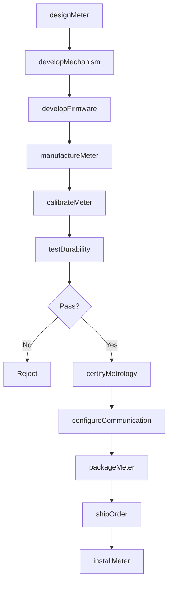
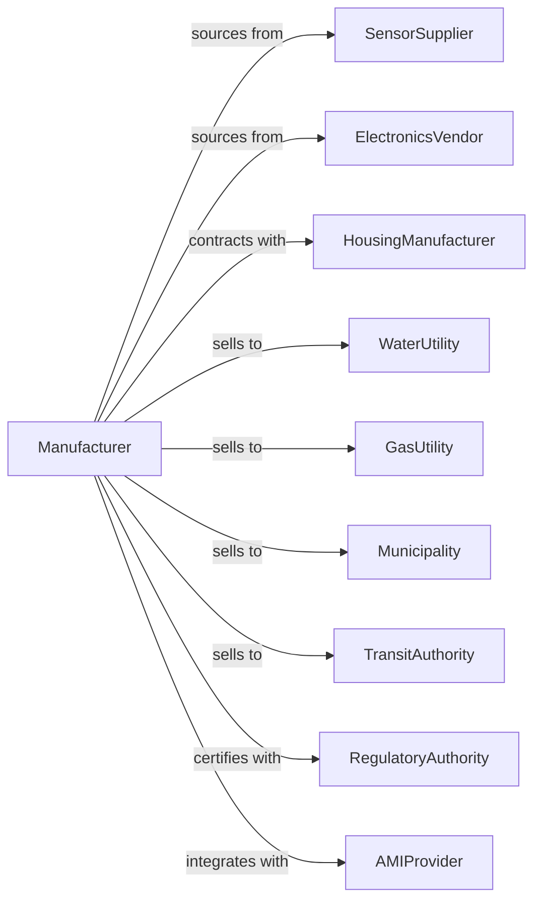

# Totalizing Fluid Meter and Counting Device Manufacturing

> Business-as-Code definition for utility meter and counting device manufacturing. Models the production of water meters, gas meters, parking meters, and fare collection equipment.

## Overview

This industry manufactures totalizing meters and counting devices including water consumption meters, gas meters, electric meters, parking meters, taxi meters, and fare collection systems. Products serve utilities, municipalities, and transportation authorities. This definition covers metrology certification, smart meter technology, and AMI integration.

## Actors

| Actor | Description |
|-------|-------------|
| SensorSupplier | Provides flow, pressure, and magnetic sensing elements |
| ElectronicsVendor | Supplies metering electronics and communication modules |
| HousingManufacturer | Produces weatherproof and tamper-resistant enclosures |
| WaterUtility | Purchases residential and commercial water meters |
| GasUtility | Acquires gas consumption meters |
| Municipality | Deploys parking meters and fare systems |
| TransitAuthority | Operates fare collection equipment |
| RegulatoryAuthority | Certifies meters for trade measurement |
| AMIProvider | Integrates meters with advanced metering infrastructure |

## Roles

| Role | Description |
|------|-------------|
| MeteringEngineer | Designs totalizing meter mechanisms |
| ElectronicsEngineer | Develops smart meter circuitry |
| FirmwareEngineer | Creates embedded software for data logging |
| MechanicalEngineer | Designs meter housings and registers |
| QualityEngineer | Ensures metrology accuracy standards |
| CalibrationTechnician | Verifies meter accuracy against standards |
| ProductManager | Manages meter product lines |
| FieldServiceTechnician | Supports installation and maintenance |

## Entities

| Entity | Description |
|--------|-------------|
| WaterMeter | Device measuring water consumption |
| GasMeter | Device measuring gas volume |
| ParkingMeter | Coin or card operated parking timer |
| TaxiMeter | Fare calculating device for vehicles |
| FareCollectionSystem | Transit payment and access equipment |
| SmartMeter | Connected meter with AMI communication |
| Register | Mechanical or digital display of totalized value |
| Firmware | Embedded software for logging and communication |
| Calibration | Verification against certified reference |
| Protocol | Communication standard for AMI networks |

## Actions

| Action | Description |
|--------|-------------|
| designMeter | Create specifications for totalizing device |
| developMechanism | Engineer measurement and register mechanism |
| developFirmware | Build smart meter embedded software |
| manufactureMeter | Produce meter assemblies |
| calibrateMeter | Verify accuracy against certified standard |
| testDurability | Validate performance over operating life |
| certifyMetrology | Obtain weights and measures approval |
| configureCommunication | Set up AMI or network connectivity |
| packageMeter | Prepare for shipment with installation hardware |
| shipOrder | Dispatch meters to utilities or municipalities |
| installMeter | Deploy at customer premises |
| readMeter | Collect consumption data remotely or manually |

## Events

| Event | Description |
|-------|-------------|
| meterDesigned | Specifications approved |
| mechanismDeveloped | Measurement system qualified |
| firmwareDeveloped | Smart software completed |
| meterManufactured | Production completed |
| meterCalibrated | Accuracy verified |
| durabilityTested | Life testing passed |
| metrologyCertified | Trade approval obtained |
| communicationConfigured | Network settings applied |
| meterPackaged | Ready for distribution |
| orderShipped | Products dispatched |
| meterInstalled | Deployed at location |
| meterRead | Consumption data collected |

## Searches

| Search | Description |
|--------|-------------|
| findMeters | List meters by type, size, or communication |
| getInventory | Check stock levels by model |
| getOrders | Retrieve orders by utility or municipality |
| getCertifications | List metrology approvals by jurisdiction |
| getCalibrationData | Retrieve verification records |
| getDeployments | Track installed meters by location |
| getConsumptionData | Access usage readings from smart meters |

## Workflow

## Actor Relationships

